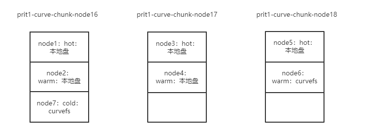

# Curve 双周会 2022-05-26

## 时间

2022/06/09 19:00-19:30

## 议题

- v2.2.0 版本进展
- 近期工作同步
- 答疑（欢迎在文档中提前描述 [Curve 双周会 Q&A](https://docs.qq.com/doc/DSHdlZExPckVUQm1W))

## 加入会议

> 会议主题：Curve 双周会
>
> 会议时间：2022/06/09 19:00-19:30 (GMT+08:00) 中国标准时间 - 北京
>
> 点击链接入会，或添加至会议列表：
>
> https://meeting.tencent.com/dm/dYKdjGgWosWi
>
> #腾讯会议：340-155-597
>
> 手机一键拨号入会
>
> +8675536550000,,340155597# (中国大陆)
>
> +85230018898,,,2,340155597# (中国香港)
>
> 根据您的位置拨号
>
> +8675536550000 (中国大陆)
>
> +85230018898 (中国香港)
>
> 复制该信息，打开手机腾讯会议即可参与

## 会议内容

### v2.2.0 版本

#### 主要特性

* 支持以 CurveBS 作为 CurveFS 的数据存储后端
* 支持以 RocksDB 作为元数据的存储引擎

#### 目前进度

封版提测中：

* [v2.2.0 分支](https://github.com/opencurve/curve/commits/release2.2)
* [v2.2.0 Issue](https://github.com/opencurve/curve/milestone/6)

#### 目标

1. 6 月底发布稳定版本
2. 适配大规模场景，保证在大规模场景下的稳定性和性能

# 近期工作同步

1. CurveFS v2.2.0 Bugfix
   1. [curvefs/mds: fix create partition error at parallel case](https://github.com/opencurve/curve/commit/ed3485915acade3b7762005c879d60959fc9aecc)
   2. [docker/entrypoint: redirect etcd stdout and stderr to file.](https://github.com/opencurve/curve/commit/4b6a1f74ec69da518dbfc2b73628d814400f5c0a)
   3. [glog: fixed dead lock in child process](https://github.com/opencurve/curve/commit/319ed950132df19040c0ce7bbf159b0eb119437e)
   4. [curvefs/metaserver: recover s3ChunkInfoRemove field for GetOrModifyS3ChunkInfo PRC request](https://github.com/opencurve/curve/commit/07a9e7600551577d99b27bff3067612f3ba3f5c5)
   5. [curvefs/metaserver: fixed s3chunkinfo was padding into inode when it wasnt needed.](https://github.com/opencurve/curve/commit/0e2188b256fa079bb0d7a9a89de4df5e05a3306c)

* 见 [release2.2](https://github.com/opencurve/curve/commits/release2.2)

2. elk 冷数据场景
   
   适配热数据转冷数据的场景，替换本地盘。
   后续会对相关使用场景的性能进行优化。
   
   

3. NVME研发
   
   [CurveBS Direct Access NVME](https://github.com/opencurve/PolarDB-FileSystem/blob/nvme/docs/nvme_chunkserver.md)
   
   [PFS 4K原子写实现](https://github.com/opencurve/PolarDB-FileSystem/blob/nvme/docs/rangelock.md)

4. 开源之夏

[2022 开源之夏 | Curve 邀你与中国存储软件共成长，赢万元奖金](https://mp.weixin.qq.com/s/EklEtm_HUeQkicqWcfYbvA)
- PFS和CurveBS客户端deb/rpm打包工具
- CurveBS支持读挂载和写挂载及读写权限转换
- Curve块存储(curvebs)分配容量策略和运维工具容量统计优化
- 为 CurveAdm 增加显示服务监听端口

# 问答

> 自由提问
