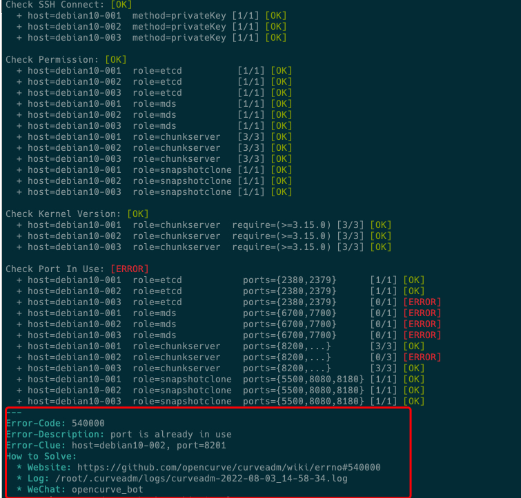

# Curve 双周会 2022-08-04

## 时间

2022/08-04 19:00-19:30

## 议题

- v2.4.0-pre 版本
- v2.4.0 版本规划
- 答疑（欢迎在curve论坛提前提问 https://ask.opencurve.io/t/topic/74 )

## 加入会议

会议主题：curve双周会
会议时间：2022/08/04 19:00-19:30 (GMT+08:00) 中国标准时间 - 北京
重复周期：2022/08/04-2023/08/03 19:00-19:30, 每两周 (周四)

点击链接入会，或添加至会议列表：
https://meeting.tencent.com/dm/DckjtgWnOM1o

#腾讯会议：493-3764-3146

手机一键拨号入会
+8675536550000,,49337643146 (中国大陆)
+85230018898,,,2,49337643146 (中国香港)

根据您的位置拨号
+8675536550000 (中国大陆)
+85230018898 (中国香港)

复制该信息，打开手机腾讯会议即可参与

## 会议内容

### v2.4.0-pre 版本

上个迭代，我们正式发布了v2.3.0版本。
[支持生产级共享文件存储，Curve v2.3.0版本发布！](https://mp.weixin.qq.com/s/kUF_BS8v8acWocOsvAoOWA)

我们预计九月初提测v2.4.0，我们期望在这中间加一个小版本，以增加一些重点功能：

1. CurveFS支持使用CurveBS后端

当前fs的稳定版本只支持把文件数据存储到S3；
该版本使得fs支持使用curvefs后端存储文件数据。

RoadMap：支持curvebs后端与s3后端的数据切换，用以提供高低性能，以及冷热分层

2. 调度均衡性

当前版本可以应对多fs，大规模使用场景下的元数据资源的均衡。但是在一些场景下会出现一些问题

-  单fs，小规模使用场景   
  
这个场景下，整个系统只有最开始创建的几个copyset和partition。在fs创建大量的文件耗尽一开始分配的partition之前，很长时间都不会有新的copyset和partition的创建。虽然copyset的创建，已经尽量做到metaserver均衡，但是创建partition是随机选择copyset。随机算法在partition个数很少的时候，并不能做到均衡的分不到不同的copyset上，就会造成很长的时间内，整个metaserver的资源是不均衡的。

-  资源使用率不高时metaserver恢复

在坏盘或者坏机器场景下，新替换的metaserver上没有copyset。或者metaserver由于故障或者升级，停止服务一段时间，上面的copyset已经迁移走，拉起服务之后，上面没有copyset。

如果接下来一段时间没有新的创建copyset的需求，而且其他mataserver的资源使用率不高，那么新扩容的metaserver上就会很长时间没有copyset，新扩容的metaserver的能力也得不到使用。

3. warmup

客户端新增预热功能，可提前把需要的文件/目录从云端加载到本地缓存目录

4. bugfix

见issue

### v2.4.0 版本规划

#### CurveAdm 规划

CurveAdm 1.0 稳定版本下周一提测。

1.0 就是个稳定版本，常见功能基本都有了：
- 集群部署
- 监控
- 常见运维
  - 查看集群列表
  - 切换集群
  - 添加集群
  - 删除集群
  - 导出集群
  - 导入集群
  - 查看集群拓扑
  - 修改集群拓扑
  - 对比集群拓扑
  - 查看集群状态
  - 启动服务
  - 停止服务
  - 重启服务
  - 修改服务配置
  - 进入服务容器
  - 清理集群
  - 升级
  - 扩容、缩

另外新增错误码以及错误提示，主要是为了提高部署成功率了，减少用户部署的问题:
- 各类检测（网络，配置）
- 错误码

#### CurveFS 规划

- 性能优化
  - 元数据性能进一步优化；
  - CurveFS aws s3 sdk 后端上传iops并发增大；
- 文件系统配额和权限控制
  - 文件系统的quota(bytes)设置以及对写io的限制；
  - 用户系统以及对应的fs读写权限控制；
- CurveFS 支持 CurveBS 后端优化
  - 挂载时自动获取卷大小；
  - 稳定性测试；
- curvefs_tool工具功能新增，增加检查copyset副本状态，检查follower是否落后功能等；
- 解决 InodeCache 缓存 s3Info 占用内存过大问题；

[curveadm wiki](https://github.com/opencurve/curveadm/wiki/maintain-curve)

#### CurveBS 规划

- 增加iofence功能。

iofence功能是指，当读写挂载发生切换时，旧的写挂载节点假死或者脑裂场景下，新的节点能够重新以写挂载模式挂载上去，并且新的节点写挂载后，阻止旧的写挂载节点的inflight写请求，从而保证读写的一致性。

#### 其他

brpc支持rdma

基本代码已经拉通

## 答疑

