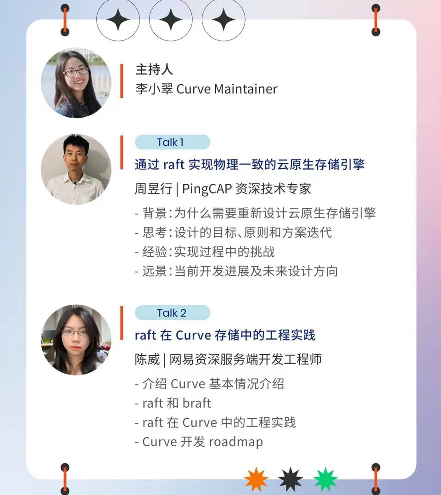

# Curve 双周会 2022-12-15

## 时间

2022/12/15 19:00-19:30

## 加入会议

```
会议主题：curve双周会
会议时间：2022/12/15 19:00-19:30 (GMT+08:00) 中国标准时间 - 北京
重复周期：2022/10/20-2023/07/27 19:00-19:30, 每两周 (周四)

点击链接入会，或添加至会议列表：
https://meeting.tencent.com/dm/DckjtgWnOM1o

#腾讯会议：493-3764-3146
```

## 会议内容

### 一、近期进展

#### curvefs 近期工作

**CurveFS 2.4版本测试中**

- 2.4版本的changelog，见https://github.com/opencurve/curve/blob/master/CHANGELOG-2.4.md, 2.4版本的主要功能包括
    - warmup功能，提供缓存预热的功能
    - aws sdk 升级
    - 元数据均衡功能完善
    - cto相关问题修复等，以及其他的一些bugfix

目前curvefs 2.4版本正在进行测试，已经发现部分bug，团队正在抓紧修复中

测试方案见:  https://github.com/opencurve/curve/blob/master/docs/cn/test/release2.4-test.pdf

测试问题及进展，请关注： https://github.com/opencurve/curve/milestone/8

**CurveFS 支持CurveBS后端删除方案**

- CurveFS已经实现了从CurveBS分配空间，并把写入file的数据持久化到volume上。但是空间回收部分功能还没有实现，在删除文件，或者对文件truncate的时候，没有释放volume分配的空间，最终会造成volume上有大量的垃圾数据，导致volume空间耗尽，因此提出了CurveBS后端删除方案。

目前该方案已提交到opencurve docs，见[curvefs_volume_space_deallocate](https://github.com/opencurve/curve/blob/master/docs/cn/curvefs_volume_space_deallocate.md),

目前方案还有一些遗留问题还没解决，如：

 - truncate 场景下的空间回收的方案尚未完善
 - bitmap删除存在不幂等的问题

 欢迎大家积极参与方案讨论和完善，一同开发实现该功能

相关的issue在 [issue2160] (https://github.com/opencurve/curve/issues/2160) 欢迎讨论和留言

也可以在github上的讨论区参与讨论：[[CurveFS] Support CurveBS as backend](https://github.com/opencurve/curve/discussions/2117)

**支持memcached 代码合入master分支**

文件存储新增共享读缓存memcached，加速AI训练场景中训练中间数据的存储和多端共享。对于后端为S3的部署方式，如果需要实现多个client共享，目前数据只有上传到S3，才能对所有client可见，但S3的性能又不尽人意。当前的解决方案是，使用memcache（不仅是全内存，还支持SSD）作为共享的读缓存

#### curvebs 近期工作

**spdk & rdma 相关工作:**

- spdk 代合入curve-spdk分支，欢迎测试 [curve-spdk] (https://github.com/opencurve/curve/tree/curve-spdk)
- rdma 相关代码已poc，链接 [rdma] (https://github.com/wu-hanqing/curve/commits/ucx)
- 目前正在进行spdk与rdma的对接，实现数据从网卡到落盘完全的零拷贝，CPU只参与控制流程而不参与数据拷贝，从而提升性能和降低cpu使用率

**curvebs raftlog写放大优化:**
- raft层wal日志header和data数据分离，data使用O_DIRECT方式，header使用buffer IO, 使用pagecache合并刷盘，这样的方式测试下来可以提升30%的性能。

**iscsi target 优化**
- 支持直接对接curve-sdk, 原先iscsi target只支持使用nebd对接curve方式，nebd主要是为了支持client热升级而抽象的隔离层，通过一层unix socket通信隔离nebd client和server，是的nebd server可以进行热升级，但这同时也带来了一点的性能损失，随着curvebs 代码的稳定，当前nebd组件可以去掉以提升性能（用户需要根据是否有热升级的需求进行相应的取舍）
- 进一步优化性能，支持scsi write-same命令，从而节省从initiator 到target的网络带宽。支持Linux MSG_ZEROCOPY, 加速大数据块读取，Linux文档建议10KB 以上使用零copy技术。实际测试，读取速度在16K 128深度的情况下提高了20%性能。相关文档https://github.com/opencurve/curve-tgt/blob/master/doc/README.curve

该代码仓库在[curve-tgt](https://github.com/opencurve/curve-tgt)，欢迎测试和使用

**大IO性能优化方案调研中**
- 针对curve大IO场景，相比于ceph等其他开源存储没有性能优势，目前curve团队内部正在进行大IO性能优化方案的调研, 分析下来大IO主要问题在于写放大，相关思路有：
    - 类似ceph bluestore/seastore的新的存储引擎，实现raft日志和apply数据只写一次数据，从而减少写放大，需要大规模改造底层存储引擎
    - 类似于cubefs的大IO引擎，实现双引擎，大IO顺序写时不走raft, client直接写三副本

上述方案正在调研中，欢迎社区的同学们留言和参与讨论。

**poolset功能进一步完善**

- poolset功能指的是curvebs支持创建多种不同类型的poolset，如nvme poolset，ssd poolset, hdd poolset等，目标：
    - 支持在同一个集群中创建不同底层存储介质的卷 
    - 支持poolset级别的存储池隔离（一个卷只能存在于一个poolset中）, 类似于ceph中pool的概念，可以指定poolset创建卷

#### 二、开源社区

**curve开源周报**
- [2022-12-05] (https://github.com/opencurve/community/blob/master/affair/week_report/2022-12-05.md)
- [2022-12-12] (https://github.com/opencurve/community/blob/master/affair/week_report/2022-12-12.md)

**OpenCurve公众号文章：**

**Curve块存储应用实践系列文章：**
- [Curve块存储应用实践一部曲之iSCSI] (https://mp.weixin.qq.com/s/FiL66QnVnZew4X2AWv7NZw)
- [Curve块存储应用实践二部曲之NBD] (https://mp.weixin.qq.com/s/Bf-iJVi51VC2Sz-x3mQUpA)  **本期发布第3篇**
- Curve块存储应用实践三部曲之云主机
- [Curve块存储应用实践四部曲之云原生数据库] (https://mp.weixin.qq.com/s/mOUZjkeeRMBapeOOMxsUIA)
- Curve块存储应用实践五部曲之性能调优

**其他文章**
- [开发者活动系列 -- 新晋 Curve Contributor Sindweller](https://mp.weixin.qq.com/s/HSbKy7rD_fvcqW4GKTjXsg)

关注OpenCurve公众号，查看更多Curve文章。

**社区开发者活动结束:**

活动页面：https://github.com/opencurve/curve/issues/2017

**活动预告**
- Curve社区 & TiKV社区联合 raft主题分享 讲师陈威
    - 

## 答疑 & 交流
