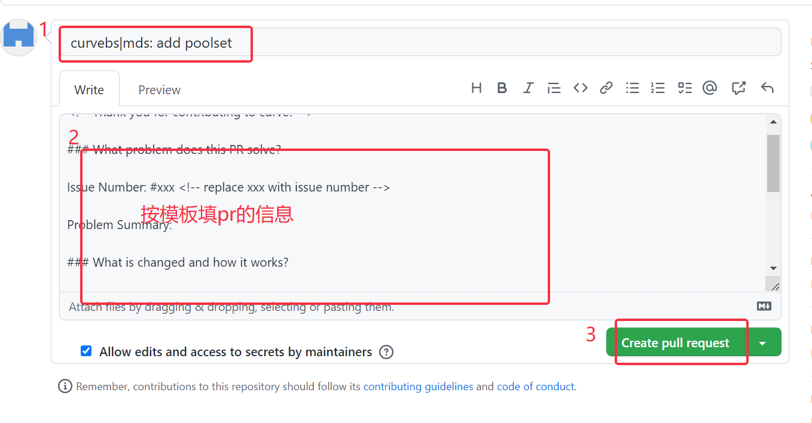
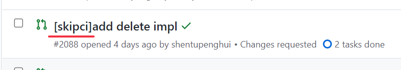
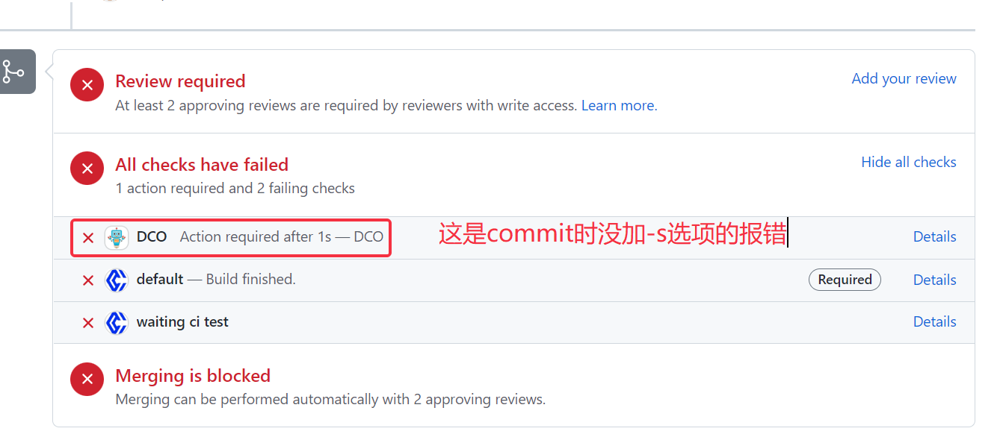
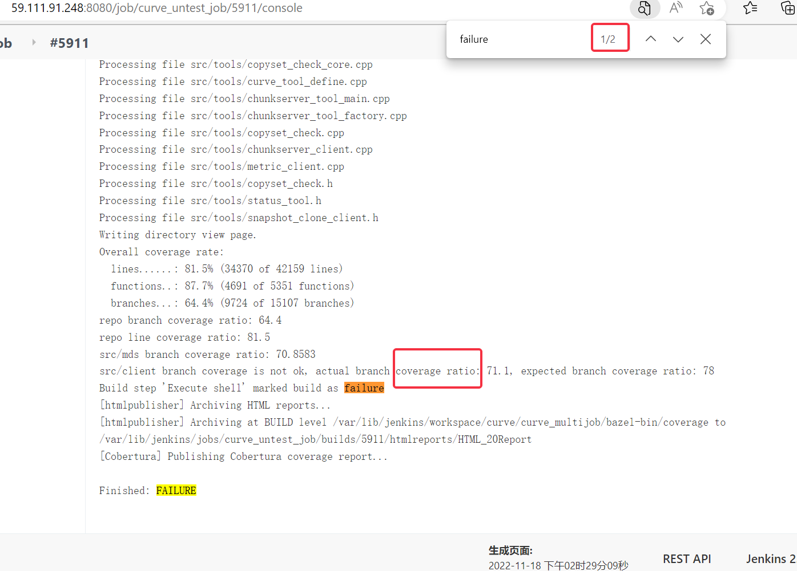
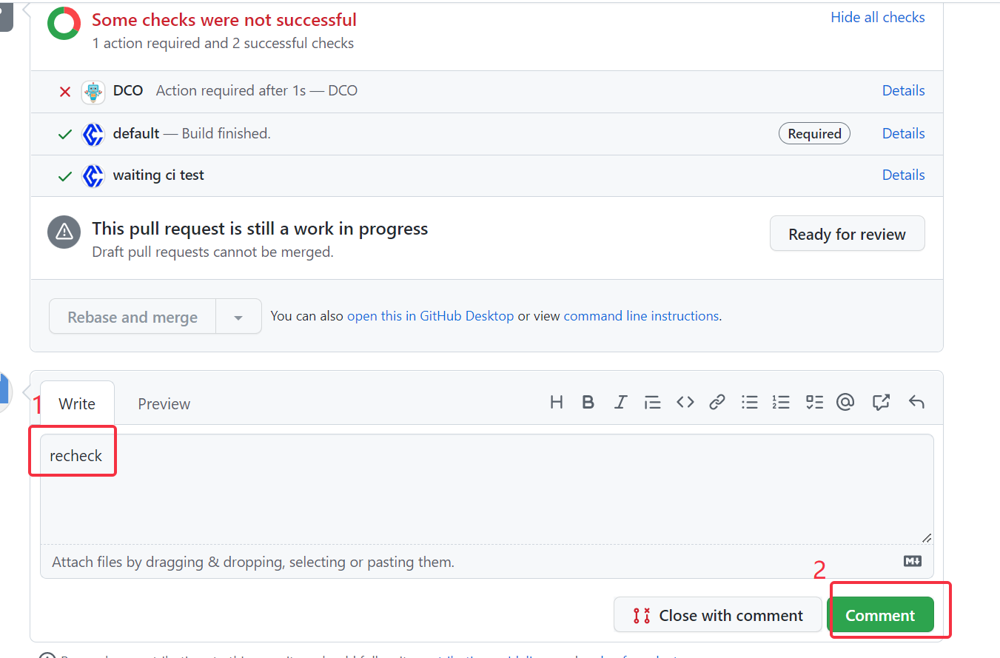

# 如何给curve提交你的第一条pr

导读：本文是针对新手curver的一篇提pr的简要指南，不仅仅是给curve提pr的教程，还包含了对提交pr前后一些常见问题的说明，比如功能开发完成后如何编译、如何编写单元测试以及提交pr之后常见ci问题的查看和解决。

## pre:开发前准备工作

首先，从[curve的github](https://github.com/opencurve/curve.git)中fork一份代码到你自己的仓库中

然后**从你自己的仓库中将curve代码clone到本地**，接着添加curve的官方仓库为你自己的远程仓库（执行`git remote add upstream https://github.com/opencurve/curve.git` 命令），`git remote -v`查看是否添加成功。开发之前同步curve官方仓库的代码：`get fetch upstream` 、`git rebase upstream/master`

## part1 编译

这里先只说明c++代码的编译和proto文件的编译，go和python的代码有编写相应的脚本去编译，这里不提及

功能需求开发完成后要进行的第一步是编译，curve采用的是bazel编译，举个例子来说明bazel编译的使用：首先进入curve项目的根目录下，如果修改了根目录下src/mds/topology文件夹里的一个或多个文件，那么直接执行`bazel build //src/mds/...` 这条命令就可以对mds下的代码进行编译。

p.s.简单说明一下，`//`开头的目标模式都相对于curve根目录进行解析，mds/...表示对mds目录下所有的target进行构建。其他文件夹下的编译以此类推。

proto文件的编译

如果修改了proto目录下的proto文件，那么编译命令是 protoc --cpp_out=. proto/*.proto

## part2 单元测试编写

功能开发完并且编译通过之后要添加相应的单元测试进行验证，curve采用的是gtest/gmock框架，[gtest参考文档](https://github.com/opencurve/curve/blob/master/docs/cn/gtest.md)、[gmock参考文档](https://github.com/opencurve/curve/blob/master/docs/cn/gmock.md)

curvebs单元测试的编写可以参考test下的文件，curvefs单元测试的编写可以参考`curvefs/test`下的文件

单元测试文件的目录名和文件名的命名必须与源文件形成对应，比如`src/mds/topology/topology_service_manager.cpp`文件对应的单元测试文件的目录名和文件名是`test/mds/topology/test_topology_service_manager.cpp`。

编写好单元测试代码之后也要进行编译，执行`bazel build //test/mds/topology/...` 这是编译topology模块下所有的单元测试，接下来运行单元测试。

在topology模块下的单元测试中，编译构建的target名字是"topology_utest"（在`test/mds/topology/BUILD`文件里查看），bazel 编译后的可执行程序都在 `./bazel-bin` 目录下，CurveBS相关单元测试程序目录是 `./bazel-bin/test`，执行`./bazel-bin/test/mds/topology/topology_utest`命令来运行topology模块所有的单元测试。

假设你现在编写了一个单元测试`TEST_F(test_case_name, test_name)`，并且你只想运行这一个小模块里的所有测试用例或者仅仅是某个测试用例，那么加上`--gtest_filter`选项，如 `--gtest_filter=test_case_name`（运行test_case_name测试模块下所有的测试用例）或者`--gtest_filter= test_case_name.test_name`(仅运行test_case_name模块下的名为test_name的测试用例）

## part3 提交pr

提pr前先进行git三步曲——`git add`、`git commit`、`git push`，唯一要注意的是在**git commit时一定要加-s选项**，因为ci会有DCO检查，不加的话ci会直接不过，如果你是在push前不小心忘了这个选项，可以直接执行`git commit -s --amend`，然后直接保存退出，如果push后想补救就只能用git rebase了，在DCO的Details信息里会说明怎么使用git rebase来补充签名

选择pr合并到的分支为master

pr的名字，pr的名字要体现改动了什么模块的什么功能，比如在curveBs里增加了poolset集群结构，主要修改的是mds模块那么pr的命名应该是 curvebs|mds: add poolset ;  curve的pr信息有设置模板，按照模板上的提示填写此条pr相关的信息

点击create pull request 后，pr就提好了

如果仅仅是提交文档，不涉及代码修改，那么pr可以不跑ci，只要在pr名字的开头加上[skipci]即可，如下图所示：

## part4 ci报错查看和解决

1.DCO报错

commit时没加-s选项就会有DCO报错

按照前面说的用git rebase在commit信息里添加签名然后重新push可以解决（点击右边的details可以看到详细解决方法）

2.代码的报错

代码的报错在default里

代码里的错误直接点进default的details查看，有黄色和红色标记的就是有报错，蓝色标记无报错，像下图这个黄色标记的就是常见的cpplint报错

（1）cppLint报错

cpplint主要是对代码风格的检查，curve代码的编写必须遵循[谷歌代码风格](https://zh-google-styleguide.readthedocs.io/en/latest/google-cpp-styleguide/)

解决方法：在IDE里对报错文件执行 cpplint 命令，以上面这个文件为例就是 cpplint --filter=-build/c++11 --quiet ./curvefs/test/client/test_disk_cache_manager_impl.cpp命令，可以提示该文件里所有的cpplint报错，修改完再执行没有任何提示就表示修改完成了。

（2）单元测试报错

如果有单元测试的报错(xxx_utest)那么点进控制台，在控制台里查找关键字failure可查看具体报错，如果没有明显的failure报错，那么可能仅仅只是单元测试覆盖率的问题导致的概率性报错，如下图

图中只有一处报错，且不是单元测试失败，而是ratio问题，这就是典型的单元测试覆盖率问题导致的报错，那么先检查单元测试是否有遗漏，如果有遗漏需要补充，然后确保单元测试在本地都可以编译和运行通过，如果这两点都满足，recheck重新跑一下ci，如下图

最后，如果修改完ci报错有多个commit需要用git rebase合并为一个commit提交。