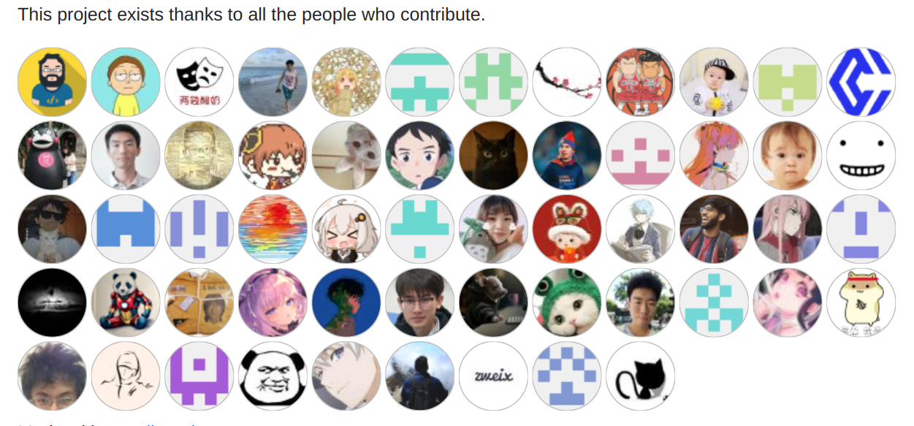
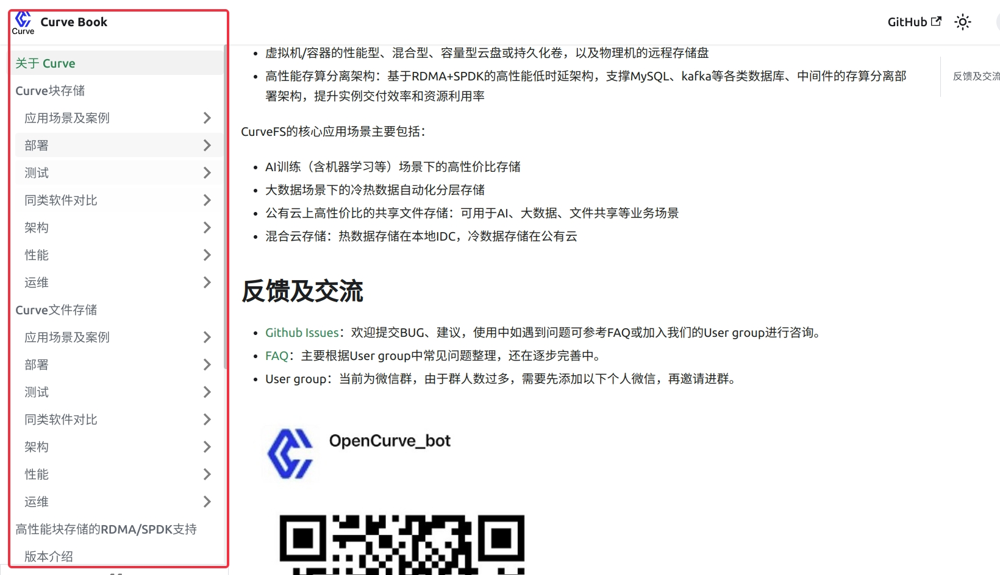

## 时间

2023/08/03, 19:00-19:40


## 加入会议

```
W 邀请您参加腾讯会议
会议主题：W预定的会议
会议时间：2023/08/03 19:00-19:40 (GMT+08:00) 中国标准时间 - 北京

点击链接入会，或添加至会议列表：
https://meeting.tencent.com/dm/Rvx4NU7xdkz6

#腾讯会议：653-606-758
(可微信小程序入会)
复制该信息，打开手机腾讯会议即可参与
```

## 0：会议内容概要

本次社区双周会主要包括以下几点：
- 上半年社区roadmap总结与下半年工作展望
- Curve自动化测试框架开源
- Curve官方文档网站正式搭建
- “社区活动 Summer Code Camp”正在持续招募报名


## 会议内容

### 一. 2023上半年社区Roadmap总结与下半年工作展望
#### 1. 感恩/致谢

自开源以来，Curve 项目受到了社区小伙伴们的大量关注和讨论，项目的一些特色得到了部分社区小伙伴的认可，但是还有更多的小伙伴们给Curve 项目提出了更高的要求和期望，这些需求我们都已经收到并且牢记在心，只是限于社区开发者数量和能力，不能立刻满足。

但我们一直在朝着更优秀的分布式存储项目在努力，也希望更多优秀的小伙伴一起加入社区，为这个年轻的社区添砖加瓦，争取让Curve从开源基础设施领域的新星成长为明星。




#### 2. Curve当前主推场景

- Curve文件存储已经上线并支持机器学习，ES，NAS等以posix为接口的场景，即将支持以HDFS为接口的大数据场景；
- Curve块存储已经上线并支持高随机的数据库，云盘等场景

#### 3. 上半年roadmap及下半年展望

详见下文：

[Curve 社区上半年 Roadmap 进展及下半年规划](https://mp.weixin.qq.com/s/uBQV_58oSZf9Z9NBVCP-ew)

### 二、近期主要工作

#### 1. 通用存储测试框架开源

[存储通用测试框架fsthrash](https://github.com/opencurve/fsthrash)

fsthrash 是一个自动化压力测试框架，用 Python 编写。它是一个通用的测试框架，也可用于其他分布式存储系统。

目前用例场景包括所有块存储、文件存储上的元数据测试、posix兼容性测试、数据一致性测试、读写测试、AI训练测试。

#### 2. Curve官方文档网站上线

[Curve官方文档网站](https://docs.opencurve.io/)



Curve的文档目前有不少，但是散落于Curve githu主仓库，curveadm以及curve-meetup-slides等子仓库。我们深知文档易读性的重要性，同时也是应Curve社区很多小伙伴的要求，所以我们建立了这个官方文档网站

框架本周刚搭建完成，内容有待补充，也欢迎社区同学们给文档库提pr，一起来完善这个唯一的入口。


### 三、开源社区

1. “社区活动 Summer Code Camp”正在持续招募报名，本次奖品丰厚，形式新颖，欢迎大家关注参与。

本次开发者活动主要分为两大专题，如下：

- Curve项目本身

准备了非常多有意思且范围涵盖较广的议题，包括Curve web控制台方向，云原生方向，核心代码逻辑方向，Curveadm方向以及Curve的Ci方向。涉及的语言包括C/C++、go、python/shell等

- 社区联动

openEuler拥有非常好的开源生态系统。Curve期望在openEuler操作系统上运行，所以我们需要做一些适应和验证工作。

开发活动详情见:
[Curve夏季特别活动](https://github.com/opencurve/curve/issues/2603)


### 四、近期公众号文章

1. [Curve 社区上半年 Roadmap 进展及下半年规划](https://mp.weixin.qq.com/s/uBQV_58oSZf9Z9NBVCP-ew)

2. [Curve 控制台详细部署使用指南](https://mp.weixin.qq.com/s/CpsaribS41FqnFsdvb2hdw)


### 五、答疑 & 交流


