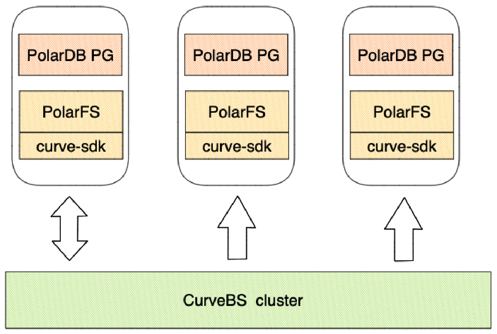

# Curve块存储实践-10分钟带你体验高性能云原生数据库

## 前言

Curve 块存储是云原生计算基金会 (CNCF)  Sandbox 项目，是网易自研和开源的高性能、易运维、云原生的分布式存储系统。而 PolarDB File System （PFS）是由阿里云自主研发的高性能类 POSIX 的用户态分布式文件系统，服务于阿里云数据库 PolarDB 产品。
通过本文的介绍，大家可以快速部署一套 PolarDB+PFS+CurveBS 的云原生数据库，并在 PFS 上编译部署 PolarDB 。



## 环境准备

### Curve 块存储集群

首先大家需要一个部署完毕的 Curve 块存储集群，相关的内容大家可以参考 [Curveadm Wiki](https://github.com/opencurve/curveadm/wiki)，关于如何部署 Curve 块存储系统有着详细的介绍和指导，欢迎大家上手体验。
如果是为了体验大家可以仅部署单机的 Curve 块存储系统，无需格式化硬盘；如果是为了性能性能建议大家部署多机版本，并格式化硬盘。

> CurveAdm 是 Curve 社区为提高部署的易用性而设计的工具，其主要用于快速部署和运维 Curve块存储/Curve文件集群，其操作简单并且拥有丰富的功能和一些高级的特性。

可以使用 `curveadm status` 查看部署的 Curve 块存储集群。

```shell
curveadm status
Get Service Status: [OK]  

cluster name      : curve-bs
cluster kind      : curvebs
cluster mds addr  : ***.***.***.***:***0,***.***.***.***:***1,***.***.***.***:***2
cluster mds leader: ***.***.***.***:****2 / b42a0bf806c0

Id            Role           Host             Replicas  Container Id  Status                   
--            ----           ----             --------  ------------  ------                   
3f4eacb8d9bf  etcd           ***************  1/1       8e34804b0f9a  Up 33 hours              
c1cdc738ba4e  etcd           ***************  1/1       e898382a8bd4  Up 33 hours              
85c7fcc3a1a0  etcd           ***************  1/1       065ba1dad6c3  Up 33 hours              
eab7a8933d85  mds            ***************  1/1       6d52a4d48b82  Up 10 hours              
d8eef53ce9bf  mds            ***************  1/1       8c0d2065bfbf  Up 10 hours              
b42a0bf806c0  mds            ***************  1/1       a8b49cc65f4d  Up 24 hours              
acd02a245b41  chunkserver    ***************  1/1       80d7e673c789  Up 33 hours              
ad6fb1dedce0  chunkserver    ***************  1/1       fe39d4b4e34e  Up 33 hours              
c45b9a0435f9  chunkserver    ***************  1/1       9ee3d30e9895  Up 33 hours              
5f5ad870598a  snapshotclone  ***************  1/1       224d32c2e0bc  Up 33 hours
bab6e56368c6  snapshotclone  ***************  1/1       4e321e8f40cc  Up 33 hours
455b674b84e8  snapshotclone  ***************  1/1       64927e222397  Up 33 hours
```

### PolarDB 开发镜像

Curve 社区已经准备好了专门用于适配 Curve块存储的 PFS，镜像内已经打包好所需的内容，无需再次编译安装。
使用以下命令拉取对应的镜像：

```shell
docker pull opencurvedocker/polardb-build:latest-centos7
```

## 格式并挂载 PFS

在用于部署 PolarDB 的计算节点上，通过以下命令进入容器：

```shell
docker run -it \
    --network=host \
    --cap-add=SYS_PTRACE --privileged=true \
    --name curve-polardb_pg \
    opencurvedocker/polardb-build:latest-centos7 bash
```

### 创建条带化卷

在镜像内已经安装了 `curve` 工具，该工具可以用于创建实际存储 PolarFS 数据的 Curve 卷。打开配置文件 `/etc/curve/client.conf`，修改属性 `mds.listen.addr` 为 `curveadm status` 显示中的 cluster mds addr 后面的内容：

```shell
#
################### mds一侧配置信息 ##################
#

# mds的地址信息，对于mds集群，地址以逗号隔开
mds.listen.addr=***.***.***.***:***0,***.***.***.***:***1,***.***.***.***:***2
...
```

使用以下命令可以创建 Curve 条带化卷：

```shell
curve create --filename /volume --user my --length 10 --stripeUnit 16384 --stripeCount 64
```

用户可以使用 `curve create -h` 命令来查看创建卷命令的详细说明。上面的例子中我们创建了一个拥有以下属性的 Curve 卷：

- 卷名为 /volume
- 所属用户为 my
- 大小为 10GB
- 条带大小为 16KB
- 条带个数为 64

**注意** 在数据库场景下，我们强烈建议使用条带化卷，只有这样才能充分发挥 Curve 的性能，而 16384 * 64 是目前最优的条带设置。

### 格式化 curve 卷

在使用 Curve 卷之前需要使用 `pfs` 来格式化对应的 curve 卷：

```shell
sudo pfs -C curve mkfs pool@@volume_my_
```

**注意**由于 PolarFS 解析的特殊性，需要以供 `pool@@volume_my_` 的形式指定 Curve 卷，并且以`@` 来替换卷名中的根 `/`。

### 启动 pfsd 守护进程

使用以下命令启动 pfsd 守护进程来挂载 PFS 文件系统：

```shell
sudo /usr/local/polarstore/pfsd/bin/start_pfsd.sh -p pool@@volume_my_
```

## 部署 PolarDB

在前面的步骤中我们已经成功的拉去了 PolarDB 的镜像，并进入容器中。下面我们需要从 [GitHub](https://github.com/ApsaraDB/PolarDB-for-PostgreSQL) 上下载 PolarDB for PostgreSQL 的源代码，稳定分支为 `POLARDB_11_STABLE`，代码克隆完成后，进入源代码目录：

```shell
git clone -b POLARDB_11_STABLE https://github.com/ApsaraDB/PolarDB-for-PostgreSQL.git

cd PolarDB-for-PostgreSQL/
```

### 部署读写节点

在读写节点上，使用以下命令编译 PolarDB 内核：

```shell
./polardb_build.sh --with-pfsd
```

**注意**
上述脚本完成后会自动部署一个基于本地文件系统的实例，需要执行以下命令来停止这个实例：

```shell
$HOME/tmp_basedir_polardb_pg_1100_bld/bin/pg_ctl \
    -D $HOME/tmp_master_dir_polardb_pg_1100_bld/ \
    stop
```

初始化数据目录：

```shell
$HOME/tmp_basedir_polardb_pg_1100_bld/bin/initdb -D $HOME/primary
```

使用 `pfs` 创建共享数据目录 `/pool@@volume_my_/shared_data`，并初始化 db 的本地和共享数据目录：

```shell
# 使用 pfs 创建共享数据目录
sudo pfs -C curve mkdir /pool@@volume_my_/shared_data
# 初始化 db 的本地和共享数据目录
sudo $HOME/tmp_basedir_polardb_pg_1100_bld/bin/polar-initdb.sh \
    $HOME/primary/ /pool@@volume_my_/shared_data/ curve
```

编辑读写节点的配置文件 `$HOME/primary/postgresql.conf`，增加以下内容：

```shell
port=5432
polar_hostid=1
polar_enable_shared_storage_mode=on
polar_disk_name='pool@@volume_my_'
polar_datadir='/pool@@volume_my_/shared_data/'
polar_vfs.localfs_mode=off
shared_preload_libraries='$libdir/polar_vfs,$libdir/polar_worker'
polar_storage_cluster_name='disk'
logging_collector=on
log_line_prefix='%p\t%r\t%u\t%m\t'
log_directory='pg_log'
listen_addresses='*'
max_connections=1000
synchronous_standby_names='replica1'
```

打开 `$HOME/primary/pg_hba.conf`，增加以下配置项：

```ini:no-line-numbers
host replication postgres 0.0.0.0/0 trust
```

最后，启动读写节点：

```bash:no-line-numbers
$HOME/tmp_basedir_polardb_pg_1100_bld/bin/pg_ctl start -D $HOME/primary
```

检查读写节点能否正常运行：

```bash:no-line-numbers
$HOME/tmp_basedir_polardb_pg_1100_bld/bin/psql \
    -p 5432 \
    -d postgres \
    -c 'select version();'
            version
--------------------------------
 PostgreSQL 11.9 (POLARDB 11.9)
(1 row)
```

在读写节点上，为对应的只读节点创建相应的 replication slot，用于只读节点的物理流复制：

```bash:no-line-numbers
$HOME/tmp_basedir_polardb_pg_1100_bld/bin/psql \
    -p 5432 \
    -d postgres \
    -c "select pg_create_physical_replication_slot('replica1');"
 pg_create_physical_replication_slot
-------------------------------------
 (replica1,)
(1 row)
```

### 只读节点部署

在只读节点上，使用 `--with-pfsd` 选项编译 PolarDB 内核。

```bash:no-line-numbers
./polardb_build.sh --with-pfsd
```

**注意**
上述脚本完成后会自动部署一个基于本地文件系统的实例，需要执行以下命令来停止这个实例：

```bash:no-line-numbers
$HOME/tmp_basedir_polardb_pg_1100_bld/bin/pg_ctl \
    -D $HOME/tmp_master_dir_polardb_pg_1100_bld/ \
    stop
```

在节点本地初始化数据目录 `$HOME/replica1/`：

```bash:no-line-numbers
$HOME/tmp_basedir_polardb_pg_1100_bld/bin/initdb -D $HOME/replica1
```

编辑只读节点的配置。打开 `$HOME/replica1/postgresql.conf`，增加配置项：

```ini
port=5433
polar_hostid=2
polar_enable_shared_storage_mode=on
polar_disk_name='pool@@volume_my_'
polar_datadir='/pool@@volume_my_/shared_data/'
polar_vfs.localfs_mode=off
shared_preload_libraries='$libdir/polar_vfs,$libdir/polar_worker'
polar_storage_cluster_name='curve'
logging_collector=on
log_line_prefix='%p\t%r\t%u\t%m\t'
log_directory='pg_log'
listen_addresses='*'
max_connections=1000
```

创建 `$HOME/replica1/recovery.conf`，增加以下配置项：

**注意**
请在下面替换读写节点（容器）所在的 IP 地址。


```ini
polar_replica='on'
recovery_target_timeline='latest'
primary_slot_name='replica1'
primary_conninfo='host=[读写节点所在IP] port=5432 user=postgres dbname=postgres application_name=replica1'
```

最后，启动只读节点：

```bash:no-line-numbers
$HOME/tmp_basedir_polardb_pg_1100_bld/bin/pg_ctl start -D $HOME/replica1
```

检查只读节点能否正常运行：

```bash:no-line-numbers
$HOME/tmp_basedir_polardb_pg_1100_bld/bin/psql \
    -p 5433 \
    -d postgres \
    -c 'select version();'
# 下面为输出内容
            version
--------------------------------
 PostgreSQL 11.9 (POLARDB 11.9)
(1 row)
```

### 集群检查和测试

部署完成后，需要进行实例检查和测试，确保读写节点可正常写入数据、只读节点可以正常读取。

登录 **读写节点**，创建测试表并插入样例数据：

```bash:no-line-numbers
$HOME/tmp_basedir_polardb_pg_1100_bld/bin/psql -q \
    -p 5432 \
    -d postgres \
    -c "create table t(t1 int primary key, t2 int);insert into t values (1, 1),(2, 3),(3, 3);"
```

登录 **只读节点**，查询刚刚插入的样例数据：

```bash:no-line-numbers
$HOME/tmp_basedir_polardb_pg_1100_bld/bin/psql -q \
    -p 5433 \
    -d postgres \
    -c "select * from t;"
# 下面为输出内容
 t1 | t2
----+----
  1 |  1
  2 |  3
  3 |  3
(3 rows)
```

在读写节点上插入的数据对只读节点可见。

## 总结

通过以上的步骤我们基于 Curve 块存储系统部署了 PFS 系统；然后分别编译部署了 PolarDB 的读写节点和只读节点；最后通过在读写节点写入、读节点读取的方式检查测试了集群是否正常工作。通过这种方式部署避免了直接暴露块设备，并且 PFS 通过 Curve-sdk 直接与 Curve 块存储通信，减少了 IO 的路径。
好了，现在你已经成功部署了一套基于 Curve 块存储的 PFS 和 PolarDB，快去享用吧！
