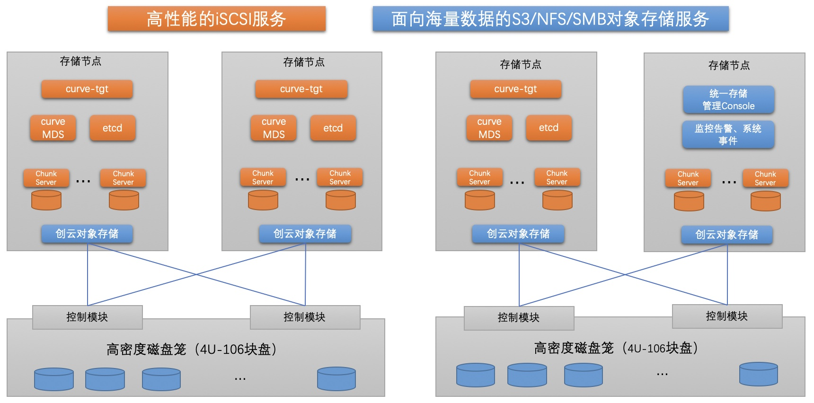

# 创云融达：基于Curve块存储的超融合场景实践

```
作者简介：王彦灵（wangyanling@oct-ea.com），曾在XSky等公司从事存储运维开发工作，
目前担任创云融达存储解决方案专家。2021年开始关注Curve社区，使用、部署、运维Curve集
群，也在代码上做一些原型实验，对社区有浓厚兴趣。
```

## 1. 创云融达背景

创云融达是一家以海量数据的存管用为核心，以企业级私有云建设能力为基础，并提供数据资产和数据中台产品和解决方案的高新技术企业。

## 2. 超融合业务背景

近年来，为了优化人们纳税缴费的服务体验，各省市税务系统逐步构建了面向税务办事大厅的各种创新型智慧设备和智慧应用,如办税一体机，智慧税务大屏，语音辅助设备、以及业务流程辅助AI机器人等。**极大便利人们税业务体验的同时也对IT集成和IT基础设施提出了更高的要求。** 

创云融达承建了多地的智慧税务大厅解决方案，在实践中，我们发现智慧事务大厅的业务有如下特点：
1. 各类智慧税务应用系统**数量较多**
2. 办事大厅的业务场景对服务的**实时性和可用性**也有较高要求
3. 应用不仅仅需要数据库等结构化数据，也需要一定规模的**非结构化数据**的存储需求

根据以上特点，我们总结出了智慧税务基础设施的需求：稳定、可靠，适应于超融合集群环境（规模3-6节点）的分布式存储解决方案，提供云主机和对象存储，保证数据安全性、和稳定可靠运行。

## 3. 方案选型

**对于对象存储**，创云融达有自研的OEOS, 有冷热数据自动分层和智能编排机制，实现了海量数据的持久化存储，同时也满足了海量小文件的高IO性能要求。可以为各类智慧应用提供非结构化数据的存管用治理平台。

**对于块存储**，非常知名的有ceph，但是开源版本的ceph在使用过程中是有很多稳定性的问题，常规的一些异常都会引起IO抖动, 和 [Curve 替换 Ceph 在网易云音乐的实践](https://mp.weixin.qq.com/s/530nTRxHHE5ghSItctqYvA) 中提到的问题也类似。这些问题和Ceph的一致性协议、数据放置算法都相关，基于开源版本去改动复杂度和工作量都很大。同时，我们注意到了开源的Curve。

通过和Curve社区多次深入的技术交流，了解到Curve分布式存储通过对数据块的数据摆放机制的优化，成功解决了Ceph类存储中CRUSH算法在生产环境中的巨大不确定性，从而具有生产环境所需要的稳定性和高可靠性。因此，基于Curve构建分布式块存储，作为虚拟化环境的数据底座，具有比Ceph产品具有更高的可靠性和数据安全性。

特别需要提到的是Curve块存储在快照上的设计。Curve块存储的快照支持上传到S3,不限制快照数量并且降低了快照的存储成本。这一设计和我们自研的对象存储OEOS可以完美结合。

## 4. 方案落地

我们对Curve块存储进行了深入的测试，当前已经在项目中成功构建了基于Curve的分布式块存储和创云OEOS对象存储结合的分布式存储解决方案，为智慧税务项目中提供了统一存储基础设施。为智慧税务提供了有力的技术支撑，并在多地市的新建智慧税务大厅项目中得到了成功应用。

整体的架构如下：



- 支持块存储和对象存储，支持ISCSI、S3、NFS、SMB协议
- 对象存储支持冷热分层，支持EC
- 块存储提供高性能，快照数据支持转储到对象存储中
- 所有服务高可用，任一节点故障不影响用户IO

**在项目落地的过程中，结合Curve的特点和业务场景，总结了一些虚拟化场景下的使用经验。**

**1. 业务短暂的IO波峰**

在KVM虚拟化场景下，当用KVM镜像生成虚拟机实例的时候，会有短暂的IO波峰（5000-6000 IOPS），之后则消失。而业务场景多数情况下对IO的要求不高。
因此，我们设计了两个逻辑池，一个SSD盘逻辑池，和一个机械盘逻辑池。KVM虚拟机则制作成40G的系统盘。这样，所有的KVM系统盘都分配在SSD逻辑池中，而数据盘分配在机械盘逻辑池中，从而解决了KVM镜像问题。

**2. nebd服务的单点和性能问题**

Curve 社区提供的curve-tgt版本是基于[nebd](https://github.com/opencurve/curve/blob/master/docs/cn/nebd.md)的，nebd是为了解耦上层应用和curve-sdk所加的热升级模块。但在实践中，这个服务有可能存在单点问题，且对IO时延也有15%左右的消耗。

因此，我们在社区版[curve-tgt](https://github.com/opencurve/curve-tgt)基础上做了一点改进，让curve-tgt的backend直接调用Curve客户端（libcurve.so），测试证明也很稳定，并且也提高了性能。

此外，curve-tgt还有一个多节点负载均衡的问题。我们的解决思路是，在每个节点上开两个curve-tgt进程（3260和3261端口），传统的3260端口仅用于iscsi discovery，当收到iscsi login命令的时候，利用iscsi的login redirect机制，调用loadbalancer，取第二个进程（3261端口）做重定向。Loadbalancer进程随机选取所有active节点的一个，重定向到该节点的3261端口上，完成login。最后一点，再通过keepalived为3260端口提供一个虚IP机制，则保证了discovery过程不会因为单节点掉电而失效。

**3. 集群整体掉电**

和社区讨论后，我们解决思路是：在分析出UPS市电故障时，第一步把前端curve-tgt进程停止掉，第二步集群所有的卷做一次快照，第三步做一次fsync，保证所有内存中的数据都刷到盘上，最后停止集群。
