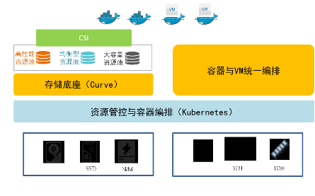

# 扬州万方：基于申威平台的Curve块存储在高性能和超融合场景下的实践

## 1. 扬州万方背景

**扬州万方科技股份有限公司**主要从事通信、计算机和服务器、智能车辆、基础软件等产品的科研生产，是国家高新技术企业、专精特新小巨人企业、国家火炬计划承担单位。

## 2. 业务背景

**申威处理器**是在国家“核高基”重大专项支持下、由国家高性能集成电路（上海）设计中心自主研发，采用自主指令集，具有完全自主知识产权的处理器系列。当前主流的申威3231处理器是基于第三代“申威 64” 二次优化版核心的国产高性能多核处理器，主要面向高性能计算和高端服务器应用。申威3231采用CC-NUMA多核结构和SoC技术，单芯片集成了32个64位RISC结构的申威处理器核心、8路DDR4存储控制器接口、40lane的PCI-E 4.0标准I/O接口以及3路直连接口，最高工作频率可达2.5GHz。

2018年至今，万方科技基于申威系列处理器研制了面向海量存储、高密度存储、全闪存储等多种需求的多类型存储系统，大量采用了基于Ceph的分布式统一存储技术。在随后的生产环境使用维护中，**Ceph在性能一致性、运行稳定性、故障修复能力等方面的表现差强人意**，并且复杂的IO处理流程、数据放置及迁移机制、庞大的代码规模等增加了使用运维成本。同时，我们也持续关注存储的技术生态，有意向另辟蹊径，探索新型的存储技术，改善目前存储产品的不足。在深入调研了Curve的技术架构、应用成熟度、社区背景的基础上，决定在申威硬件平台上适配、试用Curve技术，主要的试用场景包括高性能块存储、超融合等。

## 3. 应用实践

### Curve的适配申威平台

由于申威3231处理器采用自主申威指令集，因此需要使用申威平台的gcc对Curve进行重新编译。

Curve的移植适配需要解决的**核心问题**是brpc的编译，brpc采用M:N的线程模型，为了进一步优化性能，在原子操作、用户态上下文切换等部分使用了与处理器平台强关联的汇编语言，我们使用申威的汇编指令重写了这两部分内容，并且优化了申威平台非对齐访问内存的相关代码。

### 高性能块存储场景实践

高性能是Curve的主要特点之一，而在业务层面，高性能块存储是支撑数据库等性能型应用的关键。在Ceph存储技术的实际应用中，我们大量使用了NVMe闪存盘，通过bcache缓存方案提升机械盘的存储性能。

对于高性能块存储场景，我们**采用全NVMe闪存方式构建Curve集群**。

为了充分发挥NVMe闪存性能，我们**基于SPDK技术重构Chunkserver的Ext4 filepool。**
与当前社区中所采用的Polarfs+SPDK的方式不同，我们使用SPDK blobstore实现Chunkserver的底层存储逻辑。

这种方案需要注意的点是：SPDK blobstore不存在目录的概念，只支持blob读写，不支持目录操作及文件命名等功能。为了尽量减少对于Chunkserver上层逻辑的修改，我们仍然使用Chunkserver既有的目录结构，但filepool中的文件不再用于存储真实用户数据，而是记录blob id，用于将Ext4文件系统中的文件关联到对应的SPDK blob，目录操作、文件命名等功能仍然沿用Ext4文件系统的相关操作接口，从而实现基于SPDK blobstore的数据存储。

**经过相关改造，在3节点*3块NVMe闪存盘、万兆网络互联的申威3231存储服务器集群上，单个NBD盘IOPS达到32K。**

### 超融合场景实践

万方科技的超融合产品采用混闪的硬件存储架构，并基于Kubernetes统一管理容器及KVM虚拟机。

由于超融合产品需要适应大容量、高性能等不同的存储场景，因此需要Curve满足同一物理池中支持不同类型存储介质的需求，为实现这一需求，我们为chunkserver增加了存储介质类型的属性，并在逻辑池创建时通过配置存储介质类型匹配chunkserver并创建copyset，从而使得逻辑池的物理存储空间在指定类型存储介质上进行分配。

另一方面，为了实现Kubernetes对于传统KVM虚拟机的统一管理，以容器方式运行KVM虚拟机，并使用Curve的CSI接口为KVM虚拟机提供虚拟磁盘，Curve为虚拟机的容器化运行提供了稳定、高性能的存储服务。

### 后续规划

结合Curve及万方科技相关产品的发展规划，后续工作将会集中在两个方面：

1）Curvefs在申威平台的适配、验证；

2）结合社区的SPDK+RDMA块存储性能优化方案，探索NVMe全闪存储的性能优化。
