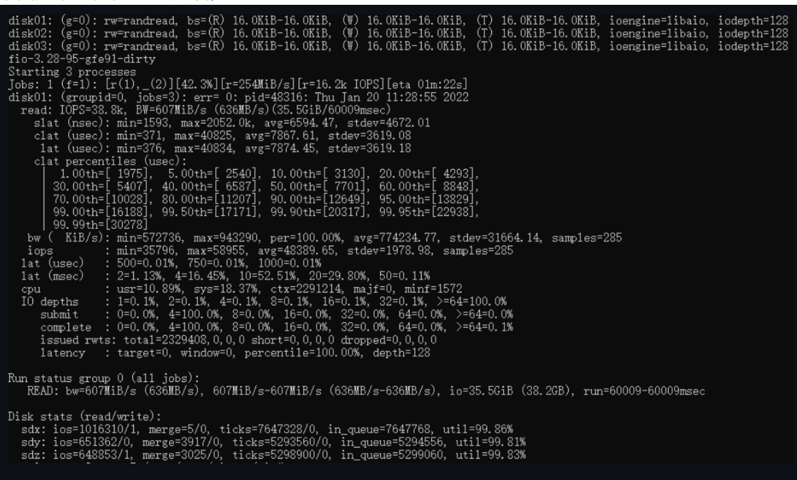
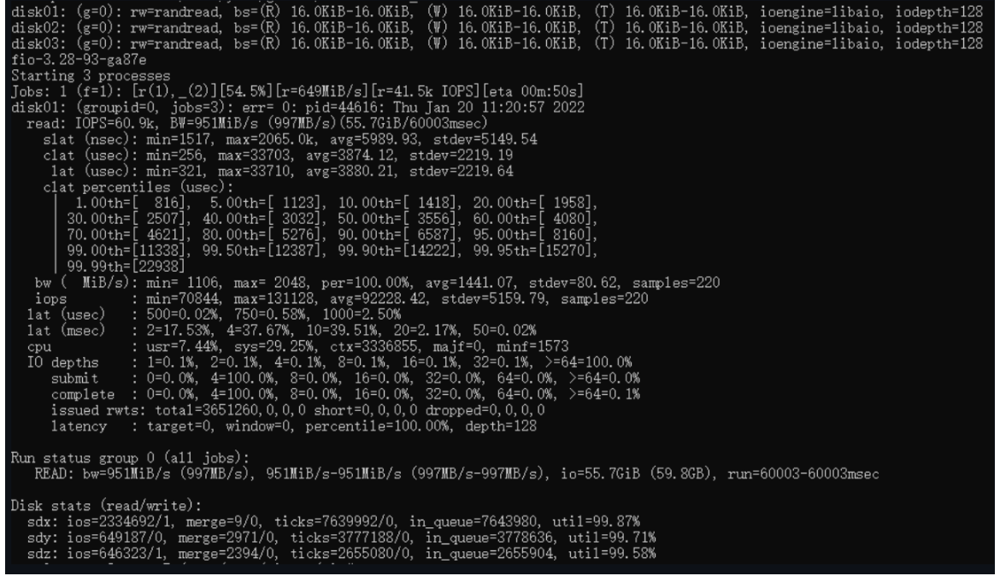

# 前言
Curve 是云原生计算基金会 (CNCF) Sandbox 项目，同时提供分布式块存储以及分布式文件存储能力。

为了让大家更容易使用以及了解Curve，我们期望接下来通过系列应用实践文章，以专题的形势向大家展示Curve。

本篇文章是Curve块存储应用实践的第一篇，该系列文章包括:

- Curve块存储应用实践一部曲之iscsi
- Curve块存储应用实践二部曲之nbd
- Curve块存储应用实践三部曲之云主机(OpenStack)
- Curve块存储应用实践四部曲之云原生数据库
- Curve块存储应用实践五部曲之性能调优


# iscsi以及tgt的简介

`tgt`是一个开源`iscsi`服务器，详情请见[tgt github](https://github.com/fujita/tgt)。我们在开发Curve块设备服务器时，想让更多的系统能够使用Curve块设备，而不仅仅是Linux系统，iscsi协议是一个广泛使用的块设备协议，我们想修改tgt以便让Curve提供iscsi服务。

# curve块存储结合iscsi

为tgt提供了访问curve的驱动，详见[部署网络高性能版本tgt](https://github.com/opencurve/curveadm/wiki/curve-tgt-deployment#%E7%AC%AC-4-%E6%AD%A5%E5%90%AF%E5%8A%A8-tgtd-%E5%AE%88%E6%8A%A4%E8%BF%9B%E7%A8%8B)或者
[doc/README.curve](https://github.com/opencurve/curve-tgt/tree/master/doc)
， 文档里有操作步骤，这样用户就可以在任何支持iscsi的操作系统上使用curve块设备存储，例如Windows。
# curve使用tgt时遇到的问题

我们观察到原版tgt使用单一主线程epoll来处理iscsi命令，还包括管理平面的`unix domian socket`也在这个主线程里。在10 Gbit/s网络上甚至更快的网络上，单线程（也即单cpu）处理iscsi命令的速度已经跟不上需要了，一个线程对付多个target的情况下，多个`ISCSI Initiator`的请求速度稍微高一点，这个单线程的cpu使用率就100%忙碌。

所以本文的重点就是介绍tgt的性能优化。同时社区用户使用过程中还遇到了nebd服务的单点和性能问题，社区用户对此耶进行了优化，详情可参考[创云融达：基于Curve块存储的超融合场景实践](https://github.com/ilixiaocui/curve-meetup-slides/blob/4cc2f0657c7fd74b27097751e018b478c13d64fd/PrePaper/2022/1117-%E5%88%9B%E4%BA%91%E8%9E%8D%E8%BE%BE%EF%BC%9A%E5%9F%BA%E4%BA%8ECurve%E5%9D%97%E5%AD%98%E5%82%A8%E7%9A%84%E8%B6%85%E8%9E%8D%E5%90%88%E5%9C%BA%E6%99%AF%E5%AE%9E%E8%B7%B5.md)

# curve对tgt的性能优化实践

## 使用多个线程做epoll

实现多个event loop线程，每个线程负责一定数量的socket connection上的iscsi命令处理。 这样就能发挥多cpu的处理能力。

## 为每个target创建一个epoll线程

为了避免多个target共享一个epoll时依然可能出现超过单个cpu处理能力的问题，我们为每一个 target设置了一个epoll线程。target epoll的cpu使用由OS负责调度，这样在各target上可以 实现公平的cpu使用。当然如果网络速度再快，依然会出现单个epoll线程处理不过来一个iscsi target上的请求，但是目前这个方案依然是我们能做的最好方案。

## 管理平面

管理平面保持了与原始tgt的兼容性。从命令行使用方面来说，没有任何区别，没有任何修改。管理平面在程序的主线程上提供服务，主线程也是一个epoll loop线程，这与原始的tgt没有区别，它负责`target, lun, login/logout,discover，session, connection`等的管理。当Intiator连接到ISCSI服务器时，总是先被管理平面线程所服务，如果该connection最后需要创建session去访问某个target，那么该connection会被迁移到对应的target的epoll线程上去。

## 数据结构的锁

为每一个target提供一个mutex，当target epoll线程在运行时，这把锁是被该线程锁住的，这样该线程可以任意结束一个sesssion或connection，当线程进入epoll_wait时，这把锁是释放了的，epoll_wait返回时又会锁住这把锁。我们修改了相关代码，让这个epoll线程不用遍历target list，只存取它服务的target相关结构，这样我们不需要target列表锁。管理面也会增加、删除一个session或者connection时，也需要锁住这把target锁。所以管理面和target epoll线程使用这个mutex来互斥，这样就可以安全地访问对应target上的session和connection了。

## connection建立session

当login_finish成功时，login_finish有时候会创建session(如果没有session存在)。login_finish在connection结构的字段migrate_to里设置目标iscsi target。

## connection加入到session

通常一个新的连接产生一个新的session，就如上面讲的login_finish一样。但是有一种情况，iscsi允许一个session里有多个连接，这样connection直接加入到这个session里，这是由login_security_done做的。

## 什么时候做connection迁移

当调用返回到iscsi_tcp_event_handler时，因为login_finish设置了migrate_to目标target, iscsi_tcp_event_handler就锁住目标iscsi target结构，并把该connection的fd插入到目标target的evloop 里面，完成迁移。

## 设置pthread name

设置各target event loop的线程在top中的名为tgt/n, n为target id，这样容易用top之类的工具观察哪一个target占用的cpu高。

## 一个实现例子

假如ＭＧＭＴ要删除一个target，下面的代码说明了流程：

```
/* called by mgmt */
tgtadm_err tgt_target_destroy(int lld_no, int tid, int force)
{
        struct target *target;
        struct acl_entry *acl, *tmp;
        struct iqn_acl_entry *iqn_acl, *tmp1;
        struct scsi_lu *lu;
        tgtadm_err adm_err;

        eprintf("target destroy\n");

        /*
         * 这里因为控制面是单线程的，而且ＳＣＳＩ　ＩＯ线程不会删除target，
         * 所以我们找target的时候并不需要锁
         */

        target = target_lookup(tid);                                  
        if (!target)                                            
                return TGTADM_NO_TARGET;

        /*
         * 这里要锁住target，因为我们要删除数据结构，所以不能和iscsi io
         * 线程一起共享，必须在scsi 线程释放了锁时进行
         */

        target_lock(target);                                            
        if (!force && !list_empty(&target->it_nexus_list)) {
                eprintf("target %d still has it nexus\n", tid);
                target_unlock(target);                 
                return TGTADM_TARGET_ACTIVE;
        }        
 …
        /* 以上步骤删除了所有资源 ，可以释放锁了 */
        target_unlock(target);                                               
        if (target->evloop != main_evloop) {
                /* 通知target上的evloop停止，并等待evloop 线程退出 */
                tgt_event_stop(target->evloop);                         
                if (target->ev_td != 0)                                 
                        pthread_join(target->ev_td, NULL);
                /*　下面把evloop的资源删除干净 */
                work_timer_stop(target->evloop);                      
                lld_fini_evloop(target->evloop);
                tgt_destroy_evloop(target->evloop);
       }
```


# 性能优化(结果)

我们为tgt配置了3块盘，一块curvebs卷，两块本地盘

```

 <target iqn.2019-04.com.example:curve.img01>
    backing-store cbd:pool//iscsi_test_
    bs-type curve
</target>

<target iqn.2019-04.com.example:local.img01>
    backing-store /dev/sde
</target>

<target iqn.2019-04.com.example:local.img02>
    backing-store /dev/sdc
</target>
```

使用本机登录iscsi
iscsiadm --mode node --portal 127.0.0.1:3260 --login

为fio设置存取这些iscsi的块设备，使用


```
[global]
rw=randread
direct=1
iodepth=128
ioengine=aio
bsrange=16k-16k
runtime=60
group_reporting

[disk01]
filename=/dev/sdx

[disk02]
filename=/dev/sdy
size=10G

[disk03]
filename=/dev/sdz
size=10G
```

测试成绩如下：

下面是未经优化的fio成绩，IOPS 38.8K


下面是经过多线程优化的fio成绩，IOPS 60.9K




