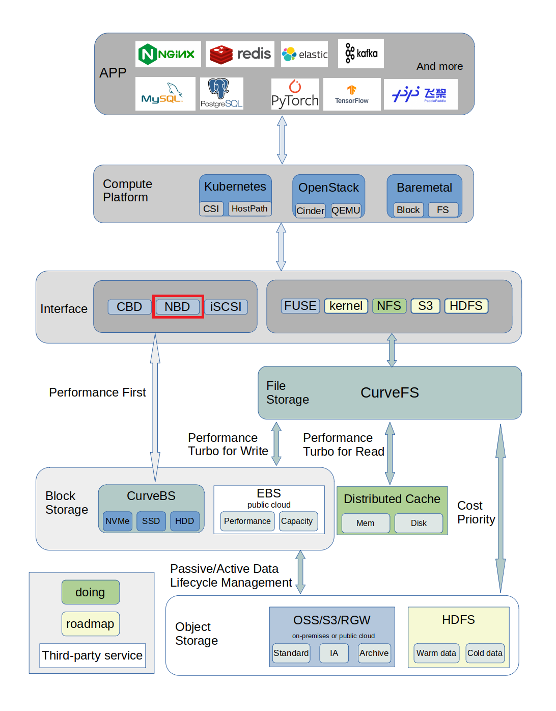
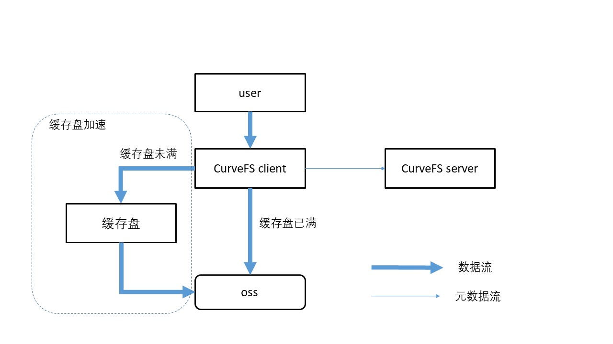
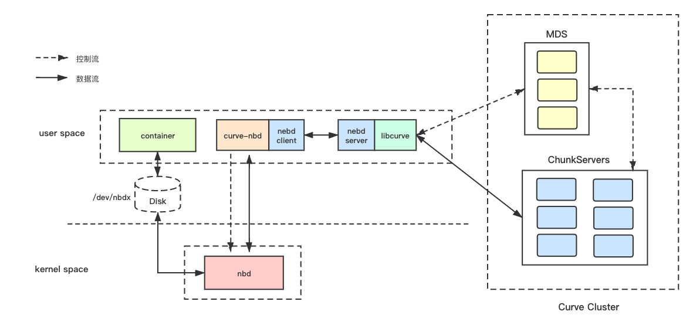

# Curve块存储应用实践之nbd

## 前言

Curve 是云原生计算基金会 (CNCF) Sandbox 项目，同时提供分布式块存储以及分布式文件存储能力。

为了让大家更容易使用以及了解Curve，我们期望接下来通过系列应用实践文章，以专题的形势向大家展示Curve。

本篇文章是Curve块存储应用实践的第二篇，该系列文章包括:

- Curve块存储应用实践一部曲之iscsi
- Curve块存储应用实践二部曲之nbd
- Curve块存储应用实践三部曲之云主机(OpenStack)
- Curve块存储应用实践四部曲之云原生数据库
- Curve块存储应用实践五部曲之性能调优

## 什么是NBD

NBD (Network Block Device) 是一种网络块设备，它允许用户将远程块设备映射到本地块设备，从而实现对远程块设备的访问。

Curve块存储支持NBD协议，通过NBD技术可以把Curve块设备映射到本地，直接提供本地裸设备的形式进行使用。



映射到本地的Curve块设备以裸盘的形式存在，映射到/dev目录下，格式为/dev/nbdxxx，如/dev/nbd0。可以直接使用/dev/nbdxxx，或者把/dev/nbdxxx设备格式化为文件系统，挂载到目录上使用。

比如：

在K8S场景中，curve nbd可以作为K8S的本地存储，提供给K8S的pod使用。

在Curve文件存储支持AI训练的使用场景中，使用格式化为fs的curve nbd设备，作为作为的Curve文件系统的缓存盘。在训练节点上，同时挂载一个Curve文件系统和一个Curve块设备。Curve块设备使用nbd的方式挂载到训练机器上，然后把nbd格式化为ext4文件系统，mount到指定的路径。Curve文件系统在挂载的时候，指定这个路径作为的缓存盘路径。在AI训练机器不能增加一个物理设备作为缓存盘的时候，就可以利用这种方式，对Curve文件系统进行加速。



## Curve块存储NBD的实现

Curve块存储的nbd模块，由于license不兼容的原因，curve nbd的代码和curve的代码拆分到了两个库。

curve nbd采用GPL license，代码在[https://github.com/opencurve/curve-nbd](https://github.com/opencurve/curve-nbd)。

curve采用Apache-2.0 license，代码在[https://github.com/opencurve/curve](https://github.com/opencurve/curve)。

### curve-nbd的架构

整体架构如下图。



curve nbd通过内核nbd模块在本地映射一个块设备；同时在用户态进程会起一个进程，通过socketpair和nbd内核进行数据传输。

curve nbd负责从nbd的内核缓存中获取用户的操作请求，并转发到Curve进行处理；处理完成以后，再将处理结果写回到nbd的内核缓存，由nbd返回给用户。

把Curve的块设备映射到本机后，/dev目录下就会增加一个以nbd开头的设备，比如/dev/nbd0。对这个/dev/nbd0就可以像操作本地的块设备一样操作。对这个/dev/nbd0的操作，会交给内核的nbd模块进行处理。然后curve nbd接收来自内核中nbd的请求，然后调用Curve sdk向Curve块存储集群发送请求。

### curve-nbd的热升级

curve-nbd使用Curve client向Curve块存储集群发送请求，Curve client是以链接库的形式提供给curve-nbd使用的，在Curve client需要升级的时候，需要对curve-nbd进行重启。curve-nbd重启会影响到使用该nbd设备的上层业务。

为了减少Curve升级对上层业务的一影响，我们对上层应用与Curve Client的耦合关系进行拆分，在两者之间加入了热升级模块**NEBD**。

NEBD采用client/server的架构。

* NEBD Client：即part1，对应上层业务，包括Qemu/Curve-NBD；通过Unix Domain Socket的方式连接到指定的NEBD Server。
* NEBD Server：即part2，负责接收part1的请求，并调用Curve Client进行相应处理；part2可以接收多个不同NEBD Client的请求。

part1取代了Curve Client直接与上层业务对接。这种情况下，part1的升级也会影响上层业务，所以在设计中，尽量减少了part1的处理逻辑，只进行请求转发，以及有限的重试逻辑。这样part1的处理逻辑尽可能简单，尽量做到不需要升级part1。

NEBD的详细内容，可参考文档Curve github下的[Curve NEBD介绍](https://github.com/opencurve/curve/blob/master/docs/cn/nebd.md)。

虽然NEBD可以减少Curve升级对上层业务的影响，但是毕竟是增加了一层转发，延长了IO路径，所以在性能上会有一定的损耗。当前Curve的版本还在快速迭代中，将来等到Curve稳定之后，可以考虑去掉NEBD，直接使用Client SDK与上层业务对接。

## Curve块存储NBD的使用

curve-nbd的使用集成到了CurveAdm工具中，CurveAdm工具的使用可参考文档[CurveAdm使用文档](https://github.com/opencurve/curveadm/wiki/overview)。

CurveAdm工具提供了curve-nbd的挂载、卸载、查看功能。

Curve块存储的部署参考文档[Curve块存储部署文档](https://github.com/opencurve/curveadm/wiki/curvebs-cluster-deployment)。

做好前期准备工作之后，使用CurveAdm挂载curve nbd设备。

以下操作都在CurveAdm中控机上进行。可以挂载、卸载curve nbd设备到指定的host，也可查询集群中所有的nbd设备。

### 映射curve nbd设备到指定的host

```bash
curveadm map <volume-user>:<volume-name> --host <host> -c client.yaml --create --size 10GB
```

参数说明：

- \<volume-user>: 该卷所属用户名，用户可自行定义
- \<volume-name>: 卷名，用户可自行定义
- --host: 将卷挂载到指定主机，用户可自行选择，请确保该主机已被导入
- --create：当卷不存在时，则自行创建
- --size: 指定创建卷的大小，默认为 10GB
- -c: 指定客户端配置文件

当用户映射卷成功后，在相应的host上即能看到 CurveBS 卷对应的 nbd 设备：

```bash
lsblk | grep nbd
```

使用注意事项：

- 用户名中不能带有下划线_
- 卷名必须以 / 为起始，如 /test、/volume，并且只能有单级目录
- 目前卷大小只支持以 10GB 为最小单位，即创建的卷大小只能是 10GB、20GB、30GB...，依此类推
- 我们以 <用户名>:<卷名> 作为键来存储卷的相关信息，请勿挂载相同的卷

### 卸载curve nbd设备

```bash
curveadm unmap <user>:<volume-name> --host <host>
```

### 查询curve nbd设备

```bash
curveadm client status
```

```
Get Client Status: [OK]

Id            Kind     Host          Container Id  Status       Aux Info
--            ----     ----          ------------  ------       --------
362d538778ad  curvebs  client-host1  cfa00fd01ae8  Up 36 hours  {"user":"curve","volume":"/test1"}
b0d56cfaad14  curvebs  client-host2  c0301eff2af0  Up 36 hours  {"user":"curve","volume":"/test2"}
c700e1f6acab  curvebs  client-host3  52554173a54f  Up 36 hours  {"user":"curve","volume":"/test3"}
```
