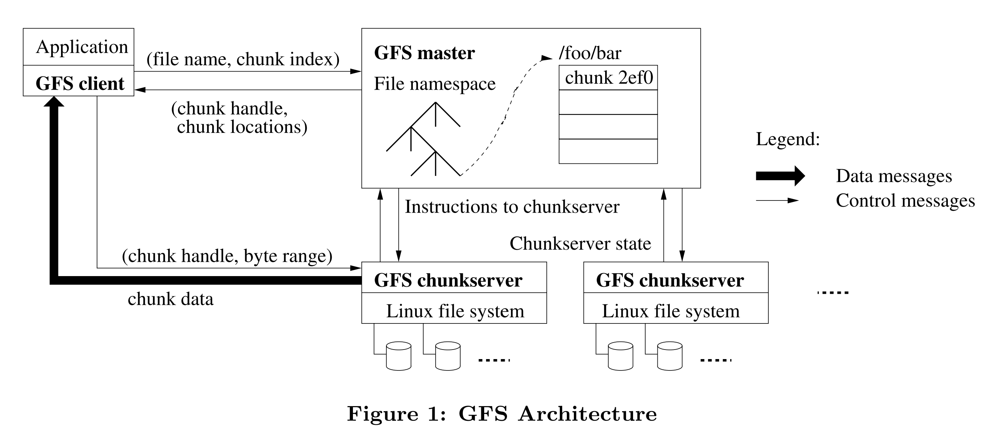

# Curve存储系统中的curvefs

## 两个curvefs？

在Curve存储中，有两个地方出现了curvefs。一个是在Curve块存储中，是Curve块存储的mds服务的一个模块，用来组织管理Curve块存储中的卷。另一个是Curve文件存储的名字。新接触Curve的人可能会有些困惑，这两个curvefs是什么关系？

其实这两个没有什么关系，只是名字相同而已。而名字相同的原因是，一开始Curve先做了块存储，块存储管理卷的方式采用了类似于文件系统管理文件的方式，使用目录和文件的层级结构管理系统中的所有的卷，所以这个管理卷的模块就被命名为curvefs。后来Curve又做了文件存储，文件存储的名字也叫curvefs，所以就有了两个curvefs。这里主要介绍的是Curve块存储中的curvefs。

## Curve块存储中的curvefs

下图是GFS的架构图，Curve使用了类似于GFS一样的namespace管理方式。不过这里Curve的每个file都是一个卷，而GFS的每个file是一个文件。

Curve块存储操作每个卷就像操作一个文件。每个卷都是从根目录开始的一个路径，比如`/test`就是一个卷。Curve块存储的卷必须是从根目录开始的路径，不能是相对路径，也不支持`..`和`.`。Curve块存储的卷的路径是唯一的，不能有重复的路径。

为了方便管理卷，curvefs有一个目录树的结构，每个目录下可以有多个子目录。

### Curve块设备的目录树

Curve块存储的卷是通过目录树的方式管理的。每个目录下可以有多个子目录，每个子目录下也可以有多个子目录，以此类推。卷属于某个目录。

目录树的根目录是`/`，根目录下可以有多个子目录，比如下图的`/home`，`/tmp`等等。每个子目录下也可以有多个子目录，比如下图的`/home/dir1`，`/home/dir2`等等。以此类推。

目录`/home/dir1`下有卷`/home/dir1/filex`，目录`/home/dir2`下有卷`/home/dir2/filey`，目录`/home`下有卷`/home/filez`。

Curve不支持自动创建目录，必须先创建这个目录，然后再在这个目录下创建卷。比如要创建卷`/home/dir1/filex`，必须先创建目录`/home/dir1`，然后再在`/home/dir1`下创建卷`/home/dir1/filex`。不少用户在第一次使用curve的时候，会忘记先创建目录，然后再在目录下创建卷，这样就会报错。

### Curve块设备的卷的管理

Curve可以对一个目录进行增删改查的操作。比如创建目录，删除目录，重命名目录，查看目录下的子目录等等。

也可以对一个卷进行增删改查的操作。比如创建卷，删除卷，重命名卷，扩容卷，查看卷的信息等等。

当前有两个工具，一个是[Curve块设备的curve_ops_tool](https://github.com/opencurve/curve/blob/master/docs/cn/curve_ops_tool.md)，不过这个工具只能对卷进行增删改查的操作，不能对目录树进行增删改查的操做。

另一个是[Curve块设备的curve工具](https://github.com/opencurve/curve/blob/master/docs/cn/curve%E5%B7%A5%E5%85%B7.md)，这个工具可以对目录进行增删改查的操作，也可以对卷进行增删改查的操作。

如果是使用curveadm工具通过docker方式部署的Curve块设备集群，由于打包curve镜像的时候遗漏了curve工具，所以暂时还不能创建目录，只能通过curve_ops_tool工具创建卷。我们正在修复这个问题。可以暂时只创建一级目录的卷来规避这个问题。

后续会把Curve存储系统中，块存储和文件存储的运维管理工具都统一合并到一个新的[curve工具](https://github.com/opencurve/curve/blob/master/docs/cn/curve%E5%B7%A5%E5%85%B7.md)中。

### Curve块设备的卷的删除

Curve块存储的卷是可以删除的。但是经常有用户问我们，删除卷了之后，为什么空间看起来并没有被释放。这是因为Curve块存储为了避免数据被误删，开发了一个机制，叫做`回收站`。删除的卷会被放到回收站中，回收站中的卷可以被恢复，也可以被彻底删除。一个卷被删除之后，只是从原路径下删除了，但是卷的数据并没有被删除，而是被放到了回收站中。只有卷从回收站中被删除了，才会真正的释放空间。

去哪可以找到回收站呢？回收站的路径是`/RecycleBin`。所有被删除的卷都会挪到这个目录下。通过`curve_ops_tool list -fileName=/RecycleBin` 可以查看回收站中的卷。

回收站的卷不会自动删除，需要手动清理。可以通过`curve_ops_tool delete` 命令带上`-forcedelete=true`来删除回收站中的卷。也可以的通过`clean-recycle clean-recycle` 清理回收站中的所有的卷。

## Curve块设备的curvefs和操作系统的fs的关系

之前也有用户问我们，Curve块存储系统的卷的路径和操作系统的fs有什么关系呢？

其实这两个没有关系，Curve的卷的路径只是记录在Curve系统中，方便Curve系统进行管理。通过Curve的工具在Curve块设备的curvefs中创建的目录和卷，并不会体现在操作系统的fs中。Curve块设备的curvefs和操作系统的fs是两个不同的文件系统。

只有当Curve的卷通过nbd的方式map到操作系统中，或者通过iscsi/target的的方式挂载到操作系统上。Curve的卷才会和操作系统的fs发生联系。

通过nbd方式挂载的curve卷，通过lsblk就可以看到系统中多了一个/dev/nbdxxx的设备。操作文档可参考[curvebs-client-deployment](https://github.com/opencurve/curveadm/wiki/curvebs-client-deployment)

通过iscsi/target方式挂载的curve卷，通过lsblk就可以看到系统中多了一个/dev/sdxxx的设备。操作文档可参考[curve tgt deployment](https://github.com/opencurve/curveadm/wiki/curve-tgt-deployment#%E7%AC%AC-4-%E6%AD%A5%E5%90%AF%E5%8A%A8-tgtd-%E5%AE%88%E6%8A%A4%E8%BF%9B%E7%A8%8B)

## 总结

这里介绍了Curve块存储的一些常见的用户在使用中问到的问题，希望能够帮助到大家。如果大家在使用中有什么问题，可以在github上提issue，或者在微信群里提问。我们会尽快的回复大家。