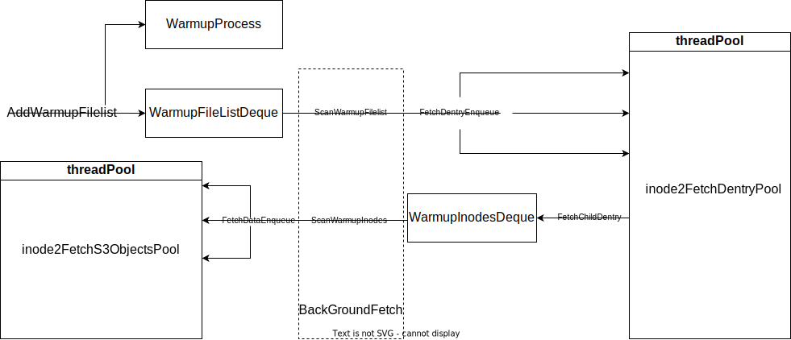

# curvefs client warmupManager 实现

- [curvefs client warmupManager 实现](#curvefs-client-warmupmanager-实现)
  - [curvefs client Warmup 介绍](#curvefs-client-warmup-介绍)
    - [curvefs client WarmupManager 需求](#curvefs-client-warmupmanager-需求)
  - [curve 预热流程分析](#curve-预热流程分析)
    - [列表文件预热流程](#列表文件预热流程)
  - [curve warmup manager](#curve-warmup-manager)
    - [新增数据结构](#新增数据结构)
    - [整体方案](#整体方案)
      - [修改后的预热流程](#修改后的预热流程)

## curvefs client Warmup 介绍

Curvefs 的数据存储在云端(S3或者CurveBS)。由于云端下载速度的局限性，在读取大量文件或大文件时会耗费较长时间。
在 Ai 等场景下，训练前需要先读取大量的文件，如果这些文件此时都存储在云端，要实时去读取的话，势必会耗费大量的时间。
因此在这些场景下，期望能够预先把需要的文件预读到本地。

### curvefs client WarmupManager 需求

Curvefs client WarmupManager 需要实现以下功能：

1. 添加 warmup 任务。首先必须要实现 warmup 任务的添加。
   预热任务分为：单预热任务和多预热任务。单预热任务指的是预热单文件或单目录；多预热指的是根据制定的文件内容预热一系列的文件。
2. 查找 warmup 任务。查找预热任务，给出指定预热任务的进度。
3. 停止 warmup 任务。顾名思义，停止指定的预热任务。
4. 列出 warnup 任务。列出所有的预热任务。

## curve 预热流程分析

目前 curvefs client 已经实现 warmup 功能，如果要实现 warmupManager 的功能需要分析目前实现的 warmup 的流程。

单个文件的预热与解析预热列表文件后预热列表文件中的单文件流程一样，因此在这里仅分析预热列表文件的预热流程

### 列表文件预热流程

step.1 工具将预热的方式和预热的目录以设置xattr的形式提供给client，client调用PutWarmTask 来预热预热列表文件；

```c++
switch (curvefs::client::common::GetWarmupType(type)) {
    case curvefs::client::common::WarmupType::kWarmupTypeList:
        g_ClientInstance->PutWarmTask(path);
        break;
    ...
}
```

step.2 PutWarmTask 将预热列表文件加入预热任务队列，并唤醒扫描队列（warmUpRun）

```c++
std::unique_lock<std::mutex> lck(warmUpTaskMtx_);
warmUpTasks_.push_back(warmUpTask);
WarmUpRun();
```

strp.3 FuseClient::WarmUpTask() 会扫描warmupTask队列，当存在warmUpTask时，会从中取出一个warmUpTask，并获取warmUpTask的inodeid、len，并保存到warmUpFile队列中；

```c++
while (hasWarmTask()) {
    std::string warmUpTask;
    GetwarmTask(&warmUpTask);
    ...
    Dentry dentry;
    CURVEFS_ERROR ret = dentryManager_->GetDentry(
      fsInfo_->rootinodeid(), pToken, &dentry);
   ...
    fuse_ino_t  ino = dentry.inodeid();
    std::shared_ptr<InodeWrapper> inodeWrapper;
    ret = inodeManager_->GetInode(ino, inodeWrapper);
   ...
    uint64_t len = inodeWrapper->GetLength();
    WarmUpFileContext_t warmUpFile{ino, len, true};
    SetWarmUpFile(warmUpFile);
}
```

step.4. FuseS3Client::BackGroundFetch() 后台扫描warmUpFile队列。如果存在预热文件任务，则取出预热列表文件并根据文件内容解析出预热文件列表warmUpFilelist。
然后按照预热文件列表依次添加获取文件dentry（FetchDentryEnqueue）队列；

```c++
void FuseS3Client::BackGroundFetch() {
    while (!bgFetchStop_.load(std::memory_order_acquire)) {
        if (hasWarmUpTask()) {  // new warmup task
            WarmUpFileContext_t warmUpFile;
            GetWarmUpFile(&warmUpFile);

            std::vector<std::string> warmUpFilelist;
            GetWarmUpFileList(warmUpFile, warmUpFilelist);
            for (auto filePath : warmUpFilelist) {
                FetchDentryEnqueue(filePath);
            }
        }
        {   // file need warmup
            std::list<fuse_ino_t> readAheadFiles;
            readAheadFiles.swap(GetReadAheadFiles());
            for (auto iter : readAheadFiles) {
                fetchDataEnqueue(iter);
            }
        }
        usleep(WARMUP_CHECKINTERVAL_US);
    }
    return;
}
```

step.5 FetchDentryEnqueue 在线程池中添加LookPath线程（根据文件路径解析出inodeid）；
step.6 LookPath 根据文件路径按照文件的类型以以下的方式获取文件的dentry；

1. 根（/）：FetchChildDentryEnqueue
2. 根目录的子目录 FetchDentry
3. 其他 FetchDentry

```c++
if (splitPath.size() == 1 && isRoot) {
    FetchChildDentryEnqueue(fsInfo_->rootinodeid());
    return;
} else if (splitPath.size() == 1) {
    this->FetchDentry(fsInfo_->rootinodeid(), splitPath[0]);
    return;
} else if (splitPath.size() > 1) {  // travel path
    splitPath.pop_back();
    fuse_ino_t ino = fsInfo_->rootinodeid();
    for (auto iter : splitPath) {
        Dentry dentry;
        std::string pathName = iter;
        CURVEFS_ERROR ret = dentryManager_->GetDentry(
          ino, pathName, &dentry);
        if (ret != CURVEFS_ERROR::OK) {
            ...
            return;
        }
        ino = dentry.inodeid();
    }
    this->FetchDentry(ino, lastName);
    return;
}
```

step.7 FetchDentry 根据上一级路径的inodeid 和 文件名 获取文件的dentry，然后根据文件的文件的类型执行以下操作：

1. 目录 执行FetchChildDentryEnqueue
2. s3文件 将inodeid 添加到 readAheadFiles_

```c++
CURVEFS_ERROR ret = dentryManager_->GetDentry(ino, file, &dentry);
...
if (FsFileType::TYPE_S3 == dentry.type()) {
    std::unique_lock<std::mutex> lck(fetchMtx_);
    readAheadFiles_.push_front(dentry.inodeid());
    return;
} else if (FsFileType::TYPE_DIRECTORY == dentry.type()) {
    FetchChildDentryEnqueue(dentry.inodeid());
    return;

}
```

step.8 FetchChildDentryEnqueue 添加扫描目录下dentry的子任务（FetchChildDentry）；
step.9 FetchChildDentry 获取当前dentry下的所有dentry，然后根据类型：

1. 目录 执行FetchChildDentryEnqueue
2. s3 将inodeid 添加到 readAheadFiles_

```c++
CURVEFS_ERROR ret = dentryManager_->ListDentry(
      ino, &dentryList, limit);
...
for (auto iter : dentryList) {
    if (FsFileType::TYPE_S3 == iter.type()) {
        std::unique_lock<std::mutex> lck(fetchMtx_);
        readAheadFiles_.push_front(iter.inodeid());
    } else if (FsFileType::TYPE_DIRECTORY == iter.type()) {
        FetchChildDentryEnqueue(iter.inodeid());
    } 
    ...
}
```

step.10 根据上述流程可以看到：整个预热的流程就是将要预热文件的 inode 加入 readAheadFiles_中，
而 readAheadFiles_ 会在 step.4 中的下述代码中将inode转化为数据预热队列（fetchDataEnqueue）。

```c++
std::list<fuse_ino_t> readAheadFiles;
readAheadFiles.swap(GetReadAheadFiles());
for (auto iter : readAheadFiles) {
        fetchDataEnqueue(iter);
}    
```

step.11 fetchDataEnqueue 创建遍历文件 inode 所有 s3InfoMap (travelChunks) 的 task 并加入线程池；

```c++
auto task = [this, ino]() {
        std::shared_ptr<InodeWrapper> inodeWrapper;
        CURVEFS_ERROR ret = inodeManager_->GetInode(ino, inodeWrapper);
        ...
        google::protobuf::Map<uint64_t, S3ChunkInfoList> *s3ChunkInfoMap
          = nullptr;
        {
            ::curve::common::UniqueLock lgGuard = inodeWrapper->GetUniqueLock();
            s3ChunkInfoMap = inodeWrapper->GetChunkInfoMap();
        }
        if (nullptr == s3ChunkInfoMap ||
          s3ChunkInfoMap->empty()) {
            return;
        }
        travelChunks(ino, s3ChunkInfoMap);
    };
GetTaskFetchPool().Enqueue(task);
```

step.12 travelChunks 使用 travelChunk 遍历 s3ChunkInfoMap 获取要预热的s3对象列表(prefetchObjs)，然后使用 WarmUpAllObjs 预热这些对象。

```c++
for (auto &iter : *s3ChunkInfoMap) {
    travelChunk(ino, iter.second, &prefetchObjs);
}
WarmUpAllObjs(prefetchObjs);
```

step.13 travelChunk 解析 chunkInfo 获取所有的s3对象名称及其长度。
step.14 WarmUpAllObjs 添加下载任务，并过滤掉已经下载的s3对象。

```c++
GetObjectAsyncCallBack cb =
    [&](const S3Adapter *adapter,
        const std::shared_ptr<GetObjectAsyncContext> &context) {
        if (context->retCode == 0) {
            int ret = s3Adaptor_->GetDiskCacheManager()->WriteReadDirect(
              context->key, context->buf, context->len);
           ...
            if (pendingReq.fetch_sub(1, std::memory_order_seq_cst) == 1) {
                cond.Signal();
            }
            delete []context->buf;
            return;
        }
        s3Adaptor_->GetS3Client()->DownloadAsync(context);
};
    
for (auto iter : prefetchObjs) {
    std::string name = iter.first;
    uint64_t readLen = iter.second;
    if (s3Adaptor_->GetDiskCacheManager()->IsCached(name)) {
        pendingReq.fetch_sub(1);
        continue;
    }
    char *cacheS3 = new char[readLen];
    memset(cacheS3, 0, readLen);
    auto context = std::make_shared<GetObjectAsyncContext>();
...
    s3Adaptor_->GetS3Client()->DownloadAsync(context);
}
```

## curve warmup manager

### 新增数据结构

为了完成上述的功能需要增加以下数据结构：

```c++
class WarmupFile { // 预热文件
    fuse_ino_t key_;
    uint64_t fileLen_;
};

using warmupFilelist = WarmupFile; // 预热列表文件。即文件中保存的是要预热的文件列表

class WarmupInodes {
    fuse_ino_t key_;
    std::set<fuse_ino_t> readAheadFiles_;
};

class WarmupObjs {
    fuse_ino_t key;
    std::list<std::pair<std::string, uint64_t>> prefetchObjs;
};

class WarmupProcess {
    uint64_t total;
    uint64_t done;
}

class WarmupManager {
    // warmup progress
    std::unordered_map<fuse_ino_t, std::shared_ptr<WarmupProgress>>
        inode2Progress_;
    BthreadRWLock inode2ProgressMutex_;

    std::deque<WarmupFilelist> warmupFilelistDeque_;
    mutable RWLock warmupFilelistDequeMutex_;

    std::unordered_map<fuse_ino_t, std::unique_ptr<ThreadPool>>
        inode2FetchDentryPool_;
    BthreadRWLock inode2FetchDentryPoolMutex_;

    std::deque<WarmupInodes> warmupInodesDeque_;
    mutable RWLock warmupInodesDequeMutex_;

    std::unordered_map<fuse_ino_t, std::unique_ptr<ThreadPool>>
        inode2FetchS3ObjectsPool_;
    BthreadRWLock inode2FetchS3ObjectsPoolMutex_;
};
```

### 整体方案

整体的预热流程维持原设计，对一些数据进行合并和拆分。

需要添加一个 warmupManager 类用于管理 warmup 的相关的内容，包括所有的中间数据、锁和方法。
并且为了便于查询和删除，所有的中间数据需要增加一个 key 来彼此区分，这个 key 设计为发起预热的 inodeid。

原有的线程池是随 client 一起创建的，所有的任务共享一个线程池，但是原来的线程池中无法得知线程池中任务的归属。
因此在删除预热任务时无法有针对性的取消任务：要么忽略线程池中正在执行的任务，要么等待线程池为空时再去取消后续的任务。
但是这两个方案都不可取：第一种会造成预热任务残留，残留的任务仍然会执行后续的任务；第二种要终止向线程池添加任务，并花费大量的时间来等待线程池的任务完成后再允许向线程池添加任务。
这两种方案都会导致执行无用任务，造成资源浪费。
为了解决这两个问题，线程池不能随着 client 或者 warmupManager 一起创建，而是一旦有相关的任务时临时添加，并且当任务结束时再删除对应的线程池。
因此线程池需要像数据结构一样需要一个key，以 key:threadPool 的形式保存（inode2FetchDentryPool_、inode2FetchS3ObjectsPool_）。
这个 key 也应该为发起预热的 inodeid ，需要删除时查询到对应的线程池，终止所有的任务，然后删除线程池。

warmup 最终获取的是 s3 对象，因此使用全部 s3 的数量和已经下载的 s3 对象的数量来代表预热的进度（WarmupProcess），同样使用 `inodeid` 作为 key 来查询预热进度。

综上，warmupMananger 需要以 inodeid 为 key 来区别不同的 warmup 中的中间数据、线程池等内容。
查找、增加、删除时通过查询发起预热任务的 inodeid 的方式来区分任务以及任务的进度（包括进行到的步骤、要下载 s3 对象的数量、已经下载 s3 对象的数量）。
已经下载的s3对象数量可以通过在回调函数 GetObjectAsyncCallBack 中添加对相应的数据结构的操作来实现。

#### 修改后的预热流程

和前文一样仅分析预热列表文件的预热流程。
首先添加预热任务进度。
如果已经存在预热任务进度表明对应的预热任务已经添加并且尚未执行完毕，因此跳过本次添加。
添加完成预热进度后获取预热列表文件的长度并添加到预热列表文件队列（warmupFilelistDeque_）中。
整体的流程如下图所示：


```c++
if (AddWarmupProcess(key)) {
        WriteLockGuard lock(warmupFilelistDequeMutex_);
        auto iter = FindKeyWarmupFilelistLocked(key);
        if (iter == warmupFilelistDeque_.end()) {
            std::shared_ptr<InodeWrapper> inodeWrapper;
            CURVEFS_ERROR ret = inodeManager_->GetInode(key, inodeWrapper);
            if (ret != CURVEFS_ERROR::OK) {
                return false;
            }
            uint64_t len = inodeWrapper->GetLength();
            warmupFilelistDeque_.emplace_back(key, len);
        }
    }
```

然后扫描线程（BackGroundFetch）中的 `ScanWarmupFilelist` 会扫描预热任务队列。
一旦存在预热任务，解析预热列表文件内容获取预热列表，然后使用 `FetchDentryEnqueue` 向线程池 `AddFetchDentryTask` 中添加解析 dentry 的任务 `LookPath`。

```c++
void WarmupManagerS3Impl::ScanWarmupFilelist() {
    WriteLockGuard lock(warmupFilelistDequeMutex_);
    if (!warmupFilelistDeque_.empty()) {
        WarmupFilelist warmupFilelist = warmupFilelistDeque_.front();
        std::vector<std::string> warmuplist;
        GetWarmupList(warmupFilelist, &warmuplist);
        for (auto filePath : warmuplist) {
            FetchDentryEnqueue(warmupFilelist.GetKey(), filePath);
        }
        warmupFilelistDeque_.pop_front();
    }
}

void WarmupManagerS3Impl::FetchDentryEnqueue(fuse_ino_t key,
                                             const std::string &file) {
    auto task = [this, key, file]() { LookPath(key, file); };
    AddFetchDentryTask(key, task);
}
```

LookPath 根据文件的类型分别向线程池分别添加 `FetchChildDentry` 和 `FetchDentry` 的任务。
 `FetchChildDentry` 和 `FetchDentry` 则会根据 dentry 的 类型递归调用 `FetchChildDentry` 和 `FetchDentry`，或文件类型为 `FsFileType::TYPE_S3` 类型时向 warmupInodesDeque_ 添加要预热文件的inodes。

```c++
if (FsFileType::TYPE_S3 == dentry.type()) {
    WriteLockGuard lock(warmupInodesDequeMutex_);
    auto iterDeque = FindKeyWarmupInodesLocked(key);
    if (iterDeque == warmupInodesDeque_.end()) {
        warmupInodesDeque_.emplace_back(
            key, std::set<fuse_ino_t>{dentry.inodeid()});
    } else {
        iterDeque->AddFileInode(dentry.inodeid());
    }
    return;
}
```

然后扫描线程（BackGroundFetch）中的 `ScanWarmupFiles` 会扫描预热任务队列，一旦发现有要预热文件的inode，使用 `FetchDataEnqueue` 来解析需要预热文件的s3对象。
后面预热的流程和解析 dentry 类似，不再赘述。
