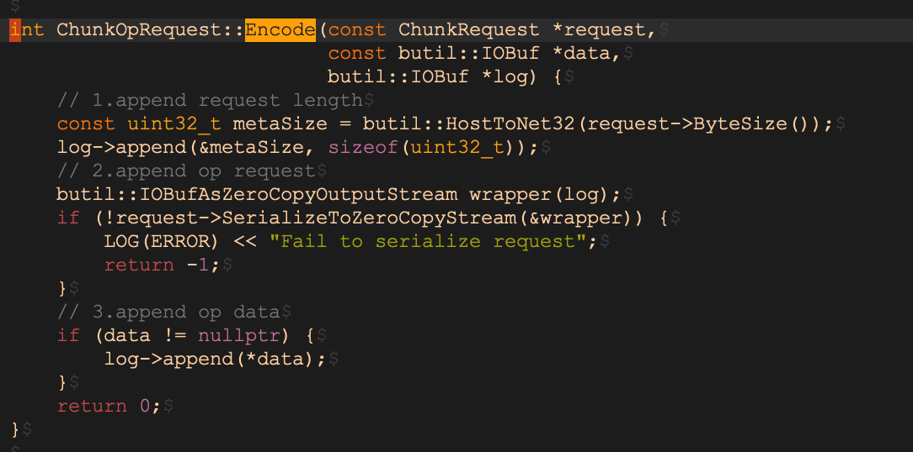
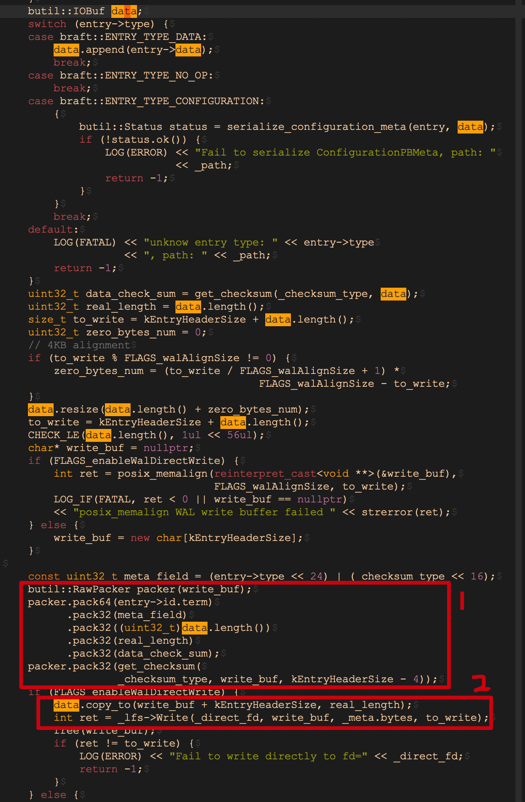
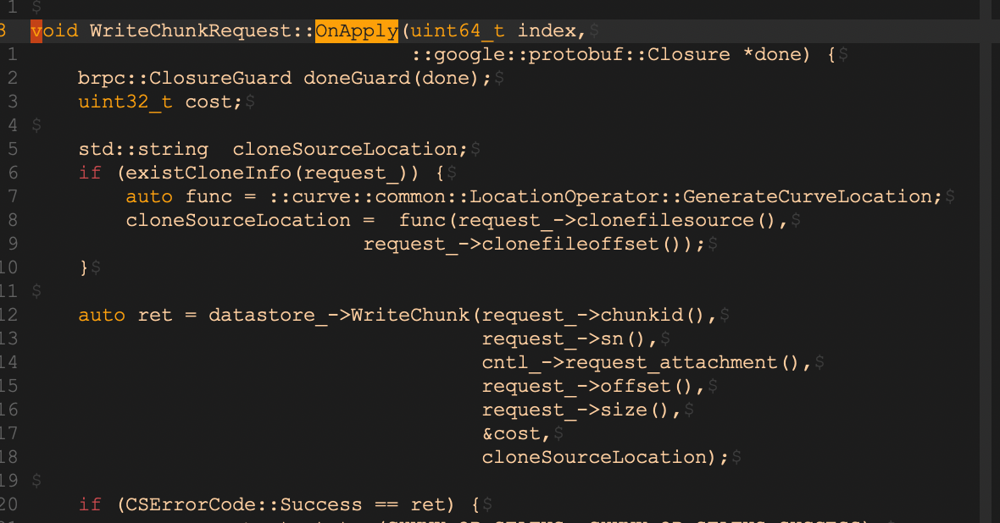
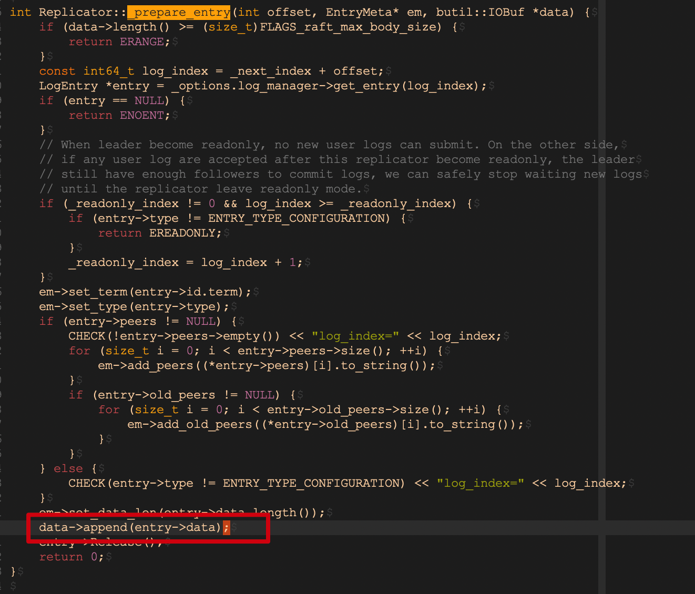
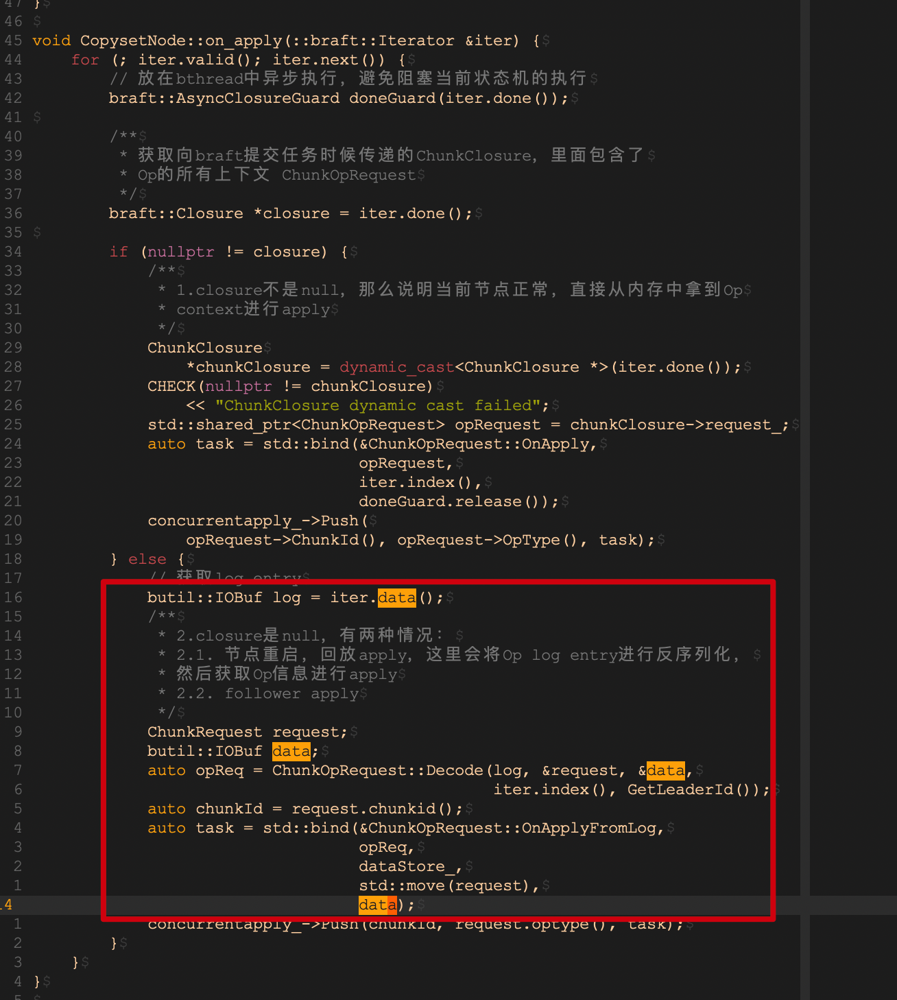
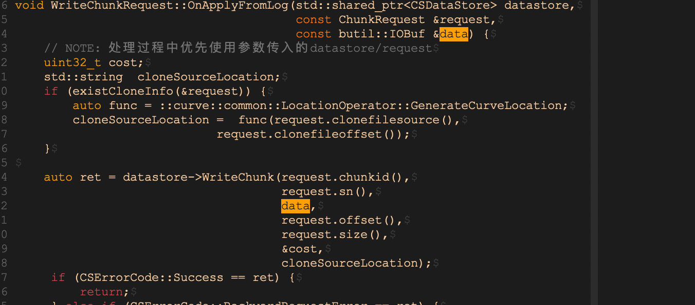
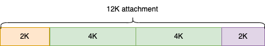
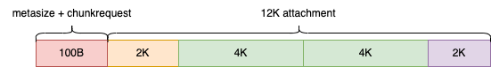
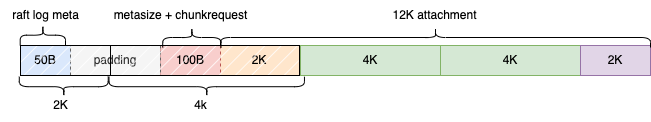

# Curve块存储IO链路零拷贝
## 背景
零拷贝技术是存储系统一个很常见的性能优化手段。理论上来说，CurveBS（Curve块存储）作为一个存储系统，在最优的情况下，CPU应当只参与逻辑的计算，而不应该去参与数据的拷贝。要实现这样的逻辑，意味着CurveBS后端chunkserver从网络收到的IO数据，可以直接写入磁盘，中间不经过任何的CPU数据拷贝。
当前CurveBS已经实现了基于RDMA技术的brpc进行网络传输，以及基于SPDK技术的PolarFS文件的系统作为底层存储引擎访问nvme磁盘，现在的目标就是要在这两者之间建立桥梁，使得这两者之间的中间过程，不需要进行任何CPU拷贝。

## Curve块存储IO链路零拷贝的实现
CurveBS实现零拷贝，使用RDMA技术从网卡将数据直接放入用户态内存，再使用brpc的IOBuf技术保证了在数据转移过程中的零拷贝，最后使用基于SPDK的PolarFS的DMA write接口，将用户态内存中的数据直接使用DMA技术落盘。这一过程，需要依赖对IOBuf中内存分配的精确控制，因为DMA接口对写buffer的内存对齐和len是有要求的。我们使用的nvme基于PRP，要使用的DMA writev接口，对iovec的内存必须满足：
-   iovec[0]的offset 4字节对齐，iovec[0]的末尾与page对齐；
-   后续的iovec项，要求整个page
-   最后的iovec项，要求以page起点开始，并且以整4字节长度对齐结束

此外，由于块设备的特性，对于非4k（或512）对齐的写，将产生read-merge-write，从而影响写性能，这也是要在整个写流程中避免的。

### Curve块存储的ChunkServer端IO路径
要解决上述问题，我们首先需要分析ChunkServer端IO路径上对brpc收下来的WriteRequest都做了下，数据是怎么转移最终落盘的。ChunkServer将使用brpc从网卡中接收数据并放入到用户态内存中，这一步骤在我们的改造brpc支持rdma代码中实现。这一过程中，brpc从网卡收到的数据分为三部分，分别是brpc框架相关的元数据，WriteRequest本身和包含数据的attachment。其中，brpc框架相关的元数据在brpc框架中就剥离了，我们最终需要落盘的是两部分数据: 一部分对WriteRequest和attachment编码后得到的raft WAL (write ahead log)；另一部分就是raft apply的数据，即attachment本身。这两部分落盘的数据都将需要作为零拷贝。

#### Leader的日志落盘路径

-   起点是brpc层接收到client的写请求之后，到达chunk service层，写请求的数据可以分为两部分，分别是ChunkRequest和cntl_->request_attachment()； 
-   在ChunkOpRequest将ChunkRequest和attachment部分，打包成raft log，提交raft node，其中核心的Encode部分代码如下：

-   Encode的逻辑： 首先添加一个4个字节的metasize字段，然后序列化ChunkRequest，之后将attachment拼接到最后；
-   raft log在raft log manager中最终交给CurveSegment调用CurveSegment::append(const braft::LogEntry* entry)执行日志落盘，其核心关键代码如下：  

-   落盘逻辑：首先调用posix_memalign分配4k 对齐的内存空间，之后将entry→id.term、 meta_field、data.length、real_length、data_check_sum等元数据打包在write_buf的头部，然后将先前的raft log拷贝到write_buf，最后调用_lfs->write落盘；  

可以看到最终的落盘的日志结构分为三部分

-   raft log meta
-   metasize + 序列化后的ChunkRequest
-   attachment 即数据部分

#### Leader的数据落盘路径

这部分关键代码：

这部分比较简单，可以看到数据落盘，落的就是cntl→request_attachment。

#### Follower的日志落盘路径

-   Follower端收到的attachment即上一节中Encode部分的日志
-   raft service将attachment取出后，调用logmanage中的CurveSegment::append(const braft::LogEntry* entry)执行日志落盘，这部分逻辑与leader日志落盘基本一致。

#### Follower的数据落盘路径

-   Follower端的数据落盘路径，首先会从raft service收到的raft log中Decode出ChunkRequest和data，这个data就是Leader收到的attachment相同的数据，这部分逻辑基本上是从IObuf中切割出ChunkRequest的过程；
-   之后，将调用datastrore层的WriteChunk，这部分与Leader一致；

### 实现零拷贝

要保证最终的日志落盘和数据落盘能够满足DMA write内存的对齐条件，需要我们在brpc收到网卡数据的第一时间，就将数据放到内存相应的对齐位置。只有这样，我们才能在后续不搬移（不拷贝）的情况下，使得最终需要落盘的数据满足内存对齐条件。因此，我们在修改基于rdma的brpc功能时，已经将brpc收到的数据attachment内存放到了满足DMA write内存对齐的位置。

Follower段的数据转移路径基本上与Leader段是相似的，下面我们以Leader日志落盘场景为例，讲解CurveBS如何做到最终的日志和数据的对齐，从而实现零拷贝。
以一个12K的IO为例:
（1） 前面讲到我们在brpc收到的attachment时已经将其对齐到page，我们读取数据是一个iovec，且满足page对齐，如下图：

（2）接下来是日志编码过程，这一步会拼接上metasize + 序列化后的ChunkRequest，比如100字节。这一部分是还将作为attachment发送到follower端，这部分长度需要保证被4整除，这样Follower端收到的attachment才能是4字节对齐的。

（3）之后，在日志落盘前，还会在其头部添加raft log 的meta，假设为50字节。在这里，我们还需要避免产生read-merge-write， 我们还需要将这个IO按照块（4k或512）对齐。因此，我们在中间添加了一段填充（0）。结果如下：

由于本身一开始的attachment就是对齐的，那么要保证最后的总长度是4k对齐的，那么就是要保证raft log meta + padding + (meta+chunkrequest) = 4K，这样最终的长度12K +4K = 16K 才是4K对齐的。因此，填充后的iovec头部，将产生2个项：

-   第一项是raft log meta + 部分padding；如图第一部分padding长度为2K-50B
-   第二项是部分padding +  (meta+chunkrequest)  + attachment的iovec[0]，一共是一个完整的4k block, 这部分的padding长度是2K-100B

从（2）到（3）的过程，不可避免地需要引入部分拷贝。绝对的零拷贝是很难做到的，如果为了实现绝对的零拷贝，提前将上述IO都做对齐，那么将引起内存分配上的大量空间浪费（因为需要对齐必然需要预留和填充）。在这里，我们需要拷贝的数据包括raft log meta + padding + (meta+chunkrequest) 和 attachment的iovec[0]，这只是总体数据的很小一部分，因此这样的拷贝是可接受。对于小内存，拷贝的消耗几乎可以忽略不计。

最后，再来看下另外三张场景：
- Follower的日志落盘： 与leader日志落盘基本是上一样的，唯一的区别是上述（2）中的meta+chunkrequest和 attachment的iovec[0]从follower收到rpc时就是一整块内存，在第（3）步重组iovec时，稍微有所区别。
- Leader的数据落盘：leader需要落盘的数据，就是rpc中收到的attachment，前面我们说到，在rpc接收时，我们已经做到了attachment的满足DMA write的内存对齐条件。
- Follower的数据落盘：follower端收到的attachment包含meta+chunkrequest和 leader的attachment数据，这里的区别就是一个从attachment切割下meta+chunkrequest的过程，我们只要保证meta+chunkrequest的长度能被4整除，那么剩余的需要落盘的数据部分，自然能保证4字节对齐的约束，因此也没有问题。

## 总结

本文介绍了CurveBS在基于RDMA技术的brpc进行网络传输，以及基于SPDK技术的PolarFS文件的系统作为底层存储引擎访问nvme磁盘的场景下，通过对CurveBS的IO链路进行分析，规划好IO链路上的数据搬移，尽可能减少数据的拷贝，使得CPU只参与控制逻辑，从而减少了CPU的占用，实现了零拷贝。
