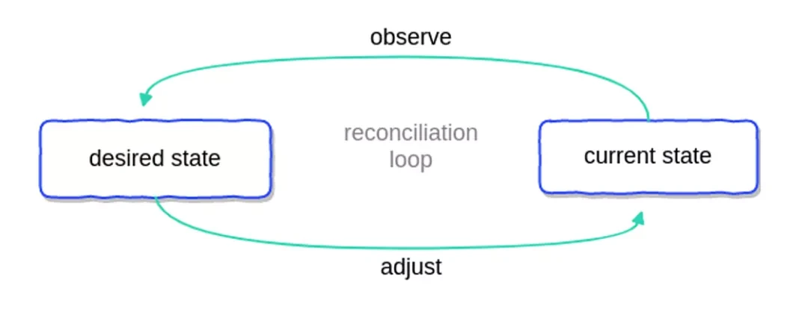

# Curve云原生部署思考

## 背景

当前，Curve还是主要以Docker容器的方式部署在物理机上运行，需要CurveAdm[1]工具进行部署和集群管理。为了进一步地云原生化，需要考虑将Curve集群部署在目前广泛使用的Kubernetes容器编排系统上。而且，Kubernetes 作为当前云原生的事实标准，我们也期望能够探索如何实现云和存储系统的深度结合，增强整个存储系统的稳定性和可伸缩性。

我们将以 Operator 模式实现 Curve 在 Kubernetes 环境下的管理和运维，从而实现对Curve集群的自动部署以及自动化运维能力，提高产品交付效率和交付水平。

## Operator模式

目前有状态应用在 Kubernetes 上主要通过 StatefulSet 进行管理，然而作为一个通用的有状态应用抽象，StatefulSet 并不能很好的适配一些复杂的有状态系统，并提供很好的运维体验。

尤其是面对基于 multi-raft 的分布式存储系统，仅仅通过 Kubernetes 原生定义的一些资源和 helm 等部署工具的搭配已经无法满足需求。因此我们期望通过 Kubernetes 扩展的 Operator 模式增强整个存储系统的易用性和运维能力。

Kubernetes operator[2]是一个应用级别的控制器用于扩展Kubernetes API以及对应的控制逻辑，使用自定义资源（CRD）允许用户自定义打包、部署以及管理应用。

当Operator被部署到K8s集群中，会通过链接APIServer监听特定资源类型的事件，基于用户在CR中提供的配置以及在operator Reconcile中的处理逻辑采取对应的操作，确保资源的当前状态与期望状态相符合，也就是Kubernetes声明式API管理对象的实现。

下图[3]表示了Controller的循环处理逻辑：



## 架构设计

针对Curve特点以及各个组件之间的通信模式，同时参考rook-ceph[4]的设计，我们设计了如下的部署框架：


对于经典的三副本结构，我们会预先选择三个节点，在这三个节点分别部署Etcd、MDS和SnapShotClone这三个服务。同时，为集群有选择的根据用户自定义的磁盘数量自定义ChunkServer服务。在服务端部署完成之后，可以在上层部署已经实现的curve-csi/curvefs-csi存储驱动，从而可以让K8s中的资源使用Curve作为底层存储。Operator通常会使用Deployment的形式部署在集群中，负责控制整个CurveCluster CR的生命周期。

详细的设计文档可以直接在项目仓库中查看：[CurveBS云原生部署设计](https://github.com/opencurve/curve-operator/pull/2/files)

## 设计要点

Curve Operator是Kubernetes上的Curve集群自动运维系统，我们规划Operator可以提供的能力包括部署、升级、扩缩容、配置变更等的Curve全生命周期管理。借助Curve Operator，Curve可以高效的运行在Kubernetes集群上。

集群部署是实现Operator的第一步，当前Curve的部署过程分为以下几个阶段：

* 磁盘格式化与创建chunkfilepool
* 启动etcd server
* 启动mds server
* 创建物理池
* 启动chunkserver
* 创建逻辑池
* 启动snapshotclone server

我们对以上Create集群的流程做了详细的设计。

### Etcd server

为了解决Kubernetes对有状态应用的有效支持，Kubernetes使用StatefulSet来编排管理有状态应用。对于分布式存储来说一般都是有状态的应用，因为Etcd集群启动的时候依赖预知的peer member的IP地址或者是域名，所以StatefulSet+Headless service是可以使用域名解决member之间的互相识别问题。

但是针对Curve来说，后续启动的MDS必须要知道集群中Etcd endpoints的IP:Port格式，并不支持域名格式，所以我们并不能使用StatefulSet管理Etcd集群。在不改变该形式的情况下，最直接的方法就是直接固定机器，预先知道要部署Etcd服务服务的机器的三个节点IP地址，即在启动之前就固定IP地址和端口，但是这样也显得有些不灵活，这也是后续可以优化的一个方面。

这里使用的方式是，在预知部署节点的IP地址之后，使用DaemonSet进行部署Etcd Server，这样可以保证所有的节点只会部署一份，同时使用nodeSelector将该Pod调度到用户预先指定的节点上，其余节点不会调度。这样就能保证label的节点上都已经被调度，且每个节点只会运行一个Etcd pod。

因为所有的服务在集群中是不可变的，要求IP和端口固定，所以设置hostnetwork: true使用宿主机地址，后面MDS与Etcd的通信直接用宿主机地址即可。

下面是EtcdSpec定义对etcd server的配置字段：

```go
// EtcdSpec represents the specification of the etcd
type EtcdSpec struct {
  // Port 
  // +optional
  Port int `json:"port,omitempty"`
  // LisentPort
  // +optional
  ListenPort int `json:"listenPort,omitempty"`
  // Config other startup parameters if need
  // +optional
  Config map[string]string `json:"config,omitempty"`
}
```

用户对于Etcd的具体配置选项可以通过设置Config字段进行修改，比如Debug: false，这些修改通过Init Container中进行替换配置文件中的默认值。最后启动指定数量的Etcd server。

### MDS 和SnapShotClone Server

MDS 以及SnapShotClone的部署和Etcd的部署方式一致，上述Etcd的部署已经比较详细的说明了部署方案和一些问题考虑，这里不再赘述。只是不同的服务期望的状态（配置）稍有差别，如下所示是对MDS的可配置项。Port和DummyPort默认固定设置。

```go
// MdsSpec represents the specification of the mds
type MdsSpec struct {
  // Port 
  // +optional
  Port int `json:"port,omitempty"`
  // DummyPort
  // +optional
  DummyPort int `json:"dummyPort,omitempty"`
  // Config other startup parameters if need
  // +optional
  Config map[string]string `json:"config,omitempty"`
}
```

MDS的启动依赖于镜像中已经打包的mds.conf配置文件（SnapShotClone依赖于snapshotclone.conf），在该conf文件中，有几个IP字段需要确定：

1. mds.listen.addr：Pod本身的IP以及监听端口，端口固定，IP地址为宿主机地址也可以确定，并且不会发生变化；
2. mds.etcd.endpoint：etcd endpoint集群的地址，也就是上述Etcd集群配置使用的hostnetwork网络，IP不会变化，可以确定；
3. 其他可选相关配置：额外的配置参数通过Config字段自定义进行设置修改。

### ChunkServer

ChunkServer的配置是通过StorageScopeSpec进行设置。

```go
type StorageScopeSpec struct {
  // +optional
    UseAllNodes bool `json:"useAllNodes,omitempty"`
  // Nodes specify the node that to use storage
    Nodes []string `json:"nodes,omitempty"`
    // +optional
  Devices []Device `json:"devices,omitempty"`
    // +optional
  SelectedNodes []SelectedNodesSpec `json:"selectedNodesSpec",omitempty`
}
```

* UseAllNodes：表示是否使用集群中的所有节点作为存储资源，true则表示使用所有Ready状态的节点，false则表示使用Nodes指定的节点；
* Nodes：当UseAllNodes置为false时，则会使用这里指定的节点；
* Devices：表示Disk信息，包括Name、MountPath以及Percentage：

```go
// Device represents a disk to use in the cluster
type Device struct {
    // +optional
    Name string `json:"name,omitempty"`
    // +optional
    MountPath string `json:"fullpath,omitempty"`
    // +optional
    Percentage int `json:"config,omitempty"`
}
```

* SelectedNodes：更灵活的选择nodes以及devices的方式，使用该字段必须将UseAllNodes设置为false。

```go
type SelectedNodes struct {
  // +optional
    Name string `json:"name,omitempty"`
  // +optional
  Devices []Device `json:"devices,omitempty"`
}
```

#### 1. Job进行磁盘格式化和挂载

根据用户配置，开启Job进行磁盘格式化任务，步骤包括1. Mkfs 2. Mount device ，上述步骤可以在Init Contianers进行，并且可以保证顺序操作。

Pod中操作宿主机环境，需要设置Pod/Container的security context[5]，这样就无需额外的手动操作进行上面的步骤。下面是Pod可能的特权配置：

```yaml
securityContext:
    # 运行在特权模式
  privileged: true
  readOnlyRootFilesystem: false
  runAsNonRoot: false
  runAsUser: 0
```

#### 2. 预分配chunkfilepool

上述创建的Job中的Init Containers负责磁盘格式化与挂载，主容器可以执行curve_format工具预分配chunkfilepool，Job会等待curve_format任务结束后自行退出。当然，需要在StorageSpec字段中指定预分配的node，device以及percentage。在创建之后需要等待执行完毕，Job的结束状态可知（即判断status.completionTime是否为nil）。

具体的操作如下列命令：

```shell
curve_format -filePoolDir=/... -filePoolMetaPath=/.. -fileSystemPath= /.. -allocateByPercent=true -allocatePercent=90
```

上述步骤**1**和**2**都需要将设置的mountPath挂载到Pod中，从而可以在Pod中对该宿主机目录进行操作。每一个有配置使用的磁盘都会创建一个对应的Job，在后续添加磁盘的时候也会默认创建一个Job重新格式化以及预分配chunkfilepool。

#### 3. 创建physical pool和logical pool

按照CurveAdm的做法，生成对应topology.yaml的topology.json，然后使用curvebs_tool进行注册，创建对应的physical pool和logic pool，而在K8s处理过程中，这里的topology文件内容可以通过解析用户的Storage配置获取，具体逻辑参考的是CurveAdm实现。

注册pool使用curvebs-tool进行注册即可：

```shell
# 注册 physical pool
$ curbebs-tool -op=create_physicalpool -cluster_map=/curvebs/tools/conf/topology.json
# 注册 logical pool
$ curvebs-tool -op=create_logicalpool -cluster_map=/curvebs/tools/conf/topology.json
```

生成对应的json文件，将文件映射到本地，利用容器中的curvebs-tool工具使用该文件创建物理池，随后启动chunkServer。

#### 4. 启动ChunkServer Pod

对每一个node的每一块设备都会创建一个ChunkServer Pod，使用Deployment控制器部署Pod。对所有的在部署之前获取已经部署的mds endpoints的IP：Port并写入启动参数配置文件进行覆盖，这个操作在Pod的Init Container中执行。 主容器使用该配置文件启动ChunkServer daemon。同样网络是固定的，使用hostnetwork。ChunkServer的启动命令大致如下所示：

```shell
/curvebs/chunkserver/sbin/curvebs-chunkserver -raftLogUri=curve:///curvebs/chunkserver/data/copysets  ... -conf=/curvebs/chunkserver/conf/chunkserver.conf
```

### 修改启动配置

因为所有组件的启动都依赖于一个固定的配置文件，目前原始的配置文件模板是打包在镜像里面。有两种方案可以使得用户自定义参数覆盖原始配置。

**方案1**

在本地编写处理脚本，创建对应文件的ConfigMap并将其添加到一个卷中，在组件Pod的Init Container中挂载该卷到指定的目录下，执行该脚本修改配置文件并且将修改后的配置文件拷贝至一个临时卷（script-volume）中。最后在主容器中挂载该卷，从而可以使用修改后的文件进行启动。

**方案2**

镜像与配置分离，将配置模板文件解析并预先创建default ConfigMap，然后在程序中根据解析的参数覆盖ConfigMap对应的值，将该ConfigMap添加到一个卷中（config-volume），在主容器中挂载该卷，最后使用该配置文件启动服务即可。

### CurveCluster Controller

CurveCluster Controller的主要作用是监视 CurveCluster 对象，根据该类型对象事件做出响应。对于当前部署工作，就是对新建的CurveCluster对象，在相应的节点启动各种Curve daemon进程，以各种控制器（Daemonset/Deployment）部署MDS、Etcd、SnapShotServer和ChunkServer pods，也就是上述的所有步骤。

### Operator

Curve operator主要是利用controller-runtime pkg创建manager，注册所有的controller并且启动manager，目前针对部署任务只有CurveCluster controller需要注册。

后续所有的Controller都会通过该过程进行注册并添加至manager进行管理，后续对于各种运维操作添加的controller，直接提供Add方法即可。

## 部署效果与使用方法

完成对三副本部署，包括Etcd/Mds/ChunkServer/SnapShotClone，部署完成之后集群中可能会存在以下几个服务：

```shell
$ kubectl get pod -n curvebs
  curve-etcd-axxx
  curve-etcd-bxxx
  curve-etcd-cxxx
  curve-mds-axxx
  curve-mds-bxxx
  curve-mds-cxxx
  curve-chunkserver-a
  curve-chunkserver-b
  curve-chunkserver-c
  curve-chunkserver-d
  curve-chunkserver-e
  curve-snapshotclone-axxx
  curve-snapshotclone-bxxx
  curve-snapshotclone-cxxx
  curve-csi-controller-xxx
  curve-csi-node-axxx
  curve-csi-node-bxxx
  curve-csi-node-cxxx
```

### 1. 注册StorageClass

```yaml
allowVolumeExpansion: true
apiVersion: storage.k8s.io/v1
kind: StorageClass
metadata:
  name: curve
parameters:
  user: k8s
  cloneLazy: "true"
provisioner: curve.csi.netease.com
reclaimPolicy: Delete
volumeBindingMode: Immediate
```

### 2. PVC声明

```yaml
apiVersion: v1
kind: PersistentVolumeClaim
metadata:
  name: curve-pvc
spec:
  accessModes:
  - ReadWriteOnce
  resources:
    requests:
      storage: 20Gi
  storageClassName: curve
```

### 3. 定义裸Pod使用上述PVC

```yaml
apiVersion: v1
kind: Pod
metadata:
  name: csi-curve-test
spec:
  containers:
  - name: web-server
    image: nginx
    volumeMounts:
    - name: mypvc
      mountPath: /var/lib/www/html
  volumes:
  - name: mypvc
    persistentVolumeClaim:
      claimName: curve-pvc
```

## 总结

以上是我们对于CurveBS云原生部署的考虑以及方案，在我们的Roadmap中Curve对接K8s进行部署只是Operator的第一步，后续的集群更新、集群版本升级以及自动化坏盘处理等工作都可以考虑使用Operator实现。目前curve-operator[6]项目还处于起步阶段，对该项目感兴趣以及想要致力于云原生方向的同学可以一起进群讨论和参与后续的开发工作。


## 参考

[1] https://github.com/opencurve/curveadm

[2] https://kubernetes.io/docs/concepts/extend-kubernetes/operator/

[3] https://pperzyna.com/blog/kubernetes-operators-explained/

[4] https://github.com/rook/rook

[5] https://kubernetes.io/docs/tasks/configure-pod-container/security-context

[6] https://github.com/opencurve/curve-operator