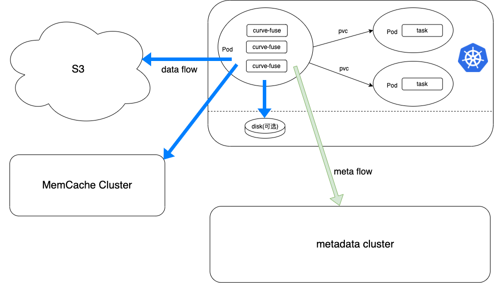
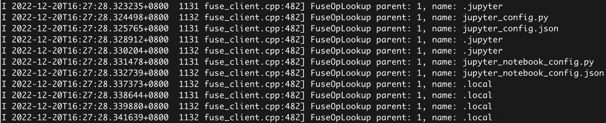
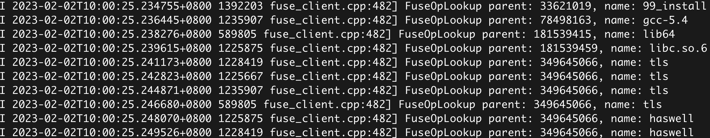

# AI场景中的IO行为浅析

## 背景

AI 是 Curve 文件系统重点支撑的场景之一，在落地过程中我们对 AI 场景中的 IO 行为了解逐渐加深。用户的 AI 场景不仅涉及到训练框架的使用，更多情况下是基于平台去做应用，所以对共享文件系的数据和元数据性能提出了更高的要求。
本文将分析两个典型 AI 场景的 IO 特点，对应的 Curve 文件系统的处理方法和待优化的部分。


## 典型场景1: 共享文件系统用于存储训练中间数据

### 场景描述
在大数据-AI结合的场景，训练数据和训练模型最终存储在 HDFS 中，训练过程中产生的日志、中间数据和模型临时存放在共享文件存储中。所有的业务都跑在k8s中。

下图是 Curve 文件系统在该场景下的部署架构：


在部署中，除了本地缓存之外，还支持了共享缓存集群用于共享数据的加速。
### IO特点及Curve的支持

1. AI 使用的分布式训练框架，分布式框架各节点之间有数据共享的需求，即节点 A 写入的数据，节点 B 要能即时访问到。
    - Curve 文件系统支持多节点间 ```close-to-open``` 一致性(文件关闭后下一次打开可以读到最新数据，多节点间表现为 A 节点文件 close 后，B 节点文件 open，读到的是最新数据)，是可以满足场景中的一致性需求。
    - Curve 文件系统对该一致性的支持，是通过 close 将文件数据上传到 S3 实现的。所以**共享数据的性能依赖于数据上传 S3 的速度**。一般来说 S3 都是 HDD+EC 的配置，性能有限。
    - 为了提升共享数据性能，**Curve 文件系统在 v2.5 版本支持了Memcache集群缓存**，数据上传到该缓存集群后就能实现共享，相比较于直接上传到 S3, 性能有5倍以上的提升。

2. AI 任务跑在 k8s 中，训练任务的 Pod 除了执行训练任务以外，还需要执行一些 k8s 的命令例如用 kubctl 于集群的管理与查看。会频繁访问很多系统文件的信息。
    - Curve 文件系统在 ```close-to-open``` 模式下，元数据的内核缓存和内存缓存都是失效的，这会导致常用命令使用性能体验很差。Curve 文件系统的元数据优化当前正在进行，之前面向社区发起过讨论，更多的信息可以参考：[CurveFS Feature - Performance](https://github.com/opencurve/curve/issues/2207)
    

## 典型场景2: 共享文件系统用于AI训练平台

### 场景说明

该场景下，用户包括代码编译、AI训练、数据/模型都存放在共享文件存储中。文件系统直接挂载在物理机上，所有的任务基于物理机进行。

### IO特点及Curve的支持
1. AI 使用分布式训练框架，对于数据集的读取，每个节点所需要读取的数据是不一样的。这要求共享文件系统为大量数据读取提供高性能

    - 在 v2.4 版本，Curve 文件系统为了加速数据读取，支持了 [Warmup](https://github.com/opencurve/curve-meetup-slides/blob/main/PrePaper/2023/02-20-Curve%E6%96%87%E4%BB%B6%E5%AD%98%E5%82%A8client%20warmupManager.md) 功能，可以把数据快速加载到本地缓存。但是在当前场景中，每个节点所需要读取的数据不同，并且不能预知任务会被分发到哪些节点，需要读取哪些数据。如果每个节点都做预热，会极大的浪费缓存以及网络带宽。
    - 为了解决上述问题，**Curve 文件在后续的版本会支持数据预热到共享缓存集群**，具体可以参考：[支持数据 warmup 到 memcache 集群](https://github.com/opencurve/curve-meetup-slides/blob/main/PrePaper/2023/02-20-Curve%E6%96%87%E4%BB%B6%E5%AD%98%E5%82%A8client%20warmupManager.md)

2. AI 训练平台中，用户会直接在文件系统中修改、编译训练或者标签生成代码等。在运行过程中，执行程序所有的依赖也都在共享文件系统中。同样会频繁的访问各种依赖库等文件。

    - 在代码执行过程中可以看到如下文件被频繁访问。这些被频繁访问的文件有两个来源： 动态依赖库和环境变量。
    
    - 由于代码的每次系统调用执行都涉及到所有环境变量和动态依赖库的查找，**这部分产生的元数据的访问次数远大于读取数据集产生的元数据开销。**
    - Curve 文件系统在共享状态下元数据的内核缓存和内存缓存都是失效, 导致所有这些文件的查找全部都要回源到元数据集群，严重影响了数据训练的速度。这个解决方法在典型场景1已经阐述过。

## 总结

在 AI 中，我们认为共享文件系统更多的是要支持 AI 业务，而不仅仅是 AI 训练的几个流程，Curve 文件系统在这方面的落地还有不完备之处，我们也正在进行优化。如果大家对 AI 业务有更多的认知，欢迎在社区进行分享，帮助 Curve 文件系统更好的支撑业务场景。
