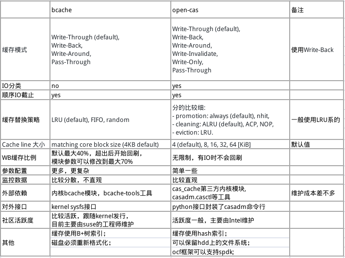
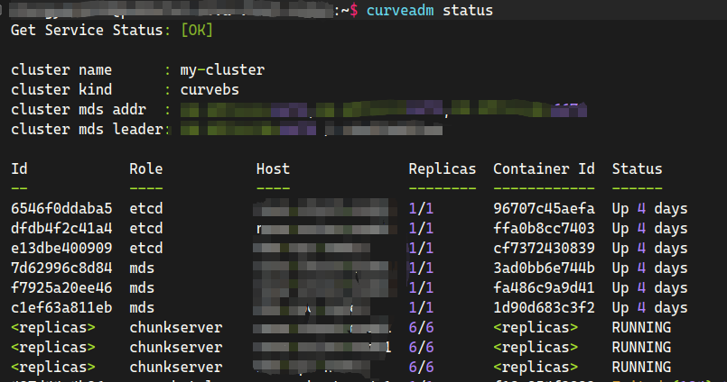
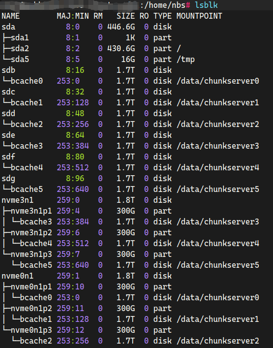

# Curve混闪之bcache与open-cas对比

## Curve支持混闪场景
近几年SSD固态硬盘已经快速普及，但是大容量、低成本的HDD硬盘在实际生产中仍然有很强的业务需求，所以把SSD和HDD结合起来各展所长的混闪系统在市面上也是主要的存储方案之一。 

Curve作为分布式存储系统，混闪也是必须支持的场景，支持基于NVME+HDD的混闪场景是Curve 2023年的重要任务之一，具体的信息可以参考Curve Roadmap 2023[1]。

## 缓存技术调研
作为经典的分布式存储系统，基于Ceph的混闪方案也是非常多的，一般在Ceph中使用SSD缓存有2种方式：cache tiering和OSD cache，但是大家都知道，Ceph的cache tiering机制并不成熟，策略复杂，IO路径长，实际生产中很少有具体的应用；更多的时候，是用SSD对块设备进行缓存加速。

目前常见的块设备缓存技术，主要有flashcache，dm-cache，bcache，open-cas等，其中flashcache已经停止维护了，dm-cache由于需要引入lvm，太过于复杂所以暂时不在考虑范围内。针对bcache和open-cas，根据参考文档[2][3]，做了一下大概的整理和对比： 

从以上的总结可以看到，2种技术提供的功能虽然略有差异，但总体上都能满足作为块设备缓存的要求；相对而言，bcache开发时间比较久，并且直接在Linux kernel中集成，也经历过大规模的测试和验证，稳定性应该会比open-cas好一些。

## 基于Curve的混闪性能测试
分别基于bcache和open-cas，部署一个NVME+HDD的Curvebs 三节点混闪集群，部署方式采用2+6模式，即2块NVME SSD做缓存，加速6块普通HDD磁盘；对NVME磁盘分区，每个分区大小300G，作为一个1.8T HDD的缓存盘。

以下是基于bcache部署的结果，open-cas也是完全相同的部署方案；关于bcache和open-cas缓存的具体部署方法和流程，就不在这里详细描述了，参考文档[4][5]即可。

部署好的Curvebs集群：  

存储节点上的部署结果：  

采用fio cbd引擎来测试Curvebs混闪集群的性能，在Curvebs里创建6个卷，分别在2个client上执行fio进行压测，获得集群的总体性能。性能数据如下表：  

可以看到，在2种缓存技术的加持下，随机读写的性能跟HDD集群相比都有了数量级粒度的提升。
* 在全部缓存时，随机写的绝对性能，bcache要比open-cas高出不少，但是在实际测试过程中会发现，bcache的写性能会出现明显的波动，甚至掉底的情况，这是由于bcache在测试过程中出现的gc操作，影响了缓存的写入性能；而open-cas的性能表现则要稳定很多；

* 随机读的性能2者差异并不大，这并不是2者的真实性能体现，而是因为测试环境10G网络的限制，网络瓶颈导致Curvebs集群性能提前达到瓶颈，实际上在缓存命中场景下，bcache的读的性能也比open-cas高出不少。

* 在缓存满回写时，2者的读写性能都出现了不同程度的下降，相对而言，bcache的性能下降要比open-cas明显很多，主要的原因有2个，一个因为bcache会优先处理回写，导致回写线程占满后端HDD的带宽，所以随机读的性能下降比较明显；另一个是由于open-cas默认采用的aLRU策略，只要设备上有IO，缓存的回写就是被抑制的，即使通过配置调高回写的周期和带宽，这种抑制也无法完全消除，所以它的性能下降就没那么厉害。

## 总结
本文简单的比较了bcache和open-cas这2种块设备缓存技术的功能差异，同时分别基于这2种缓存技术，搭建了NVME+HDD混闪形态部署的Curvebs分布式存储集群，测试了2种缓存技术在全部缓存和缓存会刷场景下的随机读写性能，并对相关的性能数据进行了分析。
基于以上对比测试和分析，也可以看到2种缓存技术都存在一些问题，还需要花费较多的时间去进行分析和调优，才能正在的落地到实际业务中。

> **参考文档：**
> 1. <https://github.com/opencurve/curve/issues/2207>
> 1. <https://segmentfault.com/a/1190000038448569>
> 1. <https://github.com/Open-CAS/open-cas-linux/issues/667#issuecomment-778223225>
> 1. <https://gist.github.com/mikulely/e2931b7cce388dbff006622a3eef7b42>
> 1. <https://open-cas.github.io/guide_configuring.html>
> 1. <https://www.modb.pro/db/135111>
> 1. <https://zhuanlan.zhihu.com/p/354018669>
