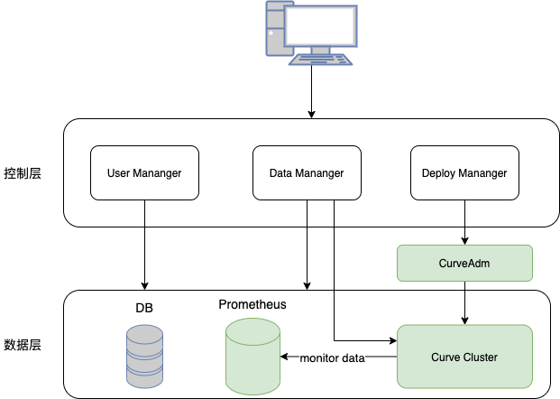
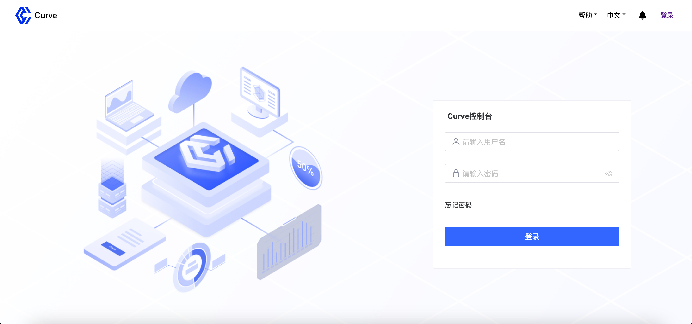
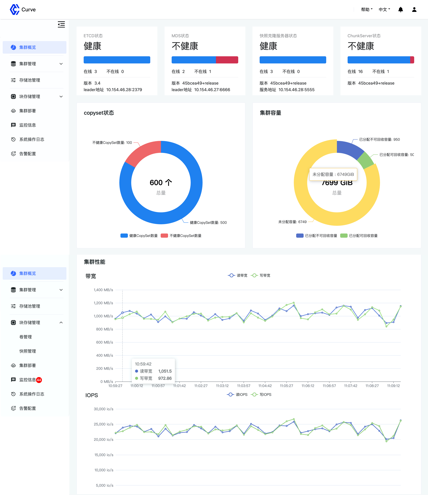

## 背景
Curve 作为一个存储底座，除了功能上的不断丰富和对极致性能的追求，**易用性**同样是我们关注的重点。为此，我们做了如下工作：

1.  [curveadm](https://github.com/opencurve/curveadm)：发布了全新设计实现的运维部署工具，其主要用于快速部署和运维 Curve 块存储和 Curve 文件存储。
2.  [curve-operator](https://github.com/opencurve/curve-operator)：为了进一步地云原生化，考虑将 Curve 集群部署在目前广泛使用的 Kubernetes 容器编排系统上，我们以 Operator 模式实现 Curve 在 Kubernetes 环境下的管理和运维，从而实现对 Curve 集群的自动部署以及自动化运维能力，提高产品交付效率和交付水平。
3.  [tools-v2](https://github.com/opencurve/curve/tree/master/tools-v2)：整合和重构 Curve 块存储和文件存储的多个运维工具，主要包括对集群信息的查询和集群操作。

**curve-manager**：Curve 控制台，也是本文要介绍的组件，curve-manager 是一个相对独立的 Web 服务，提供基于 Web 的集群管理能力，使得存储集群的部署和管理门槛进相对 CLI 方式一步降低，提供一种更加清晰直观的视图。

接下来我们将通过从**架构设计**、**系统特性**和**项目进展**几块进行展开介绍。

## 架构设计
curve-manager 整体架构如下所示，主要由控制层和数据层组成，各模块的职责如下：

* 用户管理（user manager）：负责系统用户的创建，查看，权限管理，删除等。
* 数据管理（data manager）：负责集群信息和各服务状态的展示、集群操作（卷，快照等）、审计日志管理、系统告警管理。
* 部署管理（deploy manager）：负责集群的可视化部署，通过发送请求到 CurveAdm 实现集群的部署。

数据层的 **_DB_** 主要存储控制台系统用户信息、审计日志和系统告警信息；**_Prometheus_** 是属于 Curve 集群监控的组件，这里主要为控制台提供存储集群的监控数据；**_Curve Cluster_** 是控制台访问的核心对象，提供集群信息并接收处理集群操作请求。

## 系统特性
### 主要特性
**多用户和权限管理**： 控制台支持具有不同权限（角色）的多个用户账户，可通过 UI 进行用户的增删改查操作，对用户密码强度有一定限制并进行加密存储，来提高账户的安全性。

**登录限制**：为了满足对存储系统操作的不同要求，控制台提供灵活的配置，可限制同一时间只有单一具有写权限的用户登录，限制同一用户在不用系统中的多次登录，新的登录会迫使之前的退出。

**SSL/TLS支持**：Web 浏览器和控制台直接的所有 HTTP 通信都通过 SSL 进行保护。可以使用内置的自签名证书，但生产环境建议导入由 CA 签名颁发的证书。

**审计**：控制台系统默认启用审计功能，对系统所有非读操作都会记录审计日志，便于分析，发现和追踪溯源。

**多语言支持**：目前系统主要考虑支持简体中文和英文。
### 核心监控和管理功能
**集群概览**：提供集群级别的视图，包括对集群健康状态，集群服务状态，集群容量和集群总性能的监控显示。

**集群管理**：包括拓扑管理、服务器管理和磁盘管理。集群拓扑以层级结构展示存储系统内部的 pool、zone、server、chunkserver间的所属关系和各级的详细信息；服务器管理提供集群中服务器的管理、基本信息和性能的展示；磁盘管理提供对集群中服务器上磁盘的管理能力。

**存储池管理**：提供存储池级别的视图，包括存储池的基本信息（属性信息，包含的serve、chunkserver、copyset、容量等信息）。

**块存储管理**：包括卷管理和快照管理。卷管理是针对卷的增删改查，同样的，快照管理是对存储系统中快照的操作。

**告警管理**：支持存储系统设置告警规则信息，添加告警接收人员，接收和查看系统告警信息，配置过期信息自动删除。

**审计管理**：提供对审计信息的展示，筛选和过期删除功能。

**集群部署**：该模块承担 Web 化部署的职责，接收用户的集群部署请求，并将该请求转发给 CurveAdm（增加了 service 层，可同时接收来自 CLI 和 HTTP 的请求）完成操作并返回结果。
## 项目进展
目前控制台功能首先适配的是 CurveBS，功能开发已基本完成，通过内部的测试验证之后就会发布到 Curve 社区，感兴趣的小伙伴可以关注下。

下面可以简单通过几张图来预览下 Curve 控制台：

Curve 控制台登录页

Curve 控制台概览页

