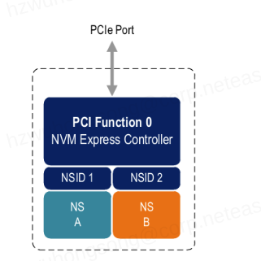
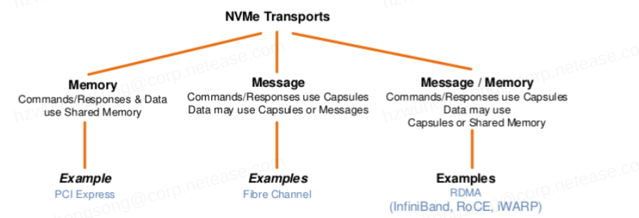
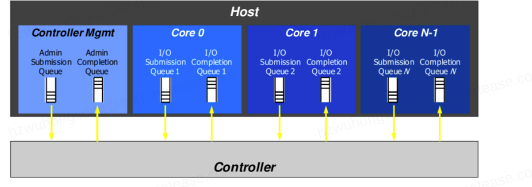
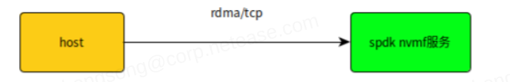
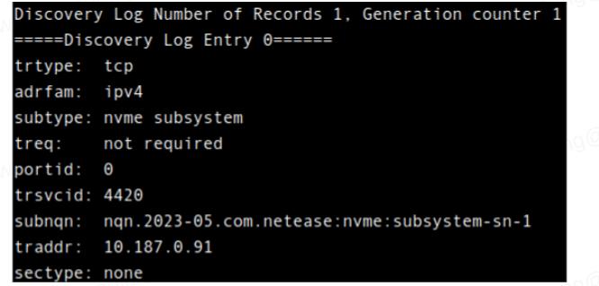
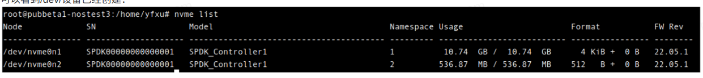
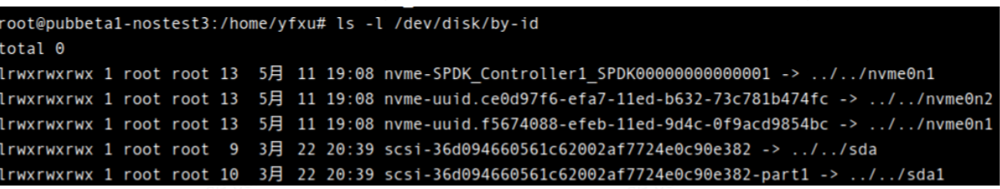
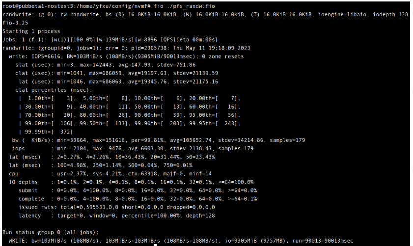

# 背景
nvme是一种接口，允许主机软件与非易失性存储子系统进行通信，常见的接口是PCIe，这个接口优化了通过 PCIe访问nvme。如果需要通过网络访问，nvme标准也定义了访问接口，这就是nvmf。PCIe接口定义了通过寄存器级别访问nvme的方法，而nvmf定义了通过网络访问的方法。

描述nvme系统，通常用的词是nvme subsystem。一个nvme subsystem通常包括控制器和namespace。控制器有Discovery控制器和IO控制器。Discovery控制器通常提供这个nvme subsystem里有哪些IO控制器和namespace的信息。namespace通常就是主机可以读写的设备。例如一块nvme盘可以用nvme命令工具划分出几个namespace，每个namespace有多大以及io特性等，都是可以定义的。这些都被nvme标准化了。例如，一块PCIe的nvme卡，也即一个nvme subsystem，有一个IO控制器对应支持两个namespace, ns1和ns2。在Linux系统上可以通过lsblk发现这两个namespace 分别对应nvme0n1和nvme0n2两个块设备。




上面的这个图画的是PCIe接口，如果粗略想象一下，把PCIe port换成TCP Listener port或者RDMA Listerner port，用网路传输，那么这个nvme subsystem是不是就可以远程访问了呢？是能实现的。这就是nvmf要定义的。如果把PCIe看成一种传输方式，而rdma和tcp就是另外两种传输方式，于是nvmf就概括了nvme transport的概念:



PCIe是一种以内存作为访问模式，而rdma和tcp则是message作为访问模式。message模式在传输数据时使用一个叫做capsule（胶囊)概念，可以理解为许多协议中的PDU概念，也即一个nvmf协议包的大小。

Host通过某种Transport方式连接到Controller后， 通过创建io-qpairs用Controller读写namespace。所以一个Controller往往有最大io-qpairs限制。io-qpairs其实分两个队列，一个是submission queue，另外一个是completion queue，例如PCIe方式的Controller如下图:




 # NVMe Qualified Names

对于我们搭建nvmf的人来说，还有一个概念需要了解，那就是`NVMe Qualified Names`（简称nqn)，一个nqn是用来命名一个nvme subsystem的，而且有格式要求:
nqn是utf8编码的unicode字符串，以nqn字符串开头，跟着是年份和月份，再跟着倒写的域名，后面跟着以冒号开头的字符串表示某公司组织内部的唯一名字。
例如: ` nqn.2023-05.com.netease:nvme:subsystem-sn-1`

上面的字面意思是于2023年05月netease.com域名下的全局唯一nvme子系统`nvme:subsystem-sn-1`

# SPDK如何支持对curve卷的nvmf方式读写
SPDK支持作为nvme subsystem提供方支持主机连接到SPDK服务。



SPDK支持RDMA和TCP连接，可以输出任何它支持的块设备（例如本地hdd, ssd, nvme)作为某个namespace供host读写。由于我们已经加入了curve卷的驱动到SPDK源码里，所以SPDK nvmf也支持输出curve卷给host。

# 一个操作SPDK提供nvmf服务的例子:
## 启动nvmf_tgt程序:
命令: `SPDK_CURVE_CLIENT_CONF=/home/yfxu/curve_config/client.conf   build/bin/nvmf_tgt -m 3`
上边就是启动spdk nvmf服务器，选择了cpu掩码3，也即在cpu0, cpu1上运行，如果不是nbd缺省的client config，就用上面设置环境变量的方式启动nvmf_tgt。
##  创建tcp transport:
命令: `scripts/rpc.py nvmf_create_transport -t TCP -u 16384 -m 8 -c 8192`
- m Max number of IO qpairs per controller，最大可以创建的io-qpairs数量
- c Max number of in-capsule data size，传输的胶囊的大小
以上只是创建了transport，启动Listener的命令则在后面会提到
##  创建一个spdk内部意义上的块设备（不是Linux内核）
命令：
```
scripts/rpc.py bdev_malloc_create -b Malloc0 512 512

scripts/rpc.py bdev_cbd_create -b Volume1 --cbd "cbd:pool//nbdtest1_yfxu_
```
上面是创建两个盘，一个是512M size,  512 bytes sector的内存盘Malloc0，另外一个是curvebs卷Volume1。
##  创建一个nvme subsystem
命令：
```
scripts/rpc.py nvmf_create_subsystem nqn.2023-05.com.netease:nvme:subsystem-sn-1 -a -s SPDK00000000000001 -d SPDK_Controller1
```

以上我们给子系统取了个名字:`nqn.2023-05.com.netease:nvme:subsystem-sn-1`
- a 是所有host都可以访问本个子系统
- s 是产品系列号，注意这个系列号会显示在客户端(host)
- d 是产品型号，同样会显示在客户端
## 添加namespace到nvme subsystem
命令
```
scripts/rpc.py nvmf_subsystem_add_ns nqn.2023-05.com.netease:nvme:subsystem-sn-1 Malloc0 -n 2 -u ce0d97f6-efa7-11ed-b632-73c781b474fc

scripts/rpc.py nvmf_subsystem_add_ns nqn.2023-05.com.netease:nvme:subsystem-sn-1 Volume1 -n 1 -u f5674088-efeb-11ed-9d4c-0f9acd9854bc

```
以上命令往上面创建的nvme子系统里添加两个namespace供host使用，namespace是用前面创建的Malloc0和Volume1设备提供的。
-n 是namespace id
-u 是给namespace 取一个uuid
## 创建Listener
最前面虽然创建了transport,但是并没有启动连接服务端口，以下命令是为刚创建的nvme subsystem启动服务端口:
```
scripts/rpc.py nvmf_subsystem_add_listener nqn.2023-05.com.netease:nvme:subsystem-sn-1 -t tcp -a 10.187.0.91 -s 4420
```
服务协议是tcp
- a 是服务地址
- s 是端口号
# 设置Linux主机作为client去访问nvmf服务
- 登录到不同于上面的linux机器上
- 使用root权限
- 输入discover命令，发现服务器上的资源
```
nvme discover -t tcp -a 10.187.0.91 -s 4420
```
应该会看到成功后的结果:




- 按上图提供的信息连接spdk nvmf服务
```
nvme connect -t tcp -n "nqn.2023-05.com.netease:nvme:subsystem-sn-1" -a 10.187.0.91 -s 4420
```
- 用nvme list查看

可以看到/dev/设备已经创建：




- 如何区分哪个是你想要的namespace也就是块设备呢？

一个方法是上面创建namespace的时候指定了namespace id，namespace 1是Malloc1,  而namespace 2是Malloc0

第二个方法是我们在上面创建namespace的时候指定了uuid，如果你知道uuid，可以根据/dev/disk/by-id目录下的符号连接打开设备:



可以看到Linux内核为我们创建了两个device分别对应上面我们创建namespace时给出的uuid，它们分别是:ce0d97f6-efa7-11ed-b632-73c781b474fc和f5674088-efeb-11ed-9d4c-0f9acd9854bc，这种方式有利于程序自动化部署。

# 简单的测试
- 通过dd简单测试curve盘

```
rroot@pubbeta1-nostest3:/home/yfxu# dd if=/dev/disk/by-id/nvme-uuid.f5674088-efeb-11ed-9d4c-0f9acd9854bc of=/dev/null bs=1M count=1000
1000+0 records in
1000+0 records out
1048576000 bytes (1.0 GB, 1000 MiB) copied, 3.14141 s, 334 MB/s
```
- fio


