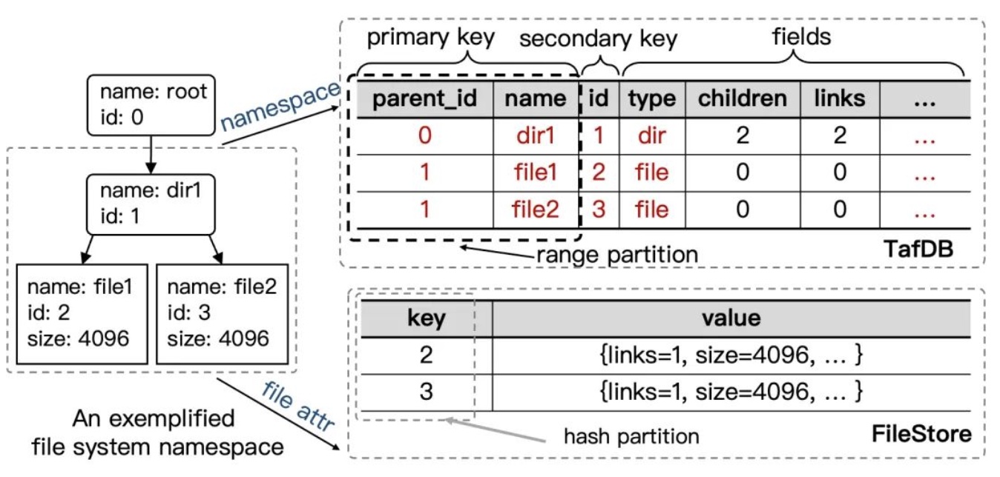
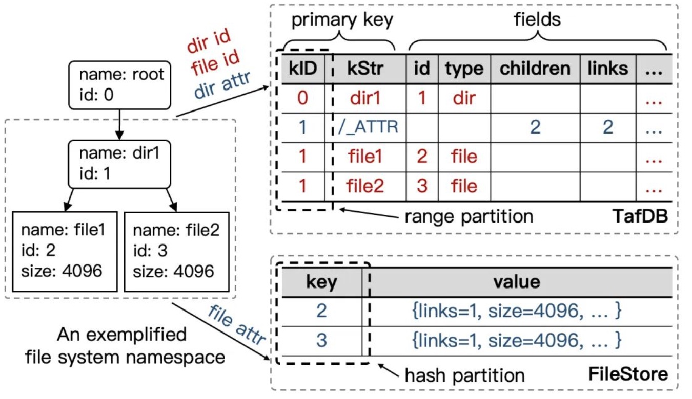

## 从 EuroSys'23 CFS 论文看千亿文件系统：Curve 如何演进？

### 前言

CFS是百度智能云文件存储，是一个大规模分布式文件系统。[EuroSys'23 CFS论文](https://dl.acm.org/doi/10.1145/3552326.3587443) 主要介绍了该系统的元数据核心设计，对长期困扰文件系统元数据领域的Posix兼容性和高扩展性（特别是写扩展性）难以兼顾的问题进行了解答。

为了帮助读者更了解该系统的创新过程，百度存储团队发表了一篇文章[《如何将千亿文件放进一个文件系统，EuroSys'23 CFS 论文背后的故事》](https://mp.weixin.qq.com/s/qtTkM710ta1DHHdvUIuRBg)，从文件系统的概念和需要解决的关键问题说起，非常详细的介绍了设计理念、演进过程。

我们在阅读论文和文章解析的过程中受益匪浅，CFS跟Curve文件系统在设计上有一些理念是相同的，也有很多地方值得Curve借鉴、学习。本文的目的是从CFS的设计理念对Curve做一次回顾，查漏补缺。

### 关键点解析

#### 元数据服务的架构

```
元数据服务的第三阶段：分离式架构，文中提到：分离式架构同样没有解决写扩展性的问题，写延时的表现甚至比耦合式架构更差：

- 事务在架构里的实质作用其实也是一种分布式锁，并没有解决其它分布式锁机制的缺陷，当一个写操作需要多节点参与时，无论是吞吐还是延时的表现都会比较差；

- 分离式架构处理请求时，需要先经过元数据代理层，再到数据库层，比耦合式架构的处理路径要更⻓，因此天然在性能上，特别是延时指标上更具劣势。读请求可以通过客户端直接读数据库层的方法来进行优化，但写请求就没有办法这么处理了。
```
这一点，之前我们有测试过使用TiKV作为元数据引擎，对比Curve文件系统原生的引擎，同样发现，使用分布式KV在标准测试```mdtest```下的性能并不好，是Curve文件系统原生引擎性能的一半。文章在[2.5 对分布式锁性能影响的定量分析中]提到，在没有锁冲突的情况下，锁在整个操作中的耗时占比也达到了50%+。

#### NameSpace1.0
```
namespace1.0其中的一个设计要点是将文件的属性从元数据服务中剥离出来，和文件数据一起放到数据服务器中进行处理。
基于这一理念，元数据的结构如下图所示：
```


元数据操作需要用到的数据库的能力可以概括为：按照secondary key查找指定项，按照parent_id list，子项和parent_id的事务操作。Curve文件系统, 所有信息可以认为都是存储在分布式KV上(Curve文件系统使用Raft+Rocksdb作为元数据的)持久化引擎，虽然没有使用数据库作为引擎，但Curve文件系统通过一定的放置策略加速上述提到的几个能力，以提高元数据性能：每个数据分片负责一定范围的```inodeid```, 所有的```dentry```存放在```parent_inodeid```所在的分片上。

下面我们来对比下CFS和Curve文件系统在```lookup```和```readdir```两个读操作：

- ```lookup /A/B```

    - Namespace1.0查找路径：先在中查找 [rootinodeid + filenameA] 的项，获取/A的inodeid；再使用 [/A的inodeid + filenameB] 获取 /A/B 的inode。涉及到两次查表操作。

    - Curve文件系统查找路径：先通过 [rootinodeid + filenameA] 去 rootinodeid 所在的分片上，获取/A的dentry，解析出inodeid；再使用[/A的inodeid + filenameB]去 /A所在的inode上获取 /A/B的dentry，解析出对应的inodeid。 同样也是涉及两次rpc操作。

- ```readdir /A```

    - 在Namespace1.0中查找路径：先查找 [rootinodeid + filenameA] 的项，获取 /A的inodeid，再通过db操作，list parentid 为 /A的inodeid的所有项。需要经过db两次查询操作。

    - Curve文件系统查找路径：通过 [rootinodeid + filenameA] 去 rootinodeid 所在的分片上，获取/A的dentry，解析出inodeid；再去[/A的inodeid]所在的分片获取parentid 为/A的inodeid的所有项。同样涉及到两次rpc操作。

关于写操作，对比```mknode```和```rename```两个写操作：

- ```mknode```

    - Namespace1.0的操作路径：在filestore中写入文件属性的相关信息；将文件的dentry信息{parent_id, name, ...} 插入TafDB并修改parentid的关联信息，这一步通过TafDB的分布式事务能力完成。涉及到两次rpc操作。

    - Curve文件系统操作路径：选择一个分片写入文件属性相关信息；将文件的dentry信息插入到parent_id所在的分片中，并修改parent_id的nlink等属性信息，这一步通过本地的RocksDB的事务接口完成。涉及两次rpc操作。

- ```rename```

    - Namespace1.0可以直接通过TafDB的分布式事务接口完成。

    - Curve文件系统，由于rename涉及到删除源文件的dentry, 在新的parent_id下创建新的dentry，涉及到多个不同分片上的操作，为此设计了额外的事务处理逻辑。

#### Namspace2.0

```
最大的一个优化点在于将分布式锁去除，使用原子变量的操作来替代。能实现这一操作的前提条件是：将冲突缩小到单个分片的范围。（这就是文中说的回到耦合架构，因为DB需要通过key来感知哪些数据需要放在相同的分片中）。这对于rename以外的所有操作都成立。

在工程实践中，通过在表中增加目录的attributes record让TafDB可以识别，保证同一个KID的数据存储在同一个分片上，调整后的数据组织如下：
```


上一小节说明了Curve文件系统的dentry、inode放置策略，这个设计也正好符合文中提到的抽象模型：影响元数据服务扩展性的根源是更新父目录属性时产生的冲突，这是关联变更的一部分。这里提到的父目录的属性，指的就是inode相关的属性。

但是在工程实践上，Curve文件系统，对于同一个分片上的请求，是做不到像数据库这样使用同步原语解决。比如，对于```create dentry```的操作，在底层需要执行的操作是：

- 操作1：创建dentry，在rocksdb中插入一条记录
- 操作2：修改父目录的nlink，并修改mtime，将新记录插入到rocksdb中

在并发情况下，这两个操作是无法通过同步原语的方式解决的，目前只能做到串行操作。这是影响性能非常关键的一点。对于这一点，从上层看从减少父目录的更新次数可以做请求的合并。长期看，提高partition上多类操作的并发度是非常必要的，比如一个很常见的AI场景，数据集的批量拷贝性能会大大受限。

```
沿用的NameSpace1.0的设计，关联元数据的存储放在DB中执行，文件属性的存储放在KV中。
这样做的好处是把负载分摊到了两个系统中。另外提到的一点是，如果单个目录下的文件数量很多，
DB的分裂可以保证该记录独占一个分片，最大能有单机处理能力，认为这个处理能力已经够强了。
```

Curve文件系统中所有的分片需要处理所有负载，后续也许可以考虑在元数据集群中划分两类复制组，一类用于处理parent_id和dentry的信息，另一类用于记录文件的inode信息。

另外在单个目录下文件数量过多的场景，Curve文件系统做不到让它续展一个分片，因为当前分片上负责的inode范围是固定的。可以通过针对目录子项过大的情况，让新的inode不在创建的方式做兜底，后续也许可以考虑通过增加虚拟目录节点的方式来做迁移。

```
关于rename，很重要的一点是：根据我们的线上统计，99% 的 rename 都发生在同一个目录内文件间，这种 case 涉及到的变更都在一个 TafDB 分片内，可以采用前文提及的方法优化。
因此，我们将 rename 分为 Fast Path 和 Normal Path 两种。
```

Curve文件系统，对rename做了两个版本的优化，都是使用的2PC事务，第一个版本rename在同一个文件系统上是全局排队的，第二个版本rename在同一个文件系统上源和目的不同可以并发。并没有考虑到从业务场景做一些优化。在看到上述统计信息的时候，很快就关联到在业务使用中很多时候都是从```rename A.tmp A```这类在同一目录下，为了避免一致性使用临时文件再做rename的场景。这也是Curve文件系统可以借鉴的rename优化途径。

在工程优化上不仅考虑通用优化手段，也结合业务特征进行优化是Curve文件系统需要持续改进的部分。

### 总结

CFS为性能做了大量设计和工程实践上的优化，我们通过分段解析，也看到了Curve文件系统很多可以优化的点，后续会持续跟进，也欢迎感兴趣的小伙伴的加入。如果上述的理解和描述有疏漏或者错误的地方、或者有一些新的想法，都欢迎在[Curve社区](https://github.com/opencurve/curve)指正和交流。
