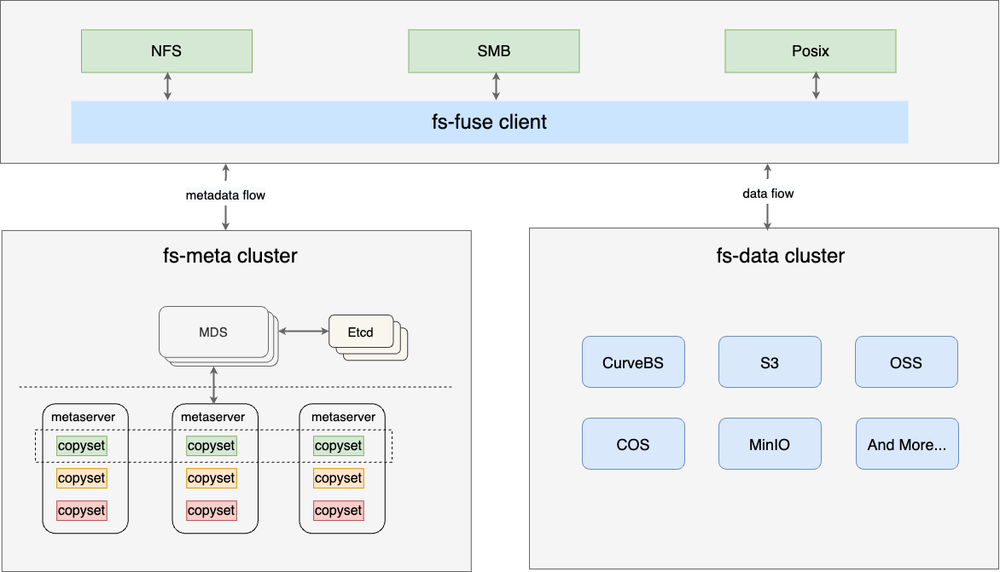
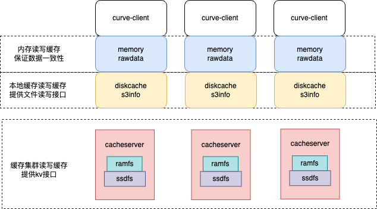
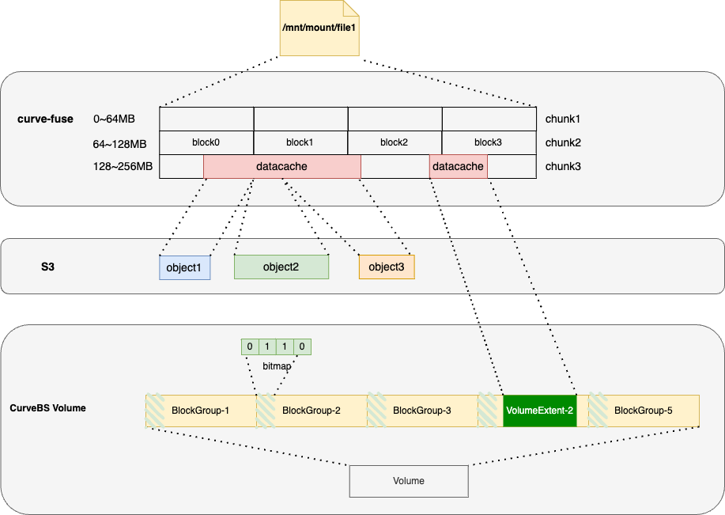

## Curve文件存储缓存介绍

### Curve文件存储简介

Curve文件存储的架构如下：



- ```客户端Posix兼容```：像本地文件系统一样使用，业务无缝接入，无侵入性
- ```独立的元数据集群```： 元数据分布式设计，可以无限扩展。同一文件系统可以在数千台服务器上同时挂载，高性能并发读写，共享数据
- ```多种数据后端的支持```：数据支持存储在各种支持S3接口的对象存储中，也支持存储在Curve块存储中
- ```close-to-open一致性```：文件重新open可以看到最新的修改信息

### Curve文件存储数据缓存

为了让读写有更高的性能，Curve文件存储支持了多级数据缓存：



- ```内存缓存```：用于加速当前节点上的读写速度。S3/Curve块存储后端均支持。内存缓存和后端持久化存储的对应关系如下：
    
    

    内存缓存按照地址空间的方式组织，按照chunk和block两级做拆分，到S3以数据分片的方式写入；到Curve块存储后端需要按照数据量大小申请空间并写入。
- ```本地缓存```：用于加速当前节点上的读写速度，当前仅支持S3后端，可以使用本地盘/云盘格式化文件系统后使用。存储的是不变的S3分片。

- ```全局缓存集群```：用于加速当前节点以及多节点数据共享时的速度。当前仅支持S3后端。同样存储的是不变的S3分片。说明：为了保证多挂载下数据的一致性，要求A挂载点写完，B挂载点可以读取到数据，在没有全局缓存的情况下，A写完的数据必须要上传到S3，B挂载点才可见。数据上传S3的延迟是不可控的，有时可能达到百ms级别，对共享性能的影响很大，所以添加一个全局缓存用于加速。在有全局缓存的情况下，数据的可靠性等价于本地缓存的可靠性。

在有多级缓存的情况下，缓存的一致性如何保证？
数据的写入顺序总是先内存缓存，再S3/Curve块存储/全局缓存；到数据的读取顺序也是先内存缓存，再S3/Curve块存储/全局缓存。

### Curve文件系统元数据缓存

Curve的元数据缓存并不保证全场景下的元数据一致性，对于元数据来说，需要实现大部分场景下的缓存一致性，并提供足够好的性能。当前一致性从3个维度来衡量：

- ```文件可见性```：在一个客户端执行文件创建、删除、重命名等操作，另外一个客户端可以立马看到。这一维度需要完全保证。
- ```属性一致性```：一个文件属性(如atime、ctime、mtime、mode、size...)在一个客户端修改后，另外一个客户端立即能看到。针对这一维度，允许某些属性在某些场景下存在一定延迟。
- ```内容一致性```：文件内容符合close-to-open的语义，即关闭后，重新打开能立即看到全部修改。

文件的元数据缓存主要有两个部分：一部分是在kernel中，一部分在CurveFS-Fuse中

```
+----------------+
+  Kernel Cache  |
+----------------+
    |       ^
(1) |       | (4)
    v       |
+----------------+
+  CurveFS Fuse  |
+----------------+
    |       ^
(2) |       | (3)
    v       |
+----------------+
+   MetaServer   |
+----------------+
```

- ```Kernel Cache```

    - 缓存类型：```entry```、```dirEntry```、```attr```、```dirAttr```

    - 缓存机制

        - 通过各类可以返回attr、entry给内核的接口（例如```mknode```, ```mkdir```, ```link```, ```getattr```等）

    - 缓存失效机制

        - 各项timeout的配置

        - 通过```open```的返回码```ESTALE```触发 ```entry```和```attr```缓存的失效（通过比较```mtime```的方式）; 通过```readdir```和```opendir```的结果更新```direntry```和```dirattr```的缓存

- ```CurveFS Fuse```

    - 缓存类型：```length```、```chunk```、```directory cache```、```lookup negative cache```

    - 缓存机制

        - ```lookup negative cache```：从metaserver中连续获取到 N(通过配置文件设置) 次not exist信息，这个状态将被缓存

        - ```directory cache```：```readdir```从metaserver中获取到的信息

        - ```length``` & ```chunk```: ```lookup,getattr,setattr,create...```从metaserver中获取的相关信息

    - 缓存失效机制

        - ```lookup negative cache```：timeout配置（这里是有误判的可能性的，这个状态被记住后需要依赖timeout来更新）

        - ```directory cache```：通过```opendir```处理时对```mtime```的比较（这里至少会有一次到metaserver的rpc）

        - ```length``` & ```chunk```：通过```close```接口的调用失效