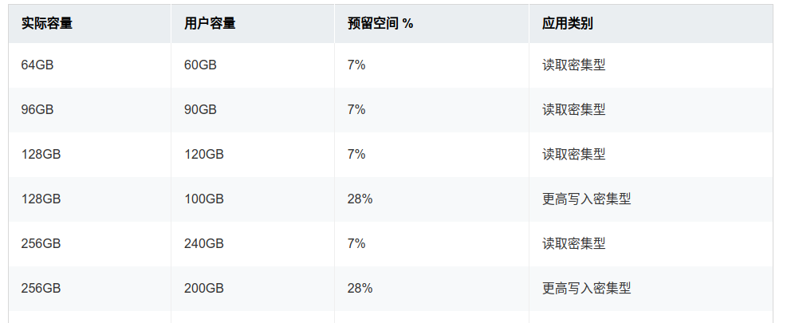
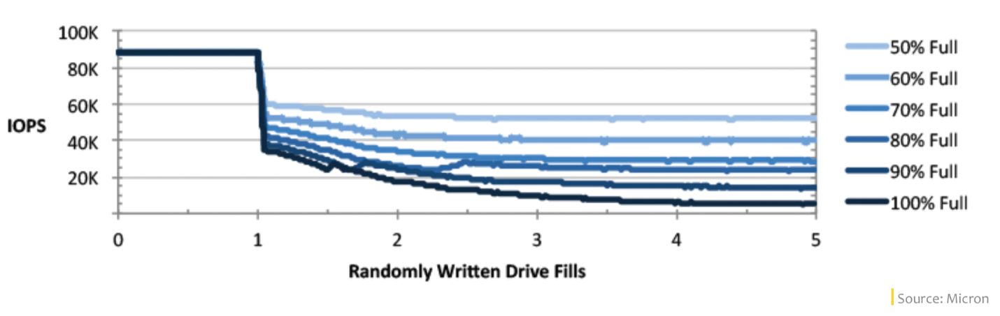

# curve混闪之性能优化（踩坑）记录

- [curve混闪之性能优化（踩坑）记录](#curve混闪之性能优化踩坑记录)
  - [前言](#前言)
    - [bcache gc性能优化](#bcache-gc性能优化)
      - [问题分析](#问题分析)
      - [优化方案](#优化方案)
    - [bcache writeback异常问题](#bcache-writeback异常问题)
      - [问题分析](#问题分析-1)
      - [优化方案](#优化方案-1)
    - [nvme 盘性能下降](#nvme-盘性能下降)
      - [问题分析](#问题分析-2)
      - [优化方案](#优化方案-2)
  - [结语](#结语)

## 前言

Curve 块存储支持基于 NVME+HDD 的混闪场景是 Curve 2023年的重要任务之一，具体的信息可以参考[Curve Roadmap 2023](https://github.com/opencurve/curve/issues/2207)。
混闪存储的主要优势是能以较低的成本获取较高的性能收益，所以性能是 Curve 块存储支持混闪场景的主要需求之一，这里分享几个 Curve 块存储支持混闪场景过程中遇到的性能问题和优化方案。

### bcache gc性能优化

#### 问题分析

在[之前的缓存对比分析](0407-Curve混闪之bcache与open-cas对比.md)中我们就提到过，在基于 bcache 的 Curve 混闪摸底时，fio会周期性的出现 io 掉底（掉零）现象。
主要原因就是 bcache 自身的 gc 操作，会把停止前端 io 的下发，在 fio 上的表现就是 io 掉底；触发周期为缓存分区大小的十六分之一。
bcache gc 行为可以通过以下几个方式进行观察：

- bcache_gc内核线程
- 内核 ftrace 里的 bcache_gc 事件
- bcache sysfs 里 gc 相关的统计

通过 sysfs 观察比较容易，这里会给出 gc 的平均持续时间，最大持续时间，平均触发频率，上次 gc 触发的时间点等统计数据。
例如：

```bash
grep . /sys/block/bcache0/bcache/cache/internal/btree_gc_* 
/sys/block/bcache0/bcache/cache/internal/btree_gc_average_duration_ms:2696 
/sys/block/bcache0/bcache/cache/internal/btree_gc_average_frequency_sec:7 
/sys/block/bcache0/bcache/cache/internal/btree_gc_last_sec:3 
/sys/block/bcache0/bcache/cache/internal/btree_gc_max_duration_ms:2783
```

#### 优化方案

在 Curve 块存储里，io 写请求会先经过 raft 协议，等多数节点写完 raft 日志后，io 请求即可返回，实际数据写到盘上是异步的。
开始时 raft 的 wal 日志和数据 chunk 都是放在 bcache 缓存里的，这样对于缓存而言是相当于产生2倍的脏数据，很容易达到 bcache gc的触发阈值。

后续我们把 raft 的 wal 日志放在单独的 nvme 分区上，只把 curve 的 chunk 文件放在 bcache上，这样就避免了对缓存空间的双写，同时由于 io 请求在 raft 写完日志后就返回了，即使 bcache 盘上依然有触发 gc，也不会对 io 请求产生影响。

wal 分离部署后，需要对 wal 分区大小和 raft 日志周期进行重新计算，防止日志分区写满。
Curve 块存储本身已经支持 wal 和 chunk 的分离部署，但当前 Curveadm 工具还不支持相关的配置，这里有一个初步的修改[PR#238](https://github.com/opencurve/curveadm/pull/238)，社区感兴趣的小伙伴可以一起参与改进。

### bcache writeback异常问题

#### 问题分析

在测试过程中，发现有时候 4k 随机写压测一段时间后，Curve 集群的性能会变差，但观察 bcache 的缓存剩余空间还比较多，io 却直接写到后端 hdd 设备上了，相当于 writeback 策略失效了。

通过检查 sysfs 相关的监控信息，以及走读 bcache writeback 相关的判断逻辑代码，确认是一个 bcache 代码 bug。

主要的原因是 bcache 在计算脏数据回写的速率时，只考虑了脏数据的量，如果脏数据低于 writeback 阈值，那基本上就没有回写(速率非常低)，而超过阈值时才根据依据模拟 PID 的算法来周期性调整回写速率，整体上是脏数据超过阈值越多，回写速率越大。

但异常的时候，虽然脏数据没有达到回写阈值，但是脏桶的数据(dirty buckets inuse)却超过了 CUTOFF_WRITEBACK_SYNC(70) 这个阈值，导致 io 无法执行 writeback 策略先写到 nvme 缓存里，而是直接写入到后端 hdd 设备上；
通过检查以下2个监控项来进行判断：

```bash
cat /sys/block/bcache0/bcache/writeback_rate_debug
rate: 0.5k/sec
dirty: 39.5G
target: 79.9G
proportional: -1.0G
integral: 0.0k
change: 0.0k/sec
next io: 1495ms

cat /sys/block/bcache0/bcache/cache/cache_available_percent
25
```

writeback的相关逻辑判断代码:

```c
static inline bool should_writeback(struct cached_dev *dc, struct bio *bio,
                    unsigned int cache_mode, bool would_skip)
{
    unsigned int in_use = dc->disk.c->gc_stats.in_use;

    if (cache_mode != CACHE_MODE_WRITEBACK ||
        test_bit(BCACHE_DEV_DETACHING, &dc->disk.flags) ||
        in_use > bch_cutoff_writeback_sync)
        return false;
    ...
}
```

如上所示，缓存内的脏数据还没有到回写阈值，所以此时的回写速率为 0.5k/s，但脏桶的比例已经超过了 70%，should_writeback 函数返回 false，此时 bcache 的 writeback 策略是无法生效的，所有 io 会接下发到后端 hdd 上去执行；

#### 优化方案

上游社区已经修复了该问题，主要是通过在回写速率更新的代码逻辑里，增加脏桶数量的计算因子来提前触发回写，从而避免出现上面的writeback策略失败问题。
在我们的内核上 backport 这个 patch 即可。

[bcache: consider the fragmentation when update the writeback rate](https://git.kernel.org/pub/scm/linux/kernel/git/stable/linux.git/commit/drivers/md/bcache?h=v6.3.9&id=71dda2a5625f31bc3410cb69c3d31376a2b66f28)

### nvme 盘性能下降

#### 问题分析

在curce混闪测试过程中，我们还遇到了一个“硬件”相关的问题。

起因是在测试过程中发现，大IO顺序写压测一段时间后，curve混闪集群的性能就会变的很差(降低一半以上)，但是过一段时间后性能会恢复正常，起初以为是缓存空间被写满导致的，但查看监控发现并不是的。

之后花了较多时间排查都没有明确的结论，最终只能靠排除法缩小问题范围可能是在 nvme 盘上，跟 Curve 块存储和 bcache 软件是无关的，出现问题的时候 nvme 盘本身的性能就是比较差的；

通过 blktrace 分析正常和异常场景下的 io 耗时，发现2者的 Q2C 和 D2C 差别都不大，说明 block 层调度没有问题，而异常时 D2C 的耗时明显增加一倍以上，说明确实是硬件处理慢了。

```bash
==================== All Devices ====================
ALL           MIN           AVG           MAX           N
//正常，D2C平均47us
D2C           0.000007957   0.000046761   0.010916137      153422
Q2C           0.000009531   0.000049924   0.010919176      153422
//异常，D2C平均126us
D2C           0.000009035   0.000125747   0.000618107       72384
Q2C           0.000010458   0.000128898   0.001085908       72384
```

然后我们就从 nvme 驱动、固件方面入手，分析了几天还是没有进展，经过多次内部讨论，意外发现磁盘性能下降跟 nvme OP(Over-Provisioning) 空间大小有关。

所谓 OP 空间是 SSD 的预留空间，只有 SSD 主控才能访问到，主机 host 是访问不到的，主要是为内部 GC、读写平衡及坏块屏蔽等存储器内部功能服务的。
不同厂商的不同型号 SSD，默认的 OP 空间大小也是不一样的，总的来说 OP 空间越大，SSD 磁盘性能越高，使用寿命越高，但用户可用的空间越小。





通过跟服务器厂商及运维 SA 了解后，确认我们使用的三星 nvme 盘，默认 OP 空间为裸容量的 7%，作为缓存盘大量写入数据后，会因为 OP 空间太小而导致内部gc等操作更耗时，外部表现出来的就是nvme盘的性能变差。
而 Intel 的 nvme 盘，默认 OP 空间为裸容量的 20%，则在我们的测试中性能表现一直非常稳定。

#### 优化方案

暂时先用 Intel 的 nvme 盘来做缓存盘，后续再请厂商一起协助分析三星盘 OP 的问题。

## 结语

本文总结了 Curve 块存储支持混闪场景过程中，遇到的几个典型性能问题的分析和解决过程。
分别涉及 Curve 块存储自身架构，bcache 代码 bug，nvme 盘 OP 空间影响等方面，希望能给社区的小伙伴带来一些收益，避免掉到相同坑里。
