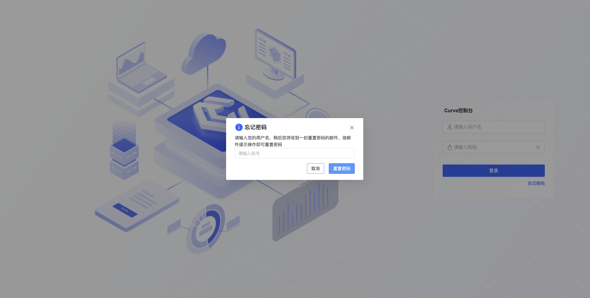
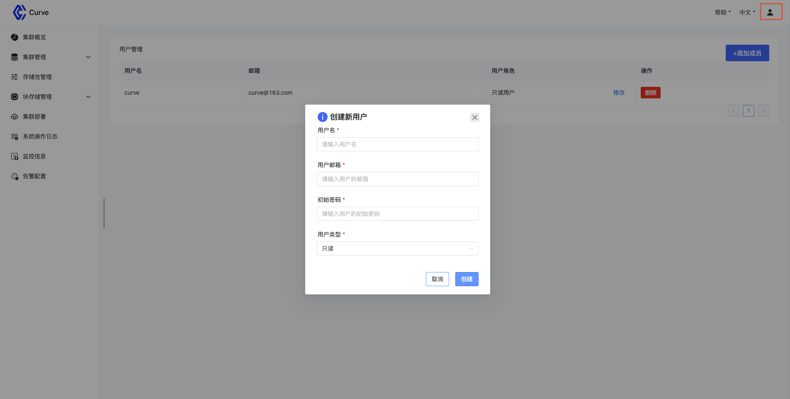
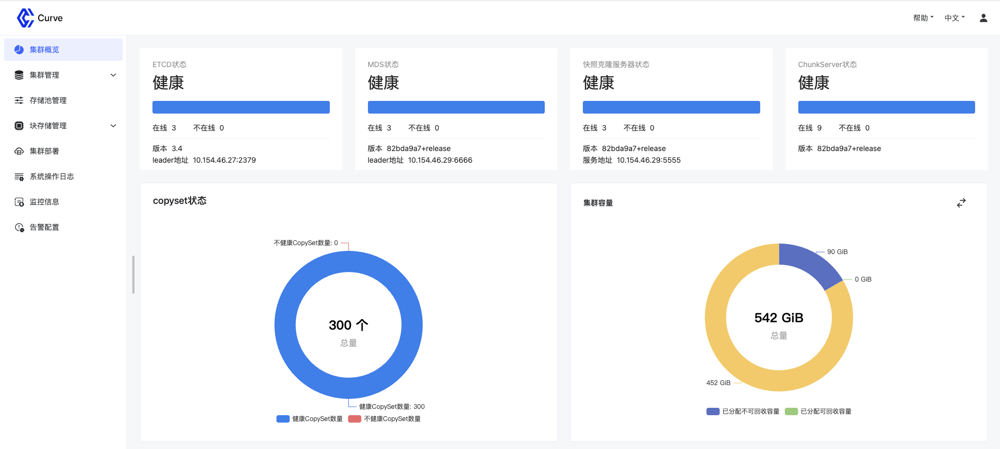
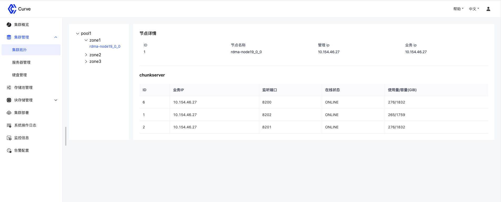
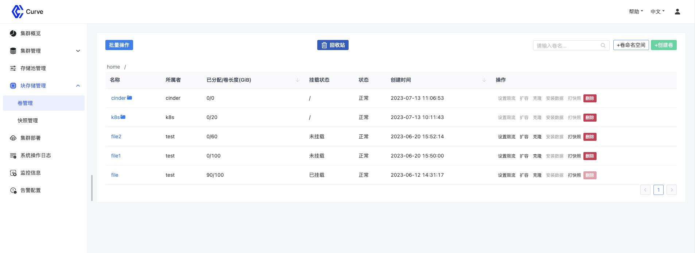
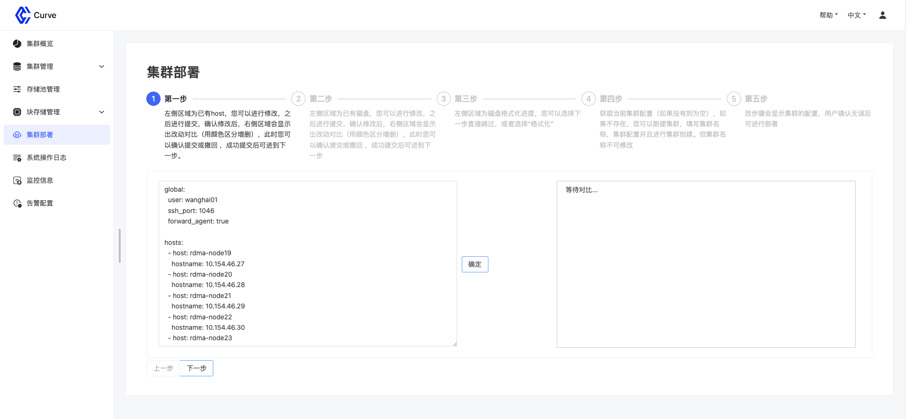
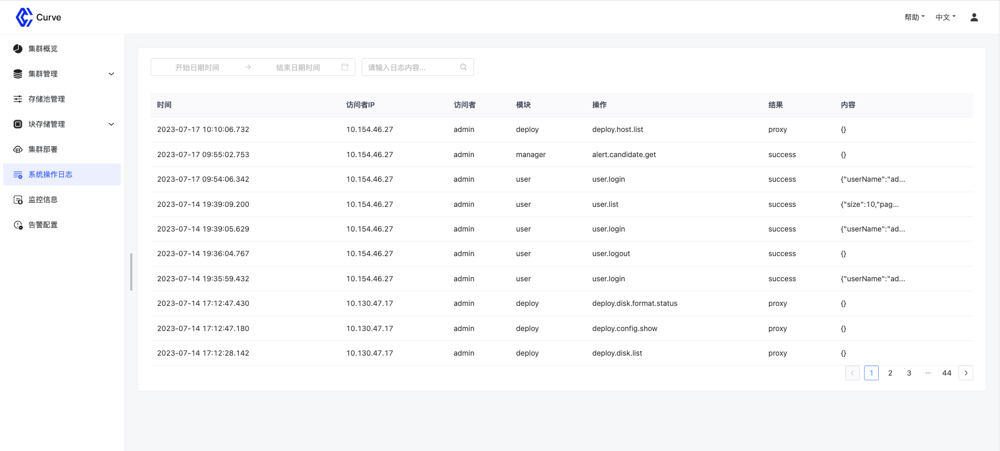
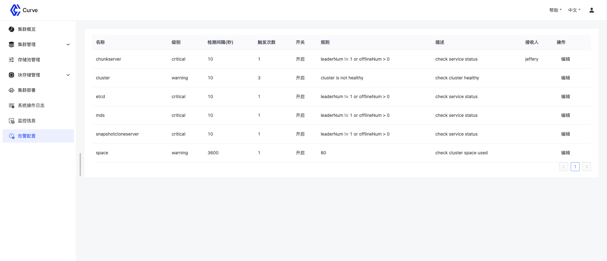
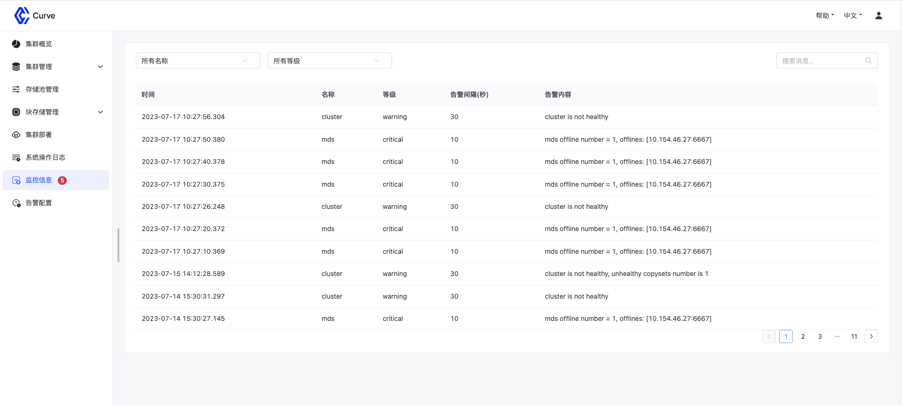

## 背景
Curve 控制台是 Curve 为了提升系统易用性而开发的一个相对独立的 Web 服务，提供基于 Web 的集群管理能力，使得存储集群的部署和管理门槛进相对 CLI 方式一步降低，提供一种更加清晰直观的视图。上篇文章[《Curve 易用性升级之可视化运维——web 控制台介绍》](https://mp.weixin.qq.com/s/5Vkshg-CGl_wVNW695Qixw)中我们已经介绍了系统架构和核心特性，控制台项目已经开源，为了帮助大家快速体验该功能，这篇文章将介绍控制台项目的**编译**、**打包**、**部署**和**使用**，同时，我们也欢迎大家参与控制台项目的开发和维护工作，希望通过共同努力，不断改进 Curve 控制台，为用户提供更好的使用体验。

## 项目编译&打包
目前 Curve 控制台代码仓库前后端分开管理：[前端仓库](https://github.com/opencurve/curve-dashboard)、[后端仓库](https://github.com/opencurve/curve-manager)，项目的编译打包是通过将前端项目作为后端项目的submodule来关联。

```shell
# clone code
git clone --recursive git@github.com:opencurve/curve-manager.git

# go version >= v1.19.0
# build
make build

# make image
make image tag=<DOCKERHUB_USERNAME>/<REPOSITORY_NAME>:<TAG>
docker push <DOCKERHUB_USERNAME>/<REPOSITORY_NAME>:<TAG>
```

## 项目部署
### 环境准备
部署控制台的机器需要[安装Docker](https://yeasy.gitbook.io/docker_practice/install)，并确保 Docker Daemon 已经运行，你可以在服务器上执行以下命令来检测：

`sudo docker run --rm hello-world`

### 准备配置文件
`vim website.yaml`

```yaml
kind: curvebs      # 集群类型，curvebs 或 curvefs (目前仅支持curvebs)
host: server-host  # 部署控制台服务的机器，需是在 curveadm 中导入的主机
config:
  container_image: opencurvedocker/curve-manager:latest  # curve控制台的镜像
  data_dir: /tmp/curve-manager/data          # 控制台的数据目录
  log_dir: /tmp/curve-manager/logs           # 控制台的日志目录
  listen_port: 443                           # 控制台服务的监听端口
  access.api.enable_check: true              # 是否开启接口认证，开启则会检测每个请求携带的认证信息
  access.api.expire_seconds: 60              # 接口认证token过期时间
  access.login.expire_seconds: 1800          # 用户登录失效时间
  enable.multiple.write.user.login: false    # 是否允许多个具有写权限的用户同时登陆
  system.log.expiration.days: 30             # 审计日志过期时间，过期内容自动删除
  system.alert.expiration.days: 30           # 系统告警信息过期时间，过期内容自动删除
  curveadm.service.address: 127.0.0.1:11000  # curveadm http service地址，对应部署步骤3 "启动curveadm http service"中配置的值
  email.addr: example@163.com                # 管理邮箱，用于重置密码，发送告警信息
  email.auth: password or authCode           # 管理邮箱授权码或密码

```

### 部署控制台
Curve 控制台的部署依赖部署工具[CurveAdm](https://github.com/opencurve/curveadm)，需提前安装该工具，目前 CurveAdm release 版本并不支持该功能，可升级到dev版本进行体验（升级前可先备份下当前curveadm（备份curveadm二进制即可），首次安装完也需要进行升级）: `CURVEADM_VERSION=curve-dashboard curveadm -u`。

**注意**：由于控制台功能依赖 CurveBS 新增部分接口，目前支持的 CurveBS 存储集群版本为v1.2.7，体验时可选择已有镜像：quay.io/opencurve/curve/curvebs:v1.2.7-beta2_872d38c 或自编译镜像。

Curve 控制台的完整依赖部署路径：

1. [部署curvebs集群](https://github.com/opencurve/curveadm/wiki/curvebs-cluster-deployment)
2. [部署监控](https://github.com/opencurve/curveadm/wiki/curve-monitor-deployment)
3. [启动curveadm http service](https://github.com/opencurve/curveadm/wiki/curveadm-http-service)
4. 部署控制台

```shell
# 查看控制台相关命令
curveadm website -h

# 部署控制台
curveadm website deploy -c website.yaml

# 查看控制台服务状态
curveadm website status

# 停止控制台服务
curveadm website stop

# 启动控制台服务
curveadm website start

# 清理控制台服务
curveadm website clean
```

部署成功后，即可以访问控制台服务（`https://ip:port` ip为部署控制台服务机器的ip，port为配置文件中配置的监听端口）来管理 Curve 集群。

## 使用控制台

### 登录 & 忘记密码

系统默认包含一个管理员用户，用户名：admin，密码：curve，登录后可选择进行密码修改和新增用户。如果忘记密码，可通过忘记密码进行重置，前提是部署时在website.yaml中配置了管理邮箱信息：

```yaml
email.addr: example@163.com                # 管理邮箱，用于重置密码，发送告警信息
email.auth: password or authCode           # 管理邮箱授权码或密码
```



### 用户管理

admin用户可以对系统用户进行管理，包括创建，权限修改，删除。每个用户可以修改自己的个人信息，目前主要包括邮箱和密码。



### 集群概览

集群概览主要展示存储集群各服务的状态信息，集群存储容量和总体性能指标。



### 集群管理

集群管理主要包括集群拓扑、服务器管理和磁盘管理，拓扑主要展示了存储集群节点的拓扑结构信息，服务器管理会展示存储集群的服务器详情和性能指标等信息，磁盘管理展示了存储节点上磁盘的基本信息、挂载状态和容量情况。



### 存储池管理

存储池管理主要以存储池为粒度展示服务和资源信息及该池子的整体性能指标。


### 块存储管理

主要包括对卷和快照的管理，在这里可以针对卷做创建、限流、扩容、打快照、克隆、删除和恢复等操作。快照管理可以取消正在进行的快照任务，可删除快照。




### 集群部署

目前采用基于配置的集群部署方式，需要用户补充必要的配置信息，最终该请求会转发给 CurveAdm 执行并返回结果。



### 系统操作日志

审计日志记录用户在系统中的操作过程，便于对安全事件的发现和追踪溯源。admin用户可查看所以用户的操作记录，普通用户只能查看自己的操作记录。



### 告警配置

告警配置是针对存储集群配置监控检测信息，系统内置了三类六种告警规则，包括针对服务（etcd、mds、chunkserver、snapshotclone）、容量和集群状态的监控，用户可在此进行修改，也可设置告警联系人，当系统出现异常触发告警时，告警联系人会收到系统发生的告警邮件。



### 告警信息

这里会展示出触发告警规则的告警信息，便于浏览和回溯。

