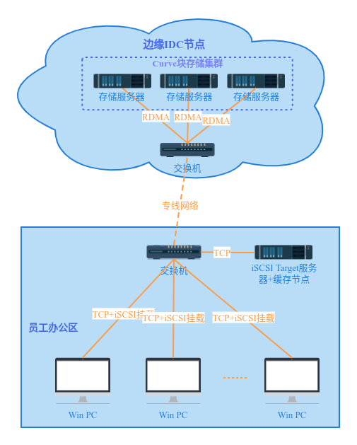
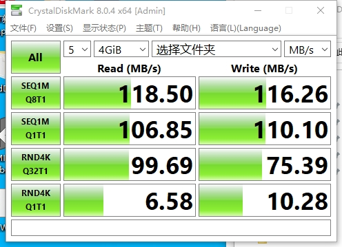
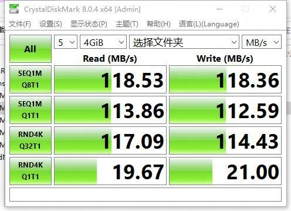
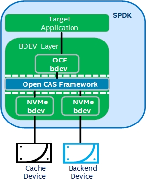

# 问题背景

背景是网易游戏基础设施团队给美术、策划、QA业务部门做了一套Win PC + iSCSI云盘 + 快照克隆能力的素材分发加速流程，能给相关研发流程的用户提供分钟级的分发体验 （相比之前的人肉给PC机加硬盘扩容、svn clone/checkout分支耗时数小时），要快上N倍，大大提升了研发效率，非常受研发团队欢迎。

但是这个方案的性能目前还要一些业务场景不能完全满足（目前是基于开源Ceph RBD + 开源tgt target实现的），我们Curve团队要做的事情就是分析性能瓶颈点、进一步提升整个方案的性能，让更多的研发团队能体验到极速云盘，同时也能覆盖更多的业务场景。

# 部署架构介绍

- 存储服务器配置： CPU Intel® Xeon® Silver 4114 \* 2，内存128G，800G SATA SSD \* 6，网卡Mellanox ConnectX-5 10GbE \* 1
- Target服务器+缓存节点：普通办公PC机配置千兆网卡

最终基于Curve块存储方案的部署架构如下图所示：

与开源Ceph块存储方案部署架构的区别主要包括：
1. 存储节点之间采用RDMA网络
2. Target服务器就近部署在办公区，并配置本地缓存

# 问题分析

经过反复对比测试和分析，现有方案的瓶颈点主要是：
- Win PC也就是iSCSI initiator端到target节点之间的网络时延
- target的性能
- target本地缓存能力
- 分布式存储集群性能

## 优化方案

针对上述瓶颈点，Curve团队提出了多项针对性的优化方案：
- 网络时延：配合集团IT部门进行交换机参数调优，将ms级时延降低到数百us，极大提升了pc机到IT交换机的网络性能
- target性能：使用spdk版本的target替换tgt target，后端对接curve集群，利用用户态协议栈增加极限性能
- target缓存能力：tgt版本的target不支持本地缓存，spdk版本通过配合Open CAS缓存模块，极大提升了PC端iSCSI盘的性能
- 分布式集群性能：从Ceph rbd集群更换为Curve块存储集群，并使用RDMA网络方案，进一步降低存储网络时延，提升集群IOPS和吞吐能力

### 部署架构调整
相比原来的Ceph RBD部署方案，Curve团队在部署架构方面做了以下几点调整：
1.  把iSCSI target从边缘IDC节点迁移到办公区
2.  为iSCSI target配置缓存
3.  把边缘IDC节点之间的网络改造为RDMA协议

这些调整都起到了性能提升的预期效果。

# 优化效果

使用Win操作系统上比较流行的硬盘benchmark工具CrystalDiskMark进行大小IO的对比测试，结果如下：

- Ceph RBD方案（开启rbd cache）：

- Curve块存储方案（开启SPDK OCF cache）：

通过对比数据可以看出，随机小IO性能有了2~3倍的提升。大IO受PC机千兆网卡限制达到带宽瓶颈。

# 后续规划

- 还需要进一步结合业务实际场景分析性能优化效果，并做进一步的优化调整。
- CurveFS + SMB协议支持渲染等依赖共享存储场景探索。

## 扩展知识

### Curve块存储

与Ceph块存储相比，Curve小文件随机性能比较高，大文件顺序读写性能差别不大。这方面的指标数据可以参考GitHub上的版本release notes：https://github.com/opencurve/curve/blob/master/CHANGELOG-1.2.md

Curve块存储相比Ceph RBD在架构上的优势有相关资料可以参考，这里不再赘述，例如：https://github.com/opencurve/curve-meetup-slides/tree/main/2020 、 https://github.com/opencurve/curve-meetup-slides/tree/main/2021 等

### iSCSI
iSCSI是一种比较经典的存储协议，可以通过以太网挂载远程存储盘使用，在各大主流操作系统上都有广泛的兼容性，因此对于办公常用的Win PC来说也是非常合适的远程挂载协议。

#### SPDK target

之前Curve提供的iSCSI target也是基于开源的tgt项目来实现的，当然也做了一些性能调优（参考之前的公众号文章：https://www.modb.pro/db/329665 ），但是其最大的问题在于不支持本地缓存，所有的数据读写都要与后端的存储集群交互才能实现，无法针对特定的业务场景进行读写加速。

为此我们基于SPDK项目实现了新的target服务，SPDK项目默认支持了Open CAS Framework也即Open CAS缓存框架，可以很方便的启用iSCSI的缓存加速服务。

相关代码已上传到：https://github.com/skypexu/spdk/tree/cbd_for_v22.05.x

#### Open CAS

Open CAS是Intel主导开源的块设备级别的缓存方案，主要目标是通过使用更高性能的存储设备加速后端块存储IO访问。其已被默认集成到了SPDK项目中，其项目介绍可以参考：https://open-cas.github.io/getting_started_spdk.html

SPDK和Open CAS Framework的结合架构示意图如下：

使用fio进行性能对比测试发现，配置OCF缓存与不启用OCF缓存，在同样的Curve卷作为后端数据盘场景下，4K单深度随机写入的IOPS性能提升了5倍之多。

