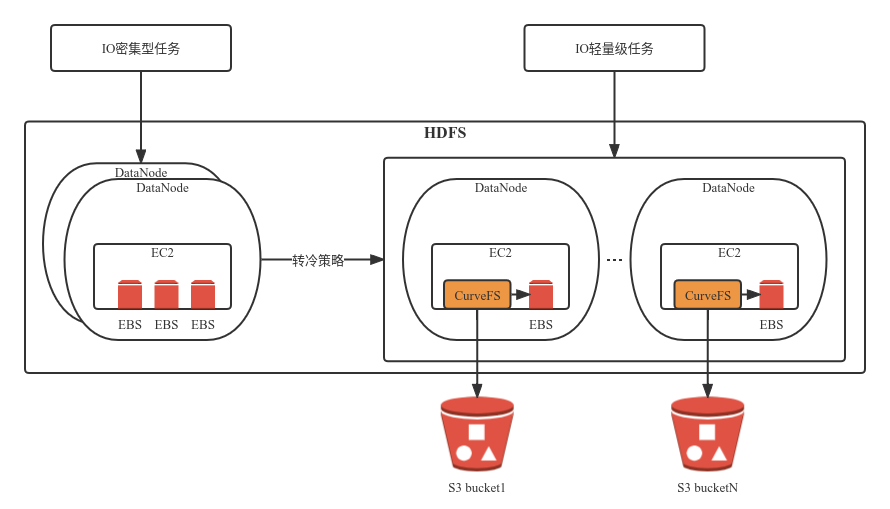

## 问题背景
场景1：由于相关海外政策法规的收紧，国内企业如果在国外有业务运营，则数据也必须在本地处理，而不能传输到国内。因此部署在国内私有IDC的大数据处理集群就不能使用，需要在国外单独部署。出于成本和运营复杂度等问题考量，国外部署环境的优先选择必定是各类公有云平台，而不是自建或者租赁IDC机房。

场景2：企业大数据业务上云，但是不想被云厂商的EMR等服务锁定，想做到随时可以切换云服务商。此时就需要考虑自己部署维护大数据存储集群。

因此云上部署Hadoop/HDFS集群就是面临的一个现实问题。

## 业界实践
通常有2个选择：
1. 使用云厂商提供的兼容HDFS协议的存储服务，甚至连上层的计算服务也都采用云厂商方案，几乎各大云厂商都提供了EMR服务
2. 基于云厂商提供的裸金属服务器+EBS云盘部署私有的HDFS集群，在EC2实例或者裸金属实例上运行MR服务

通常来说，使用第二种方案的成本要高于第一种，毕竟EBS云盘已经是多副本（通常是3副本），HDFS自身又是多副本的架构，即使只配置2副本，也有3*2倍的副本数。而且EBS云盘的价格通常比物理盘高很多很多。

一般来说第一种方案更适合中小型企业，对HDFS或者上层计算平台（如spark、flink等）没有做定制化改造，可以直接拿云厂商的EMR服务替换。第二种方案则是中大型企业（或者对计算平台做了较多定制化改造的企业）上云面临的一个门槛，只能迫于无奈选择第二种方案。

但第一种方案相比传统的私有IDC内部署大数据处理集群的方式，仍然有比较大的成本负担。云厂商的大数据处理服务价格通常也是比较高的，类似的情况还有RDS等数据库或其他中间件。

通过上面的分析来看，这两种方案都不是客户所乐意采用的，那么有没有第三种选择呢？既要又要能做到吗？

## Curve的建议
建议部署架构如下图所示：

部署架构解释：
1. HDFS集群从原来使用裸金属的EBS盘改成使用CurveFS挂载点（单机模式），数据实际存储在S3，元数据在CurveFS的3副本raft集群（也可以改为单机单副本模式）
2. 如果由HDFS管理数据副本，则对CurveFS高可用、高可靠要求进一步降低，只是会导致存储到S3上的数据量增加2~3倍（根据HDFS副本数），如果由CurveFS及S3来保证数据的可靠性，则可以把HDFS的副本数设置为1
3. CurveFS支持内存buffer、EBS云盘、以及分布式KV作为数据缓存，再加上元数据的客户端及服务端内存cache，单机部署模式下都是本地访问性能更高
4. CurveFS因为是单机部署，且不需要与其他节点共享访问文件，所以可以每个CurveFS节点用一个独立的S3桶，这也能利用多桶的能力增加性能（单桶一般会有QoS上限限制）
5. EBS云盘作为S3数据的缓存，可以大大降低S3文件的访问次数（S3一般会对访问次数收费），在提升性能的基础上进一步节省成本

根据相关业务方的FIO及Hive实测数据，这个部署架构做到了既不影响HDFS的功能增强又基本不影响性能。最主要的是把价格昂贵的EBS云盘存储替换为了价格低廉的S3对象存储，整体存储成本节约可以达到50%（HDFS设置为3副本的情况）甚至70%以上（HDFS设置1副本情况）。

## 未来思考
1. CurveFS实现更精简、更高性能的单机部署架构
2. 开发新的服务支持将S3导出为iSCSI卷类型的块设备，并配合Bcache等缓存组件来进一步提升随机读写性能

