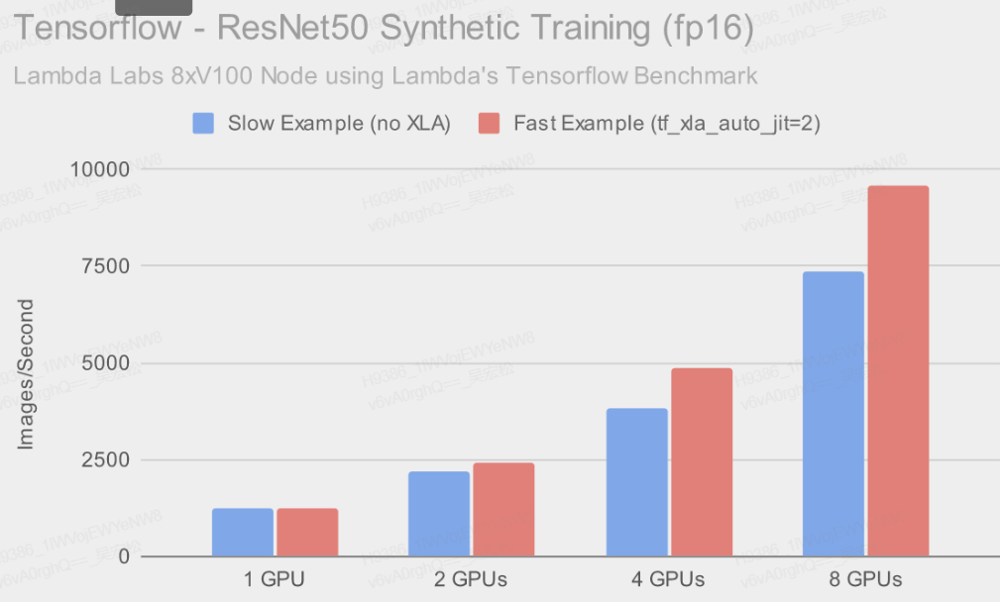
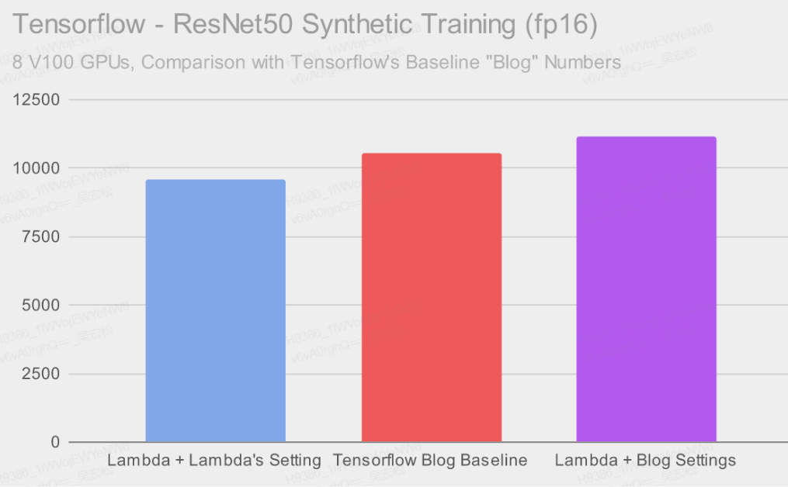
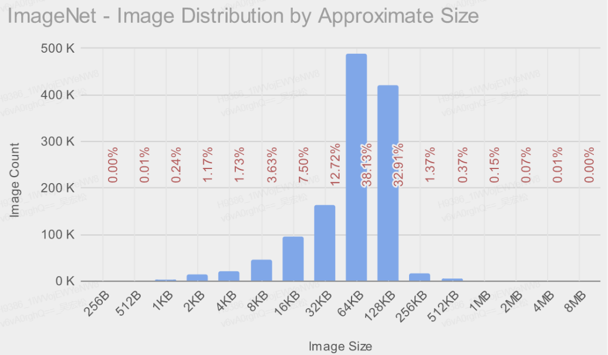
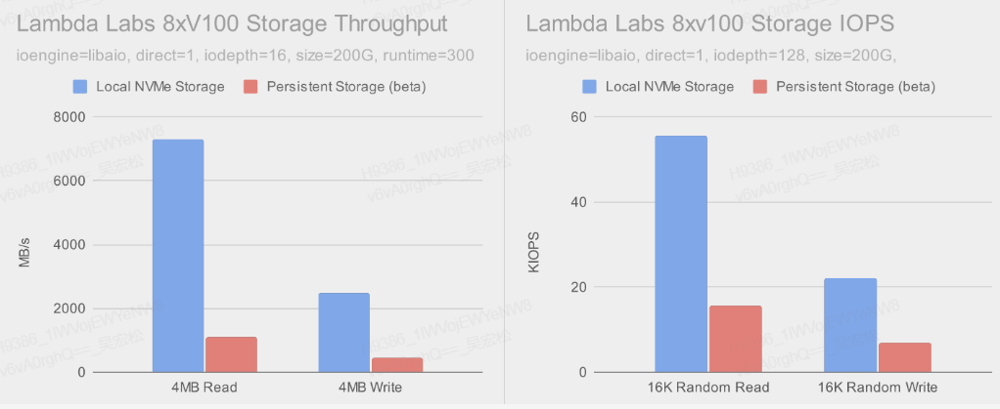
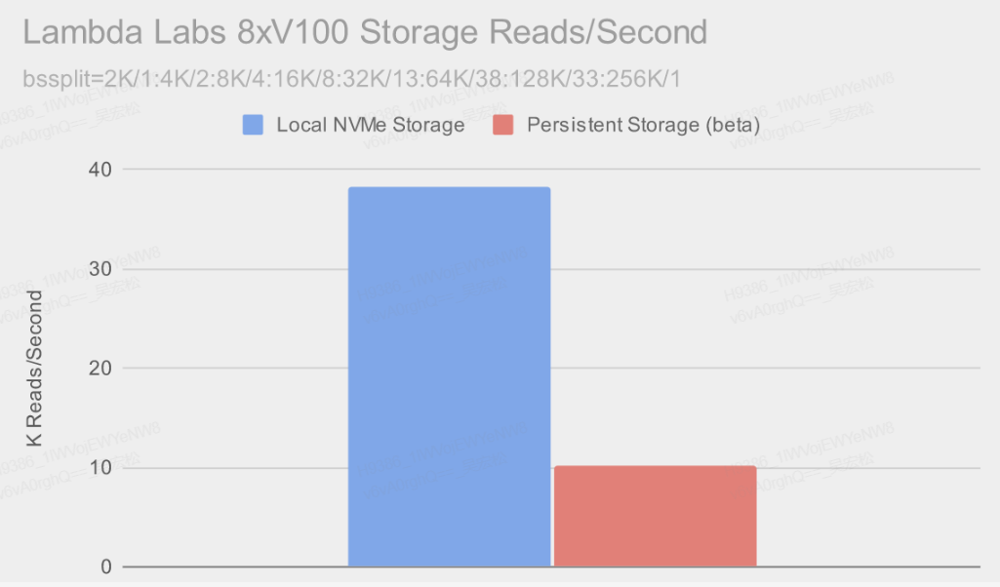
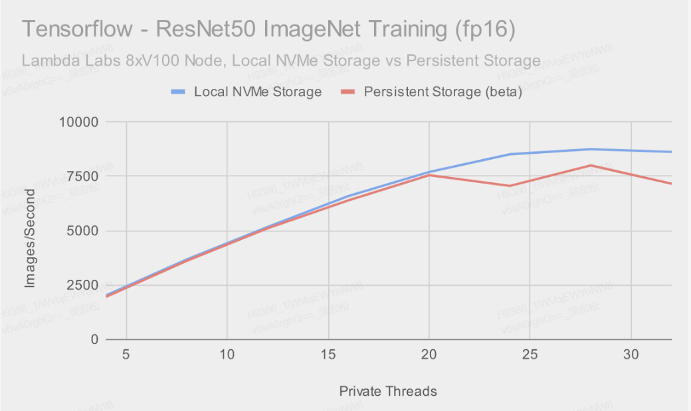
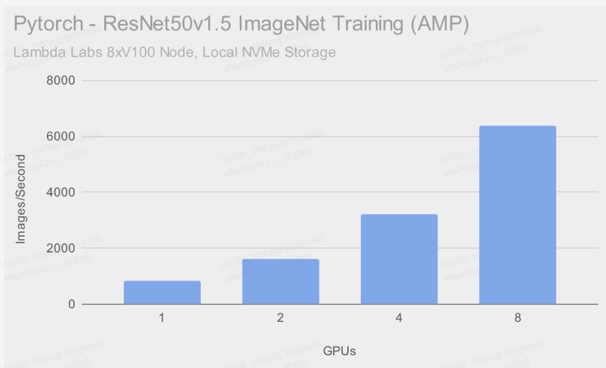
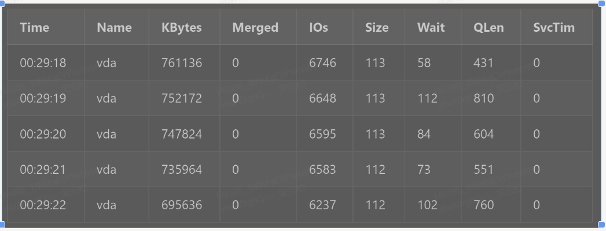
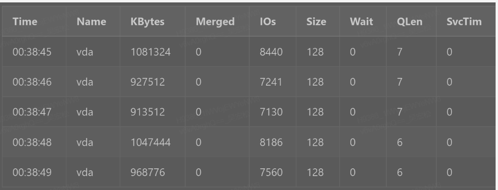

# 摘要
本文主体译自[Ceph核心开发的文章](https://markhpc.github.io/2022/11/28/Lambda.html)
，原文介绍了深度学习(AI)中的io行为及性能优化，本文对原文稍作整理(由于水平有限，如有疏漏，烦请见谅)，并增加了部分CurveFS在性能优化方面已经/正在做的以及[Curve Roadmap 2023](https://github.com/opencurve/curve/issues/2207) 里面即将做的一些事情。
# CurveFS的一些工作
## 已经/正在做
- 预热

Ai训练中的训练数据可以提前预热到本地缓存盘(或者缓存集群，预热到缓存集群功能已开发完，CurveAdm部署工具完善中)

1) 预热单个目录/文件

`curve fs warmup add  要预热的目录/文件的绝对路径`

2) 批量预热目录/文件

用户将curvefs的”/“目录挂载到本机的`/mnt/curvefs/`下，如果用户需要预热curvefs的`/`下的`/B /C /A/D`，用户需要将列表文件保存为`/mnt/curvefs/warmup/0809.list`，文件的内容为：
```
/mnt/curvefs/B
/mnt/curvefs/C
/mnt/curvefs/A/D
```

预热命令为：
`curve fs warmup add --filelist /mnt/curvefs/warmup/0809.list`

- 缓存集群

对于S3后端，数据的IO路径是从内存→ 本地盘→ s3上，只有数据上传到s3，才能实现多端共享。这种模式下，性能是一个很大的问题。

基于此，在本地缓存盘之上新增一个多client端共享的kvcache缓存集群。

- CurveFS + CurveBS

当前CurveFS release稳定版本的的数据后端对接的是S3。同时，当前正在开发FS数据存储到CurveBS这一特性。目前该特性基本功能已经ready，还剩空间回收以及性能优化待完成(预计Q2完全ready)。

对于性能有要求(或者是对数据安全有要求，不期望数据存放于S3)的业务，后端可以对接BS；对于成本有要求的业务，后端可以对接S3。

## [Curve Roadmap 2023](https://github.com/opencurve/curve/issues/2207)

- 生命周期管理

CurveFS数据后端同时对接S3以及CurveBS，热数据存放于CurveBS，冷数据转储到S3。

- 元数据性能优化

Ai训练涉及到大量元数据操作，所以元数据操作的性能对Ai训练时间有很大影响。

以上就是关于CurveFS的一些介绍，接下来就是原文的译稿。

# 前沿

这篇文章描述了在Lambda Lab的8x V100 GPU实例上运行resnet50训练期间TensorFlow和PyTorch的IO行为。对本地NVMe存储和网络连接的持久存储进行了测试。本地NVMe存储足够快，可以达到synthetic测试目标所需的吞吐率。在训练期间，网络连接的持久存储可能无法完全跑满8 V100 gpu，但只要使用TFRecords，就可以实现与本地存储几乎相同的性能水平。此外，当使用来自ImageNet的真实数据时，TensorFlow和PyTorch中存在特定的行为和瓶颈，会降低训练性能。

# 简介
```
…just because you can formulate your problem as RL doesn’t mean you should. If you insist on using the technology without understanding how it works you are likely to fail.
        Andrej Karpathy, A Recipe for Training Neural Networks, 2019
```
当我第一次开始这个项目时，这句话一直萦绕在我的脑海里。你可能会问什么项目?我想了解深度学习实验是如何利用快速存储设备的。也不是随便的实验，而是真正的实验，最好是大型的。这就是为什么我偶然看到了Andrej Karpathy的博客。他是特斯拉前人工智能高级总监，对训练大型神经网络很有经验。在过去的十年里，我一直在Ceph上工作，并且在分布式系统和分布式存储方面工作了近20年。但是训练神经网络呢?我最接近的一次尝试是在21世纪初，当时我试图创建一个预测电子游戏帧速率的工具。我从评测网站上搜集了基准数据，并根据硬件和显卡设置构建了M5决策树。这是可行的，但在一个小的(~4000个样本)数据集上过度训练。用pb级的数据训练人工智能如何有效地驾驶汽车?我已经感觉你有冒名顶替综合症了。

幸运的是，我的目标相对温和。我不需要构建最先进的分类器，也不需要探索手动实现反向传播的复杂性。我只是想了解在用快速gpu训练大数据集时所涉及的IO模式，这样我就可以帮助研究人员加快他们的工作速度。到目前为止，我做这件事的能力相当有限。在日常工作中，我可以访问一小群具有非常普通的gpu的节点。我使用MLPerf设置运行，但数据集(WMT G-E和CoCo)很容易装入内存。除了在训练开始时出现短暂的读取流量爆发外，几乎没有IO。最近，我有幸见到了Lambda Labs的联合创始人Michael Balaban。我告诉他我想做什么，他给了我访问Lambda的GPU云和beta持久存储的权限，让我尝试一下。我得到了Lambda的8x Tesla V100实例之一(这些东西非常受欢迎，所以最好在早上买一个!)。目前并不是所有的Lambda实例类型都可以访问持久存储，但是Texas区域中的V100实例可以。一旦准备就绪了，我就开始工作。
TensorFlow - Synthetic
在尝试使用真实数据运行测试之前，我意识到我需要一个基线来开始。幸运的是，Lambda的首席科学官Li Chuan编写了一个运行TensorFlow基准测试的工具，并将其发布在github上here。Lambda云计算的一个优势是，他们已经将许多流行的用于运行深度学习工作负载的工具捆绑在一个名为Lambda Stack的包中，当你启动一个实例时，这个包就会预先安装。这让我可以快速上手，尽管我确实遇到了一个问题。Lambda Stack是TensorFlow 2的标准版本，但li chuan的工具依赖于TensorFlow基准子模块，该子模块旨在与TensorFlow一起工作。1. 幸运的是，父库被非正式地更新为与Tensorflow 2一起工作(警告:它不再被维护)。在“benchmarks”子模块目录中运行“git checkout master”可以快速地使一切正常工作。Li Chuan 的工具使得运行包含了几个预配置模板的测试变得很简单。我选择了fp16 resnet50配置，因为它处理图像的速度应该很快，而且相当标准。

```
TF_XLA_FLAGS=--tf_xla_auto_jit=2 ./batch_benchmark.sh X X 1 100 2 config/config_resnet50_replicated_fp16_train_syn
```

使用benchmarks里README.md中提供的文件，我能够在有最多8个V100 gpu的节点上快速运行带有synthetic 数据的benchmarks测试。有一次，我陷入了困境，导致了最初无法解释的25%的性能损失。我重新运行了多次测试，甚至在nvidia-smi中监测GPU的时钟速度/温度，但没有运气。最终我发现了自己的错误。在运行缓慢的情况下，是因为我无意中遗漏了“TF_XLA_FLAGS= -tf_xla_auto_jit =2”环境变量。事实证明，这样的设置允许Tensorflow编译和执行支持XLA(加速线性代数)的函数，这对于这些测试来说是一个相当大的胜利。



在这一点上，我决定我需要了解li chuan的工具是如何工作的。事实证明，他使用的是tf_cnn_benchmark .py benchmark代码，Nvidia和Dell等公司也使用该代码对其GPU解决方案进行benchmark测试。我花了一些时间直接用戴尔的深度学习概述中的设置运行它here。 不幸的是，即使经过了各种调整，这些测试的结果也不尽相同。然而，在研究我前面提到的XLA问题时，我在TensorFlow网站上有了更好的发现here。 我发现了一篇很棒的博文，里面有一些Tensorflow核心开发者写的性能数据。它现在已经4年了，但似乎仍然相当有效。与我遇到的其他配置相比，所使用的调优选项更简单，而且性能更高。


使用Lambda云中的synthetic 数据进行训练的结果与Tensorflow开发人员报告的性能相似。事实上，在Lambda的8xV100实例上运行时，使用他们自己的设置产生的结果略快!这对我来说是非常鼓舞人心的，即使在Lambda的云环境和虚拟机实例中，我也可以实现与Tensorflow开发人员报告的一样快或更快的性能。

# 选一个真实的数据集
```
he first step to training a neural net is to not touch any neural net code at all and instead begin by thoroughly inspecting your data.
        Andrej Karpathy, A Recipe for Training Neural Networks, 2019
```

在证实自己让Tensorflow在synthetic测试中运行得相当高效之后，是时候开始考虑使用哪个数据集进行“真正的”训练了。最大和最明显的选择是ImageNet。ImageNet由超过120万张分类图像组成，形成一个大约160GB的训练数据集。这也是我能找到的最大的可公开访问的数据集。然而下载它并不容易。我能访问的唯一版本是托管在kaggle上的ImageNet对象本地化挑战数据集。

在最终弄清楚如何下载数据之后，是时候遵循Andrej的建议并尝试学习一些相关知识了。虽然ImageNet是经过管理和注释的，但它有许多不同大小、尺寸和像素数的图像。图像也来自不同质量水平的许多来源。通过堆栈交换的强大功能，我能够找到一个一行bash的脚本来生成图像大小的直方图:

```
find . -type f -print0 | xargs -0 ls -l | awk '{size[int(log($5)/log(2))]++}END{for (i in size) printf("%10d %3d\n", 2^i, size[i])}' | sort -n
```


大约80%的图像大小为64KB或128KB。几乎所有剩下的图片都要小一些。这让我们很好地了解了在分类过程中应该期待什么样的IOs。或者至少对于直接读取这些图像的框架来说是这样。在Tensorflow的例子中，有一种叫做TFRecord的格式。

TFRecords基本上是按顺序排列在大得多的文件中的图像数据的集合。TFRecords允许Tensorflow传输更少、更大的文件，每个文件包含多个图像，而不是迭代数千或数百万个单独的图像文件。预处理数据的成本是一次性的，因此Tensorflow在训练过程中需要做的工作更少。下载ImageNet数据后，我尝试将ImageNet LOC数据转换为TensorFlow记录。幸运的是，TensorFlow tpu github存储库已经有一个工具可以做到这一点。我不得不稍微操作数据集，但最终这个过程是有效的(至少对于训练数据):
```
pip install gcloud google-cloud-storage
pip install protobuf==3.20.1

mkdir ~/data/ImageNetFoo
ln -s ~/data/ImageNet/ILSVRC/Data/CLS-LOC/train ~/data/ImageNetFoo/train
ln -s ~/data/ImageNet/ILSVRC/Data/CLS-LOC/val ~/data/ImageNetFoo/val
ln -s ~/data/ImageNet/ILSVRC/Data/CLS-LOC/test ~/data/ImageNetFoo/test
ln -s ~/data/ImageNet/LOC_synset_mapping.txt ~/data/ImageNetFoo/synset_labels.txt
python imagenet_to_gcs.py --raw_data_dir=/home/ubuntu/data/ImageNetFoo --local_scratch_dir=/home/ubuntu/ExaltedOrbs/ImageNet/tf_records --nogcs_upload
```

也许我应该说，只要原始数据集位于本地NVMe驱动器上，这就可以工作。持久存储的表现并不好。试图在持久存储上解压缩ImageNet会导致超过所允许的打开文件的最大数量，出现如下错误：

```
OSError: [Errno 24] Too many open files.
```

不幸的是，这个问题无法在这个实例上解决。它似乎是从主机传递过来的，在实例重新启动之前，持久存储完全不可用。最近，我与Lambda的一位工程师交谈，他们正在解决这个问题。(当你读到这篇文章的时候，它可能已经实现了!)我还想指出，持久存储仍处于测试阶段，因此这样的问题并非完全出乎意料。尽管如此，在出现错误之前，在持久存储上提取ImageNet要比在本地NVMe存储上慢得多。最好在本地提取ImageNet，然后在转换过程中将大的TFRecords写入持久存储。幸运的是，将ImageNet提取到本地存储没有问题，将原始存档和生成的TFRecords存储在持久存储上也没有问题。

# FIO -基线IO结果

接下来，我将注意力转向使用fio在Lambda的本地和持久存储上运行基线测试。Fio是存储社区中高度可配置且备受尊敬的基准测试，非常适合生成基线结果。我决定使用大致类似于ImageNet (200GB)的数据集大小，fio中使用libaio引擎与direct io，以及适当的高IO深度，以让NVMe驱动器可以充分发挥他们的能力。



本地NVMe驱动器的吞吐量惊人地好。持久存储较慢，但对于大的读取来说，仍然足够快，略高于1GB/s。16K IOPS在这两种情况下都有些慢。我选择了16K，这样我就可以快速地与我在Ceph QEMU/KVM性能博客文章中运行的测试进行比较。在不深入细节的情况下，我怀疑Lambda的设置仍有提高IOPS的空间。幸运的是，转换为TFRecords应该使Tensorflow的吞吐量受到限制，而不是延迟受到限制。PyTorch或其他想要直接读取图像的工具呢?Fio让我们能够通过使用其“bssplit”特性来模拟它。我们可以使用检查ImageNet时生成的大小范围和百分位数，并给出fio类似的分布:

```
fio --ioengine=libaio --direct=1 --bssplit=2K/1:4K/2:8K/4:16K/8:32K/13:64K/38:128K/33:256K/1 --iodepth=128 --rw=randread --norandommap --size=200G --numjobs=1 --runtime=300 --time_based --name=foo
```



这并不完全正确，因为我们不是在读取分布在数百万个文件中的数据，但它应该提供了预期结果的上限。看起来，持久存储可以在大约750MB/s的吞吐率下执行大约每秒读取10K次。本地存储大约快3-4倍。本地存储应该足够快，以支持我们希望在8 V100 gpu上的Tensorflow中达到的图像/秒吞吐率，但对于持久化存储还没有定论。

# Tensorflow - ImageNet

在Tensorflow中，使用真实数据而不是synthetic 数据运行benchmarks 测试非常简单。你只需将data_dir和data_name标记附加到CLI调用中，让它知道TFRecords的位置:

```
sync; echo 3 | sudo tee /proc/sys/vm/drop_caches
python ./tf_cnn_benchmarks.py --batch_size=256 --num_batches=100 --model=resnet50 --optimizer=momentum --variable_update=replicated --all_reduce_spec=nccl --use_fp16=True --nodistortions --gradient_repacking=2 --compute_lr_on_cpu=True --single_l2_loss_op=True --xla_compile=True --num_gpus=8 --loss_type_to_report=base_loss --data_dir=/home/ubuntu/ImageNet-TF/train --data_name=imagenet

```


哎哟。ImageNet数据的性能比syntheitc数据低得多!考虑到四年前Tensorflow开发人员报告的结果要好得多，这尤其令人遗憾。我花了一些时间阅读和尝试不同的设置。最终，产生实质性差异的一个设置是“datasets_num_private_threads”。在Tensorflow benchmarkk测试源代码中，这个设置被描述为:“为所有数据集计算创建的私有线程池的线程数。”我将更详细地介绍这些线程在做什么。现在，让我们看看增加线程数量如何影响结果:



增加私有线程的数量对性能有显著的影响，尽管还没办法完全达到在本地或持久存储上的syntheic测试中获得的性能。本地存储在高线程数时表现更好，逐渐达到8600个图像/秒左右。在高私有线程计数时，持久存储的峰值在7000-8000个图像/秒之间，区间范围更大。我怀疑在这种情况下，持久存储可能已经达到了它(每个实例)的限制。

除了对性能有显著的影响外，改变私有线程数对TensorFlow进程的CPU消耗也有很大的影响。CPU使用率几乎随额外的私有线程线性增加，最高可达30个核左右。这些私有线程到底在做什么?为了回答这个问题，我使用了在Ceph中诊断CPU使用情况时经常使用的两个工具。在使用较少数量的私有线程进行测试时，我使用了linux的perf工具来查看私有线程完全饱和时，时钟周期消耗在哪里。使用更多的私有线程时，我使用我的wallclock分析器uwpmp来查看当增加线程数不再提高性能时，私有线程是如何花费时间的。

在perf的第一个例子中，我们可以很好地看到这些私有线程正在做的工作:

```
--77.31%--tensorflow::ThreadPoolDevice::Compute
          |          
          |--51.19%--0x7f511a00c7d8
          |          |          
          |           --51.18%--tensorflow::jpeg::Uncompress
          |--14.48%--tensorflow::ResizeBilinearOp<Eigen::ThreadPoolDevice, unsigned char>::Compute
          |--5.47%--tensorflow::CastOpBase::Compute
          |--2.66%--tensorflow::ReverseV2Op<Eigen::ThreadPoolDevice, unsigned char, int>::Compute
```

消耗大部分时钟周期的操作是jpeg解压缩和调整大小，以及少量其他操作。如果我们看一个私有线程数较高的案例，但现在看的是wallclock时间而不是时钟周期，会发生什么呢?不过在让profiler剖析器正常工作以及获得一致的干净的调用图方面，我最终遇到了一些麻烦，但我至少能够运行一次，这揭示了一些有趣的信息。首先，我发现时间花在了perf告诉我们的相同函数上:

```
+ 100.00% Eigen::ThreadPoolTempl<tensorflow::thread::EigenEnvironment>::WorkerLoop(int)
 + 99.90% ???
 |+ 97.30% ???
 ||+ 92.40% ???
 |||+ 77.10% _PyEval_EvalFrameDefault
 ||||+ 47.20% ???
 |||||+ 38.10% tensorflow::jpeg::Uncompress(void const*, int, tensorflow::jpeg::UncompressFlags const&, long*, std::function<unsigned char* (int, int, int)>)
 ||||+ 12.20% tensorflow::ResizeBilinearOp<Eigen::ThreadPoolDevice, unsigned char>::Compute(tensorflow::OpKernelContext*)
 ||||+ 4.40% tensorflow::CastOpBase::Compute(tensorflow::OpKernelContext*)
 ||||+ 1.70% tensorflow::ReverseV2Op<Eigen::ThreadPoolDevice, unsigned char, int>::Compute(tensorflow::OpKernelContext*)
但是wallclock profile工具也暴露了在私有线程的多个区域可能存在争用，围绕一些正在使用的nsync同步原语:
 |||||||    |  + 4.50% nsync::nsync_mu_semaphore_p(nsync::nsync_semaphore_s_*)
 |||||||    |   + 4.50% syscall
 ```

这几乎总是嵌套在内部深处:

```
tensorflow::BFCAllocator::AllocateRaw(unsigned long, unsigned long, tensorflow::AllocationAttributes const&)
```

遗憾的是，我缺少了一些调试符号，不100%信任wallclock跟踪。现在我只想说私有线程正在做大量的解压和操作图像数据的工作，以保证GPU的正常运行。我怀疑随着更新和更快的gpu，在训练真实的图像数据时，图像检索pipeline 可能会成为一个更大的问题时。在我看来，TensorFlow开发人员在4年前完全没有使用专用私有线程的情况下是如何取得如此好的结果的?也许他们有一个我不知道的更快的jpeg解压机制?

# PyTorch -ImageNet

在运行Tensorflow之后，我还使用nvidia github repo 中的`DeepLearningExamples`例子在PyTorch中运行了一些benchmark测试。首先，我安装了先决条件并设置了仓库:

```
pip install 'git+https://github.com/NVIDIA/dllogger'
pip install --extra-index-url https://developer.download.nvidia.com/compute/redist --upgrade nvidia-dali-cuda110
git clone https://github.com/NVIDIA/DeepLearningExamples
```

然后，准备在PyTorch中使用的ImageNet:

```
cd ~/data/ImageNet/ILSVRC/Data/CLS-LOC/val
wget -qO- https://raw.githubusercontent.com/soumith/imagenetloader.torch/master/valprep.sh | bash
```

最后运行测试：

```
cd DeepLearningExamples/PyTorch/Classification/ConvNets
sync; echo 3 | sudo tee /proc/sys/vm/drop_caches
python ./multiproc.py --nproc_per_node 1 ./main.py --arch resnet50 --label-smoothing 0.1 --run-epoch 1 --amp --static-loss-scale 256 --workspace /home/ubuntu/data/ImageNet-Scratch /home/ubuntu/data/ImageNet-Orig/ILSVRC/Data/CLS-LOC/
```

这里与TensorFlow测试有几个不同之处。首先，我使用原始ImageNet文档而不是预处理过的TFRecord数据集，因此读取行为是不同的。因为我无法将原始ImageNet文件提取或复制到持久存储上，所以我也只测试了本地NVMe驱动器。最后，我在nVidia的文档中没有看到任何使用fp16运行的具体示例，所以我使用了amp(自动混合精度)，它可能会稍微慢一些。



考虑到差异的数量，很难与Tensorflow进行直接比较。amp是一个区别，但很可能有调优选项，可以提高性能，这里我不知道。我注意到PyTorch和Tensorflow一样，使用了相当多的CPU来保持gpu工作。我怀疑有一些方法可以调整IO pipeline 来提高性能。现在，让我们比较一下Tensorflow和PyTorch运行期间本地NVMe驱动器上的IO模式。我希望能够使用blktrace来做到这一点，但不幸的是无法从实例中的虚拟设备中获得任何数据。不过，我可以使用collectl收集更多的一般统计数据。
PyTorch 8 GPU运行时磁盘读统计:


TensorFlow 8 GPU运行时磁盘读统计:


当只看IO大小时，两次运行看起来相似，但这并不能说明全部情况。Tensorflow很可能正在执行更大的读取，这些读取被块层根据底层设备的max_sectors_kb设置分解成连续的128KB块。这里表明的是TensorFlow相对于PyTorch，运行的队列长度和等待时间会更低些。在这两种情况下，设备服务时间都很低(0)，但在TensorFlow情况下，设备队列中仍然有IOs。

有趣的是，似乎可以使用nVidia的DALI(数据加载库)包将TFRecords读取到PyTorch中。我没有时间尝试，但这可能会对IO行为和性能产生很大影响。

# 结论
当我在写这篇文章时，我意识到理解神经网络训练的性能特征是多么复杂。即使我们谈论像images/second这样的指标，所使用的options(例如批处理大小)也会影响他的表现。要想出一种总是优于其他方法的通用方法是非常困难的。我想知道是否有另一个指标，可以达到预期的趋同水平，这样可能会更好。话虽如此，我还是很高兴做了这个测试，因为我学到了一些有价值的东西:

- 从IO的角度来看，将数据预处理为快速本地存储上的类似TFRecords这样的格式是一个巨大的胜利。它让元数据性能较慢的存储系统成功，只要它们有足够的顺序读吞吐量来保持机器学习框架的繁忙。对于许多元数据性能不达标的分布式文件系统来说，这是一个巨大的胜利(即使是良好的分布式文件系统也可能受益)。
- 要在ImageNet这样的数据集上训练，在fp16中训练时，您需要大约1-1.3GB/s的原始磁盘吞吐量来保持8个V100 gpu繁忙。对于amp或fp32，要求可能更低，因为gpu不能工作得那么快。使用比V100更快的现代gpu，磁盘吞吐量要求可能会显著提高。
- Lambda的本地NVMe存储可能足够快，可以饱和8个gpu，甚至是更新的gpu，只要剩余的IO路径可以跟上。当有足够的gpu和TensorFlow私有线程时，持久存储似乎成为了一个瓶颈，不过只要使用TFRecords，它仍然可以很好地运行。接下来的一个问题是如何确保TensorFlow和PyTorch中的数据pipeline足够快，以保持gpu的工作。TensorFlow的benchmark测试需要大量的私有线程，并且在高线程数时显示出潜在的争用证据。PyTorch似乎不支持TFRecords，但NVidia DALI或其他第三方代码可能有助于改善IO路径。
- 如果需要直接使用images而不是TFRecords进行训练，那么将它们驻留在共享文件系统上可能没有意义。Tensorflow和PyTorch似乎可以让用户指定单独的训练数据和工作目录。如果所有针对训练数据的操作都是读取的，那么将数据集驻留在只读块设备的快照上可能会更好。例如，使用Ceph，也许你可以创建一个读/写RBD卷，其中放入某个数据集，获取快照，然后将该快照映射为多个实例(这些实例都需要访问相同的图像集)上的只读快照.
- 即使使用像ImageNet这样大的训练集，Lambda的实例也有如此大的内存，以至于最终整个数据集都会被缓存。有必要在每次测试之前同步和删除缓存，并保持测试足够短，以免它们从缓冲区缓存中重新读取相同的数据。我能够看到长时间运行的测试最终会停止执行读取，并且随着时间的推移会变得更快。如果不仔细控制，这可能会使不同存储供应商之间的对比变得困难
- 我几乎肯定错过了可以帮助加速Tensorflow和PyTorch的额外调整。这篇文章不应该被视为如何使用这些框架实现高性能的全部，但我希望你在尝试使用真实数据进行训练并实现高性能时，它至少可以帮助展示一些有价值的东西。

这篇文章总结了我关于深度学习IO行为研究的初步工作。我希望下次我能掌握更多关于PyTorch和Tensorflow如何工作的内部知识，更多地关注训练的质量，找到更大的数据集来工作，也许能真正完成一些有用的事情，而不仅仅是用ImageNet。
